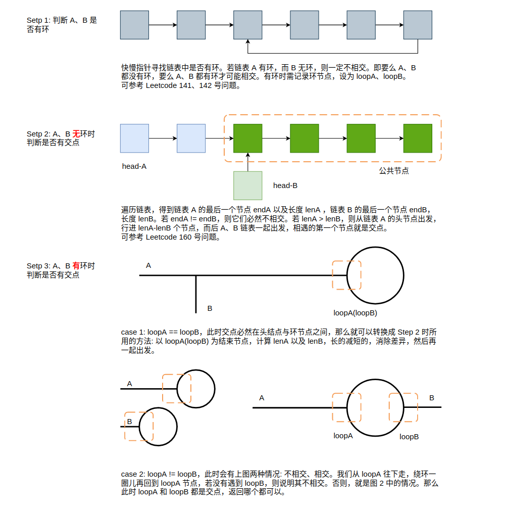

# Snorlax

----------

## :telescope:	Algorithm

- [二叉树与递归: DP、回溯、DFS、BFS，一个通用的算法框架](https://github.com/SmartKeyerror/Snorlax/tree/master/algorithm/tree)
- [回溯与剪枝: 《明日边缘》or 《源代码》](https://github.com/SmartKeyerror/Snorlax/tree/master/algorithm/backtracking)
- [Flood fill 算法小专题](https://github.com/SmartKeyerror/Snorlax/tree/master/algorithm/flood-fill)
- [排序: 经典排序算法的思想随处可见](https://github.com/SmartKeyerror/Snorlax/tree/master/algorithm/sort)

## :label: 动态规划
- [动态规划(01)——从斐波那契到硬币找零](https://github.com/SmartKeyerror/Snorlax/tree/master/algorithm/dp/dp(01))
- [动态规划(02)——0-1背包问题](https://github.com/SmartKeyerror/Snorlax/tree/master/algorithm/dp/dp(02))
- [Coin Change: 自顶向下思考，自底向上实现](https://github.com/SmartKeyerror/Snorlax/tree/master/algorithm/dp/dp(03))

## :label: Graph
- [图的二三事—基本概念与基础问题](https://github.com/SmartKeyerror/Snorlax/tree/master/algorithm/graph/base)
- [BFS与图论问题建模](https://github.com/SmartKeyerror/Snorlax/tree/master/algorithm/bfs)
- [汉密尔顿回路与欧拉回路](https://github.com/SmartKeyerror/Snorlax/tree/master/algorithm/graph/loop)
- [最短路径问题——Dijkstra 算法](https://github.com/SmartKeyerror/Snorlax/tree/master/algorithm/graph/shortest-path/dijkstra)

## :label: Other Algorithm Topics

- [位操作那些事儿](https://github.com/SmartKeyerror/Snorlax/tree/master/algorithm/bit-manipulation)
- [Leetcode 中的排列问题](https://github.com/SmartKeyerror/Snorlax/tree/master/algorithm/permutation)
- [Prefix Sum 与 Prefix XOR](https://github.com/SmartKeyerror/Snorlax/tree/master/algorithm/prefix-sum)

## :beers: Interesting Problems

### Danamic Programing

- [Coin Change 及其变种问题](https://smartkeyerror.oss-cn-shenzhen.aliyuncs.com/Snorlax/leetcode/dp/Coin-Change.pdf)

### Linked-List

- [单链表 A、B 可能有环，也可能无环。这两个链表可能相交，也可能不相交，若相交请返回相交节点，否则返回 null。额外空间复杂度请达到 O(1)](#intersection-of-two-linked-list)

<!-- ## :toolbox: Data Structure

- [并查集: 没人比我更懂连通性](https://github.com/SmartKeyerror/Snorlax/tree/master/src/union-find)
- [递归: 面试叫我小甜甜，生产叫我小垃圾?](https://github.com/SmartKeyerror/Snorlax/tree/master/src/recursive)
- [堆: 堆排序、TopK、计算百分位数，我的能量超乎你想象](https://github.com/SmartKeyerror/Snorlax/tree/master/src/heap)
- [环形队列: 我吃我自己](https://github.com/SmartKeyerror/Snorlax/tree/master/src/circular-buffer)
- [二分搜索树: 简简单单，描述二叉树所有的性质](https://github.com/SmartKeyerror/Snorlax/tree/master/src/search-tree)
- [栈: C泛型栈如何实现?](https://github.com/SmartKeyerror/Snorlax/tree/master/src/stack)
- [哈希表: 感受数组的魅力](https://github.com/SmartKeyerror/Snorlax/tree/master/src/hash-table) -->

#### intersection-of-two-linked-list

