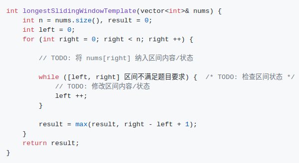

# Snorlax  

----------

## :telescope:	Algorithm

- [理解二叉树的遍历](https://github.com/SmartKeyerror/Snorlax/tree/master/algorithm/tree)
- [从栈的“消除”到单调栈](https://github.com/SmartKeyerror/Snorlax/tree/master/algorithm/stack)
- [回溯与剪枝: 《明日边缘》or 《源代码》](https://github.com/SmartKeyerror/Snorlax/tree/master/algorithm/backtracking)
- [Flood fill 算法小专题](https://github.com/SmartKeyerror/Snorlax/tree/master/algorithm/flood-fill)
- [二分搜索（待填坑）](https://github.com/SmartKeyerror/Snorlax/tree/master/algorithm/binary-search)
- [排序: 经典排序算法的思想随处可见](https://github.com/SmartKeyerror/Snorlax/tree/master/algorithm/sort)
- [与 Top-K 相关的问题](https://github.com/SmartKeyerror/Snorlax/tree/master/algorithm/top-k)
- [双指针与滑动窗口](https://github.com/SmartKeyerror/Snorlax/tree/master/algorithm/two-pointers)
- [Trie 的原理、实现及其应用](https://github.com/SmartKeyerror/Snorlax/tree/master/algorithm/trie)
- [线段树的构建、查询与更新](https://github.com/SmartKeyerror/Snorlax/tree/master/algorithm/segment-tree)

## :fire: 动态规划
- [动态规划(01)——从斐波那契到硬币找零](https://github.com/SmartKeyerror/Snorlax/tree/master/algorithm/dp/dp(01))
- [动态规划(02)——0-1背包问题](https://github.com/SmartKeyerror/Snorlax/tree/master/algorithm/dp/dp(02))
- [Coin Change: 自顶向下思考，自底向上实现](https://github.com/SmartKeyerror/Snorlax/tree/master/algorithm/dp/dp(03))

## :paw_prints: Graph
- [图的二三事—基本概念与基础问题](https://github.com/SmartKeyerror/Snorlax/tree/master/algorithm/graph/base)
- [BFS与图论问题建模](https://github.com/SmartKeyerror/Snorlax/tree/master/algorithm/bfs)
- [汉密尔顿回路与欧拉回路](https://github.com/SmartKeyerror/Snorlax/tree/master/algorithm/graph/loop)
- [最短路径问题——Dijkstra 算法](https://github.com/SmartKeyerror/Snorlax/tree/master/algorithm/graph/shortest-path/dijkstra)

## :blowfish: Other Algorithm Topics

- [N-Sum 问题](https://github.com/SmartKeyerror/Snorlax/tree/master/algorithm/N-Sum)
- [位操作那些事儿](https://github.com/SmartKeyerror/Snorlax/tree/master/algorithm/bit-manipulation)
- [Leetcode 中的排列问题](https://github.com/SmartKeyerror/Snorlax/tree/master/algorithm/permutation)
- [Prefix Sum 与 Prefix XOR](https://github.com/SmartKeyerror/Snorlax/tree/master/algorithm/prefix-sum)

## :ghost: System Design

- [如何设计一个 TinyURL 系统？](https://github.com/SmartKeyerror/Snorlax/tree/master/system-design/tiny-url)

------

## :card_file_box: Algorithm Summary

### Binary Tree

| 方法     | 注意点                   | 能够解决的问题 |
| :------: | :-----------------------: | :------------ |
| 前序遍历 | **将根节点的信息传递至左右子树** | 验证 BST: [98. Validate Binary Search Tree](https://leetcode.com/problems/validate-binary-search-tree/) 判断两棵树是否完全相同: [100. Same Tree](https://leetcode.com/problems/same-tree/) 判断是否为子树: [572. Subtree of Another Tree](https://leetcode.com/problems/subtree-of-another-tree/) 根节点到叶子节点的路径问题: [113. Path Sum II](https://leetcode.com/problems/path-sum-ii/)  **所有二叉树的构造问题都是前序遍历**: [108. Convert Sorted Array to Binary Search Tree](https://leetcode.com/problems/convert-sorted-array-to-binary-search-tree/)
| 中序遍历 | **BST 的中序遍历结果有序** | 验证 BST: [98. Validate Binary Search Tree](https://leetcode.com/problems/validate-binary-search-tree/)  BST 中第 K 小/大的元素: [230. Kth Smallest Element in a BST](https://leetcode.com/problems/kth-smallest-element-in-a-bst/) |
| 后序遍历 | **将左右子树的信息传回给根节点** | 二叉树的最大高度: [104. Maximum Depth of Binary Tree](https://leetcode.com/problems/maximum-depth-of-binary-tree/)   二叉树的最小高度: [111. Minimum Depth of Binary Tree](https://leetcode.com/problems/minimum-depth-of-binary-tree/)   翻转二叉树: [226. Invert Binary Tree](https://leetcode.com/problems/invert-binary-tree/)   翻转二叉树为链表: [114. Flatten Binary Tree to Linked List](https://leetcode.com/problems/flatten-binary-tree-to-linked-list/)   **最近公共祖先问题:** [236. Lowest Common Ancestor of a Binary Tree](https://leetcode.com/problems/lowest-common-ancestor-of-a-binary-tree/)   DP + BinaryTree: [337. House Robber III](https://leetcode.com/problems/house-robber-iii/) |
| 层序遍历 | 使用 `queue` 保存每一层的节点   **BFS 用于求解无权图最短路径** | 寻找二叉树每一行的最大节点值: [515. Find Largest Value in Each Tree Row](https://leetcode.com/problems/find-largest-value-in-each-tree-row/)   二叉树的右视图: [199. Binary Tree Right Side View](https://leetcode.com/problems/binary-tree-right-side-view/)   多叉树最短路径问题: [310. Minimum Height Trees](https://leetcode.com/problems/minimum-height-trees/)   **二叉树中所有距离为 K 的节点**: [863. All Nodes Distance K in Binary Tree](https://leetcode.com/problems/all-nodes-distance-k-in-binary-tree/)

### Two Pointers

| 方式       | 注意点                  | 能够解决的问题   | 备注  |
| :--------:| :---------------------: | :------------ | :---: |
| 对撞指针   | `left` 能否等于 `right`? | 二分搜索: [704. Binary Search](https://leetcode.com/problems/binary-search/)   盛水最多的容器: [11. Container With Most Water](https://leetcode.com/problems/container-with-most-water/)   N-Sum 问题: [15. 3Sum](https://leetcode.com/problems/3sum/)、[18. 4Sum](https://leetcode.com/problems/4sum/) | N-Sum 问题注意元素重复问题 |
| 快慢指针 | | 寻找链表的中间节点: [876. Middle of the Linked List](https://leetcode.com/problems/middle-of-the-linked-list/)   判断链表是否有环: [141. Linked List Cycle](https://leetcode.com/problems/linked-list-cycle/)   链表的归并排序: [148. Sort List](https://leetcode.com/problems/sort-list/) | |
| 滑动窗口 | **判断是否具有单调性质** | 最长无重复子串: [3. Longest Substring Without Repeating Characters](https://leetcode.com/problems/longest-substring-without-repeating-characters/)   替换后的最长重复字符: [424. Longest Repeating Character Replacement](https://leetcode.com/problems/longest-repeating-character-replacement/)   至多包含两个不同字符的最长子串: [159. Longest Substring with At Most Two Distinct Characters](https://leetcode.com/problems/longest-substring-with-at-most-two-distinct-characters/)   乘积小于K的子数组: [713. Subarray Product Less Than K](https://leetcode.com/problems/subarray-product-less-than-k/)   最小覆盖子串: [76. Minimum Window Substring](https://leetcode.com/problems/minimum-window-substring/) |     |

------
## :beers: Interesting Problems

### Danamic Programing

- [Coin Change 及其变种问题](https://smartkeyerror.oss-cn-shenzhen.aliyuncs.com/Snorlax/leetcode/dp/Coin-Change.pdf)

### Linked-List

- [单链表 A、B 可能有环，也可能无环。这两个链表可能相交，也可能不相交，若相交请返回相交节点，否则返回 null。额外空间复杂度请达到 O(1)](#intersection-of-two-linked-list)

#### intersection-of-two-linked-list

