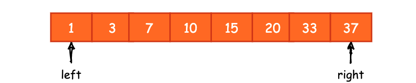
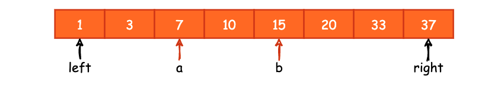
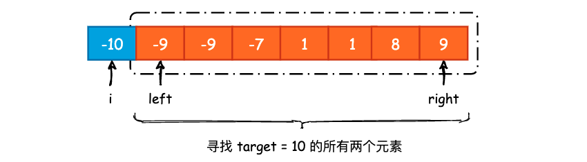
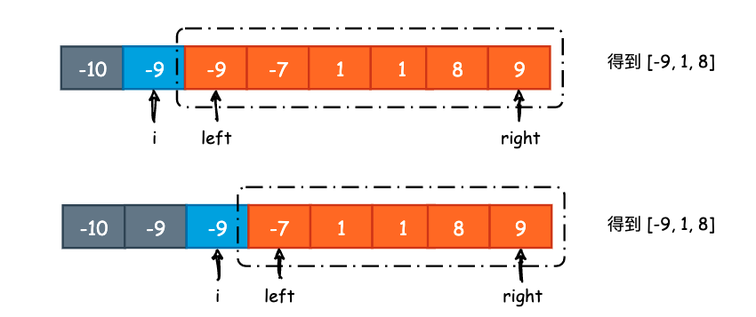
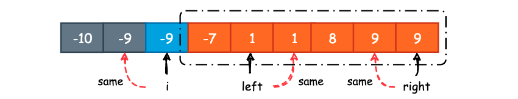

## N-Sum 问题

### 1. Two Sum

> Given an array of integers nums and an integer target, return indices of the two numbers such that they add up to target.
You may assume that each input would have exactly one solution, and you may not use the same element twice.
You can return the answer in any order.

Example 1:

```bash
Input: nums = [2,7,11,15], target = 9
Output: [0,1]
Output: Because nums[0] + nums[1] == 9, we return [0, 1].
```

Two Sum 问题应该是 N-Sum 问题中最为基础的问题了，要求我们在一个数组中找到 `a`、`b` 两个数字，使其之和等于 `target`。一个做法就是双层 for 循环遍历，平均时间复杂度为 `O(n^2)`。

另一个方式就是使用查找表。当我们遍历数组时，由于题目要求 `a + b = target`，逆向一下思维，如果我们固定了 `a`，那么只需要在数组中找到 `target - a` 是否存在即可。例如数组元素为 `[1, 2, 3, 4, 5]`，`target = 6`，那我们遍历到元素 4 的时候，只需要看看 6 - 4 = 2 是否在查找表中即可。具体实现过程如下:


```cpp
class Solution {
public:
    vector<int> twoSum(vector<int>& nums, int target) {
        unordered_map<int, int> record;
        for (int i = 0; i < nums.size(); i++) {
            int find = target - nums[i];
            if (record.count(find) != 0)
                return {i, record[find]};
            else
                record[nums[i]] = i;
        }
        // 题目保证了一定会有 answer，所以这句只是为了编译能够通过
        return {-1, -1};
    }
};
```

注意到这道题目要求我们返回 `a`、`b` 两个数的索引，因此我们不能对数组进行排序，否则将会失去原来的索引顺序。如果是仅要求我们返回 `a`、`b` 两个数字的话，除了查找表的实现以外，还可以使用**排序+对撞指针**的方式解决:



`left` 指针初始化时指向数组第一个元素，`right` 指针初始化时指向数组最后一个元素，通过判断 `nums[left] + nums[right]` 和 `target` 之间的大小关系来决定这两个指针如何移动。
- 若 `nums[left] + nums[right] > target`，由于数组是有序的，所以表明此时 `nums[right]` 的值太大了，应该减小一点点，所以让 `right` 指针向左移动；
- 若 `nums[left] + nums[right] = target`，那么这就是我们要找的答案，直接返回即可；
- 若 `nums[left] + nums[right] < target`，由于数组是有序的，所以表明刺水 `nums[left]` 的值太小了，应该增加一点点，所以让 `left` 指针向右移动。

如果到最后 `left` 和 `right` 相遇了，就说明数组中根本没有两个元素 `a`、`b`，使其之和等于 `target`。在上面的过程中，`left` 指针向右移动，`right` 指针向左移动，最后可能会在某一点“相撞”，所以又称为对撞指针。那么，为什么对撞指针是正确的呢? 在 `left` 和 `right` 移动过程中，有没有可能将正确答案漏掉? 答案是不会。




如上图所示，假设我们的 `target` 的值为 22，并且唯一解为 `a`、`b`，已在上图标注。可以看到，除非 `a`、`b` 一开始就落在数组起始和结束的地方，否则 `left` 指针一定会向右移动才能到达 `a`，`right` 指针必须向左移动才能到达 `b`。并且，`left` 和 `right` 一定会有到达唯一解的先后顺序，可能是 `left` 先落位，也可能是 `right` 先落位。

- 若 `left` 先到达 `a`，那么此时 `nums[left] + nums[right]` 必然大于 `target`，所以 `right` 向左移动
- 若 `right` 先到达 `b`，那么此时 `nums[left] + nums[right]` 必然小于 `target`，所以 `left` 向右移动
- 最终，`left` 一定会等于 `a`，`right` 一定会等于 `b`。

实现如下:

```cpp
class Solution {
public:
    vector<int> twoSum(vector<int>& nums, int target) {
        sort(nums.begin(), nums.end());

        int left = 0, right = nums.size() - 1;

        while (left < right) {
            if (nums[left] + nums[right] > target)
                right --;
            else if (nums[left] + nums[right] == target)
                return {nums[left], nums[right]};
            else
                left ++;
        }
        return {INT_MAX, INT_MAX};
    }
};
```

平均时间复杂度为 `O(nlogn)`，时间主要花在了排序上面，但是不额外占用任何空间，其空间复杂度为 `O(1)`。所以我们可以根据对内存的要求来选择何种方法实现，如果对内存有要求的话，那么就是用排序+对撞指针的方式实现，反之则可使用查找表的方式实现，其速度更快。

[167. Two Sum II - Input array is sorted](https://leetcode.com/problems/two-sum-ii-input-array-is-sorted/)，这个问题其实就是在有序数组中找到两个元素 `a`、`b`，使其和为 `target`。很明显地，可以使用对撞指针的方式以 `O(n)` 的时间复杂度、`O(1)` 的空间复杂度完成。

[653. Two Sum IV - Input is a BST](https://leetcode.com/problems/two-sum-iv-input-is-a-bst/) 这道题要求我们判断在一棵二叉搜索树上是否存在两个节点，使其节点值之和等于 `target`。一个解题思路就是使用中序遍历的方式将 BST 中所有的节点拷贝到一个数组中，得到一个有序数组后再使用对撞指针即可。

再来看一个 Follow Up 的问题，[1711. Count Good Meals](https://leetcode.com/problems/count-good-meals/)，题目描述如下:


> A **good meal** is a meal that contains **exactly two different food items** with a sum of deliciousness equal to a power of two.
You can pick any two different foods to make a good meal.
Given an array of integers `deliciousness` where `deliciousness[i]` is the deliciousness of the i'th item of food, return the number of different good meals you can make from this list modulo `10^9 + 7`.
Note that items with different indices are considered different even if they have the same deliciousness value.

##### Example 1:
```bash
Input: deliciousness = [1,3,5,7,9]
Output: 4
Explanation: The good meals are (1,3), (1,7), (3,5) and, (7,9).
Their respective sums are 4, 8, 8, and 16, all of which are powers of 2.
```

##### Example 2

```bash
Input: deliciousness = [1,1,1,3,3,3,7]
Output: 15
Explanation: The good meals are (1,1) with 3 ways, (1,3) with 9 ways, and (1,7) with 3 ways.
```

也就是给定一个 `deliciousness` 整数数组，统计数组中两个数之和是 2 的 n 次幂的个数。可以看做是两数之和的改版，只不过此时的 `target` 并不是一个固定值，而是 2，4，8，16，32，64，......， 2 的 n 次幂，题目中给出了 `deliciousness[i]` 的最大值为 2^20，那么该数组中两数之和的最大值就是 2^20 + 20^20 = 2^21。既然 `target` 不是固定的，那么我们就遍历所以可能的 `target`，在这道题目中其实我们只需要遍历 22 次。

```cpp
class Solution {
public:
    int countPairs(vector<int>& deliciousness) {
        long long result = 0;
        unordered_map<int, int> record;

        for (auto v : deliciousness) {
            for (int p = 0; p <= 21; p++) {
                int find = (1 << p) - v;
                if (record.count(find)) {
                    result += record[find];
                }
            }
            record[v] ++;
        }
        int mod = 1e9 + 7;
        return result % mod;
    }
};
```

### 2. 3Sum

[15. 3Sum](https://leetcode.com/problems/3sum/)，同样是给定一个数组，要求我们在该数组中找到 `target` 为 0 的所有 `a`、`b`、`c` 组合。

> Given an integer array nums, return all the triplets `[nums[i], nums[j], nums[k]]` such that `i != j`, `i != k`, and `j != k`, and `nums[i] + nums[j] + nums[k] == 0`.
Notice that the solution set must not contain duplicate triplets.

##### Example 1:

```bash
Input: nums = [-1,0,1,2,-1,-4]
Output: [[-1,-1,2],[-1,0,1]]
```

根据上面 Two Sum 的经验，我们很容易能够想出首先对 `nums` 进行排序，遍历数组时确定首个元素 `nums[i]`，然后在剩余的数组中利用对撞指针的方式去找 `0 - nums[i]`，看起来就是这样:




很容易写出下面的代码:

```cpp
vector<vector<int>> threeSum(vector<int>& nums) {
    
    vector<vector<int>> result;
    sort(nums.begin(), nums.end());
    
    // 基本条件判断
    if (nums.empty() || nums.back() < 0 || nums.front() > 0 || nums.size() < 3)
        return {};
    
    for (int i = 0; i < nums.size() - 2; i++) {
    
        // 如果 fixed 是一个正数的话，那么后续的值均 >= fixed，不可能凑成 0
        if (nums[i] > 0) break;
    
        int target = 0 - nums[i];
        int left = i + 1, right = nums.size() - 1;

        while (left < right) {
            if (nums[left] + nums[right] == target) {
                result.push_back({nums[i], nums[left], nums[right]});
                left ++, right --;
            }
            else if (nums[left] + nums[right] < target) left ++;
            else right --;
        }
    }
    return result;
}
```

答案提交上去之后就会得到一个大大的 `Wrong Answer!`，原因在于结果重复。



如上图所示，当遍历到第一个 `-9` 时，可以得到 `[-9, 1, 8]`，同样遍历到第二个 `-9` 时，也能够得到 `[-9, 1, 8]`，而题目中要求结果不允许重复。而除了 `i` 可能会重复以外，其实 `left` 和 `right` 所指向的元素也可能会重复。因此，我们要判重的地方有 3 处: `i`、`left` 和 `right`。




对于 `i` 来说，只需要看它左边儿的元素和当前遍历到的元素是否相同即可，若相同则跳过，看下一个元素。对于 `left` 和说，我们需要看它右边儿的元素是否和当前元素相同，若相同则跳过。对于 `right` 来说，要看它左边儿的元素是否和当前元素相同。

```
class Solution {
public:
    vector<vector<int>> threeSum(vector<int>& nums) {
    
        vector<vector<int>> result;
        sort(nums.begin(), nums.end());
        
        if (nums.empty() || nums.back() < 0 || nums.front() > 0 || nums.size() < 3)
            return {};
        
        for (int i = 0; i < nums.size() - 2; i++) {

            if (nums[i] > 0) break;
            if (i > 0 && nums[i] == nums[i-1]) continue;
            int target = 0 - nums[i];
            int left = i + 1, right = nums.size() - 1;

            while (left < right) {
                if (nums[left] + nums[right] == target) {
                    result.push_back({nums[i], nums[left], nums[right]});
                    
                    // 对 left 进行去重
                    while (left < right && nums[left] == nums[left + 1]) left ++;
                    // 对 right 进行去重
                    while (left < right && nums[right] ==  nums[right - 1]) right --;

                    left ++, right --;
                }
                else if (nums[left] + nums[right] < target) left ++;
                else right --;
            }
        }
        return result;
    }
};
```

[923. 3Sum With Multiplicity](https://leetcode.com/problems/3sum-with-multiplicity/) 则不要求我们去重，只需要返回总的组合数即可。实际上计算组合数的过程要比去重过程复杂的多，题解可参考:

> [923-3Sum-With-Multiplicity.cpp](https://github.com/SmartKeyerror/Snorlax/blob/master/leetcode/sliding-window/923-3Sum-With-Multiplicity.cpp)


[16. 3Sum Closest](https://leetcode.com/problems/3sum-closest/) 这道题也是关于 3Sum 的，只不过现在要我们找到 3 个数，使其和最接近于 `target`。过程和 3Sum 基本类似，也是使用排序+对撞指针实现，只不过我们需要额外的计算一下 `nums[i] + nums[left] + nums[right]` 和 `target` 之间的绝对值而已。题解可参考:

> [016-3Sum-Closest.cpp](https://github.com/SmartKeyerror/Snorlax/blob/master/leetcode/sliding-window/016-3Sum-Closest.cpp)


### 3. 4Sum

[18. 4Sum](https://leetcode.com/problems/4sum/)，同样是给定一个数组，要求我们在该数组中找到 `target` 为 `target` 的所有 `a`、`b`、`c`、`d` 组合。

我们继续使用相同的套路: 排序 + 对撞指针，只不过比 3Sum 多了一层循环而已:

```cpp
class Solution {
public:
    vector<vector<int>> fourSum(vector<int>& nums, int target) {
        vector<vector<int>> result;
        sort(nums.begin(), nums.end());

        if (nums.empty() || nums.size() < 4)
            return {};

        for (int i = 0; i < nums.size() - 3; i++) {
            // 对 nums[i] 去重
            if (i > 0 && nums[i] == nums[i-1]) continue;
            for (int j = i + 1; j < nums.size() - 2; j++) {
                // 对 nums[j] 去重
                if (j > i + 1 && nums[j] == nums[j-1]) continue;
                int left = j + 1, right = nums.size() - 1;
                while (left < right) {
                    if (nums[i] + nums[j] + nums[left] + nums[right] == target) {
                        result.push_back({nums[i], nums[j], nums[left], nums[right]});
                        // 对 left 去重
                        while (left < right && nums[left] == nums[left+1]) left ++;
                        // 对 right 去重
                        while (left < right && nums[right] == nums[right-1]) right --;
                        left ++, right --;
                    } else if (nums[i] + nums[j] + nums[left] + nums[right] < target)
                        left ++;
                    else
                        right --;
                }
            }
        }
        return result;
    }
};
```

[454. 4Sum II](https://leetcode.com/problems/4sum-ii/) 要求我们在 4 个数组中找出 `a`、`b`、`c`、`d`，使得 `a + b + c + d = target`，这 4 个数分别属于这 4 个数组。

Example 1:

```bash
Input: nums1 = [1,2], nums2 = [-2,-1], nums3 = [-1,2], nums4 = [0,2]
Output: 2
Explanation:
The two tuples are:
1. (0, 0, 0, 1) -> nums1[0] + nums2[0] + nums3[0] + nums4[1] = 1 + (-2) + (-1) + 2 = 0
2. (1, 1, 0, 0) -> nums1[1] + nums2[1] + nums3[0] + nums4[0] = 2 + (-1) + (-1) + 0 = 0
```

这时候我们就没有办法使用对撞指针的方式了，因为一下儿来了 4 个数组，都不知道从哪儿开始撞起。所以此时将眼光再次放到 hashmap 上面，如果我们求出了 `nums3[k] + nums4[l]` 的所有元素之和及其频率的话，那么剩下的问题就变成了求 `nums1[i] + nums2[j]` 的相反数是否存在于刚才的 hashmap 中，时间复杂度为 `O(n^2)`。

```cpp
class Solution {
public:
    int fourSumCount(vector<int>& nums1, vector<int>& nums2, vector<int>& nums3, vector<int>& nums4) {

        int result = 0;

        // 计算 nums3[k] + nums4[l]
        unordered_map<int, int> frequency;
        for (int k = 0; k < nums3.size(); k++) {
            for (int l = 0; l < nums4.size(); l++) {
                frequency[nums3[k] + nums4[l]] ++;
            }
        }

        // 寻找 target
        for (int i = 0; i < nums1.size(); i++) {
            for (int j = 0; j < nums2.size(); j++) {
                int find = 0 - nums1[i] - nums2[j];
                if (frequency.count(find) != 0) 
                    result += frequency[find];
            }
        }

        return result;
    }
};
```

### 4. N-Sum

N-Sum 问题在 Leetcode 上有一个专有名词，叫 Combination Sum。不限定结果中的元素个数，只要数组中的一个或多个元素的和等于 `target`，都可以被计入结果之中。典型的问题就是 [39. Combination Sum](https://leetcode.com/problems/combination-sum/) 以及 [40. Combination Sum II](https://leetcode.com/problems/combination-sum-ii/)，本质上是一个回溯+剪枝的问题。

这部分的内容可参考: [回溯与剪枝: 《明日边缘》or《源代码》](https://github.com/SmartKeyerror/Snorlax/tree/master/algorithm/backtracking)。


### 5. 总结

N-Sum 问题通常会有 3 种解题思路，查找表、排序+对撞指针以及回溯+剪枝，回溯+剪枝通常用在 N 不定的情况下。查找表通常用于求解“个数统计”类问题，排序+对撞指针则通常用于输出所有的可能。
