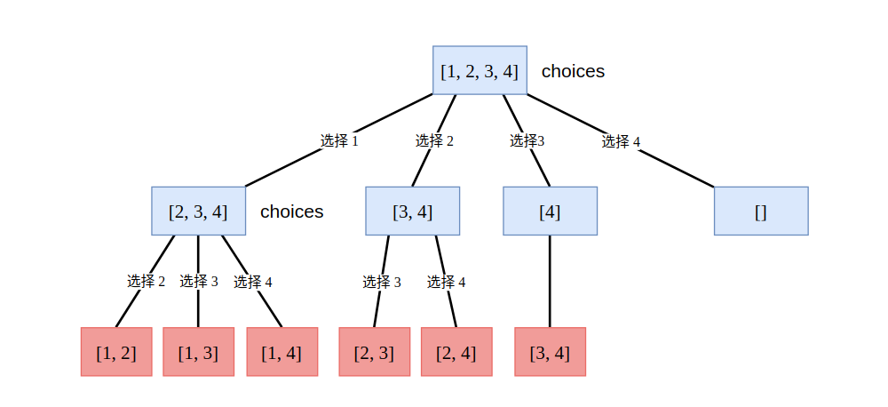
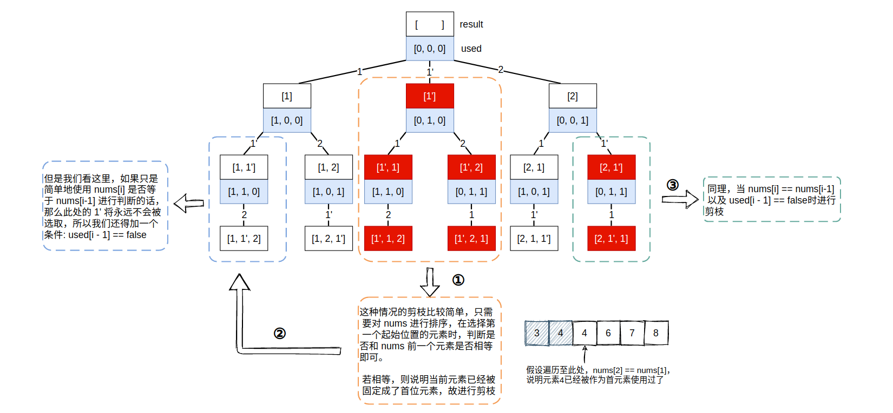
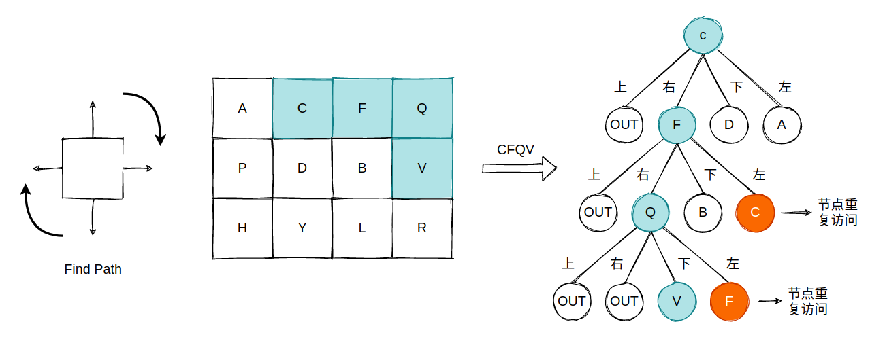
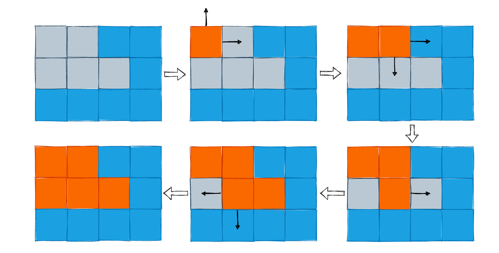
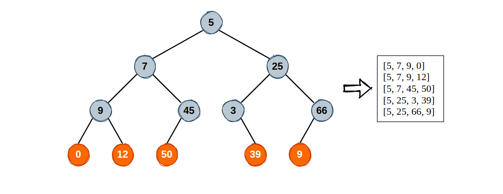

## 回溯与剪枝: 《明日边缘》or 《源代码》

回溯法在 wikipedia 中被解释成一种“暴力搜索法”，相较“暴力”一词我更喜欢称之为“枚举”，枚举一个空间中所有的搜索路径。

回溯法采用试错的思想，逐步地解决一个问题，就好像我们小时候玩儿的走迷宫一样。我们从一个点出发，选择迷宫中的一条路向前行进，当遇到死胡同时再回到当初进行选择的地方，再往下走，直到将整个迷宫搜索完毕或者是找到一条通往终点的路径。

人生是由多个选择所构成的，我们有时候会忍不住的去假设如果当初我们没有做那个选择现在会是怎么样。人生无法重来，但是回溯法却可以。

在具体的回溯算法实现中，有两个非常重要的事物：已选择的路径和下一次能够进行选择的路径。这也非常贴近现实，毕竟我们自身的存在就可以认为是“已选择的路径”，立足于当下，我们能够做出的所有选择就是剩余的选择路径。

回溯算法有一个非常通用的框架，具体表现为:

```cpp
// 其中 choices 表示我们能做出的选择，selected 表示已选择的路径
void backtracking(vecotr<int> choices, vector<int> selected) {

    if (end) return;
    
    for choice in choices {
        // 进行选择
        selected.push_back(choice);
        
        // 继续前行
        backtracking(choices, selected);
        
        // 撤销选择
        selectd.pop_back();
    }
}
```

下面使用一道非常经典的排列问题来更加具体的描述回溯法，题目如下:


> 给定一个没有重复数字的序列，返回其所有可能的全排列

即求解给定数组中元素的所有排列，根据高中数学知识，n 个元素所有的排列个数为 n!，只不过题目需要输出所有的具体排列方式。

思考方式也比较简单，以 `[1, 2, 3]` 的全排列为例。首先我们先固定第一个元素，来看剩下的元素有哪些排列方式，很明显地，只有两种: `[2, 3]` 和 `[3, 2]`，所以以 1 开始的全部排列为 `[1, 2, 3]`, `[1, 3, 2]`。接着我们固定第二个元素，来看剩下的 `[1, 3]` 有哪些排列方式，答案是 `[1, 3]` 和 `[3, 1]`，因此以 2 为起始的全部排列为 `[2, 1, 3]` 和 `[2, 3, 1]`。以此类推，直到输出数组最后一个元素的全排列，整个搜索过程结束。

如果以一棵树来表示的话，就是下面的样子:


左图中描述了确切的选择过程，而右图中则描述了选择以及回溯(撤销选择)的过程。现在，我们可以使用代码来解决这个全排列问题了。

```cpp
class Solution {

    // 保存每一个排列结果
    vector<vector<int>> result;

    // 在每次的选择中，我们不能够再选择哪些已经选择过的元素了
    // 所以我们使用一个数组来记录已经选择过的元素索引
    // visted[i] = true 则表示第 i 个元素已经被选择
    vector<bool> visted;

    // 其中 selected 表示我们已经选择过的路径
    void backtracking(vector<int>& nums, vector<int> &selected) {
        if (selected.size() == nums.size()) {
            result.push_back(selected);
            return ;
        }

        for (int i = 0; i < nums.size(); i++) {
            
            if (visted[i])
                continue;
            
            // 做出选择
            selected.push_back(nums[i]);
            visted[i] = true;

            backtracking(nums, selected);   // 怀揣着当前选择进行下一次选择

            // 撤销刚才的选择
            visted[i] = false;
            selected.pop_back();
        }
        return ;
    }

public:
    vector<vector<int>> permute(vector<int>& nums) {

        assert(nums.size() != 0);

        // 在最开始，没有元素被访问过, 所以全部初始化为 false
        visted = vector<bool>(nums.size(), false);

        vector<int> selected;
        backtracking(nums, selected);

        return result;
    }
};
```


### 1. 组合问题

除了排列问题以外，组合问题是回溯法的另外一处后花园。对于排列而言，需要元素的排列顺序，例如 `[1, 2, 3]` 和 `[1, 3, 2]` 属于不同的排列。而组合问题则不关心元素的排列顺序，`[1, 2]` 和 `[2, 1]` 为同一个组合。

在组合问题中，使用回溯法的整体框架与排列问题几乎一模一样，唯一有差别的就是我们**如何定义剩余的可选路径**。

leetcode 中的 [77. Combinations](https://leetcode.com/problems/combinations/) 就是一道非常经典的组合问题。

> 给定两个整数 n 和 k，返回 1 ...n 中所有可能的 k 个数的组合

<!--  -->


可以看到，组合问题和排列问题唯一的差别就在于当我们选择了某一个元素之后，在这之前的所有元素均不可被选择，这是因为前面的元素一定已经生成了对应的组合。

```cpp
class Solution {
private:
    vector<vector<int>> result;

    // 从 start...n 中求解组合问题, selected为已选择路径
    void combination(int n, int k, int start, vector<int> &selected) {

        if (selected.size() == k) {
            result.push_back(selected);
            return;
        }

        for (int i = start; i <= n - (k - selected.size()) + 1; i++) {
            selected.push_back(i);                  // 选择
            combination(n, k, i + 1, selected);
            selected.pop_back();                    // 撤销选择
        }
        return;
    }
public:
    vector<vector<int>> combine(int n, int k) {

        assert(n > 0 && k > 0 && k <= n);

        vector<int> selected;
        combination(n , k, 1, selected);

        return result;
    }
};
```

注意到在 `for` 循环中我们并没有让 `i` 自增到 `n`，而是自增到 `n - (k - selected.size()) + 1`。这是因为当我们已经选择了 `selected.size()` 这么多个元素之后，还剩下 `k - selected.size()` 这么多个元素需要被选择。也就是说，在 `[i...n]` 之间必须要存在 `k - selected.size()` 这么多个元素，所以我们只需要自增到剩下的元素区间无法满足选取 `k - selected.size()` 这么多个元素数量即可。


### 3. 剪枝

剪枝听起来是一个很高大上的技巧，但实际上剪枝的概念非常简单，就是让整个递归过程减少无效的计算。在上面的组合问题一解中，我们仅使变量 `i` 自增到 `n - (k - selected.size()) + 1`，剔除了许多无效的计算，这就是一种剪枝。

一个比较经典的剪枝问题就是求拥有重复元素的全排列问题，在 [47. Permutations II](https://leetcode.com/problems/permutations-ii/) 有具体描述。

```bash
Input: nums = [1,1,2]
Output: [[1, 1, 2], [1, 2, 1], [2, 1, 1]]
```

一种解决方案就是不管数组中有没有重复元素，按照原有的流程将所有的排列输出，然后再进行排序去重，这一定是一个可行解。但是，既然我们需要对结果进行排序，为什么不对原有的数组进行排序，然后在回溯的过程中进行去重呢? 

<!--  -->


如上图所示，我们首先对原有数组进行排序。而后在每一次选择时都去判断当前元素是否和前一个元素相同，以及在相同的条件下，前一个元素是否被使用。若结果为 `true`，将跳过当前元素。

因篇幅限制，这里不再贴源码，感兴趣的小伙伴可以移步: 

> https://github.com/SmartKeyerror/Snorlax/blob/master/leetcode/prune/047-Permutations-II.cpp

同时，剪枝相关的话题整理在:

> https://github.com/SmartKeyerror/Snorlax/tree/master/leetcode/prune


### 4. 二维平面中的回溯

在前面的问题中回溯都在一维数组中进行，在二维数组中回溯法同样有效，并且能够解决的问题也更加有趣。例如 N-皇后问题，求解数独，以及我们开篇就提到的迷宫问题。

在 leetcode 中，关于二维平面中的回溯问题不是很多，以 [79. Word Search](https://leetcode.com/problems/word-search/) 为例:

> 在一个 m * n 的字母板中，寻找是否存在某一个单词 word，字母和字母之间可以水平或者垂直连接。

下面给出分析图示:

<!--  -->


选择树，或者说决策树与排列、组合问题并没有什么不同，只不过选择的方向固定为上、下、左、右。同时我们的 `visited` 数组也需要设置成一个二维数组。

题解:

> https://github.com/SmartKeyerror/Snorlax/blob/master/leetcode/backtracking/079-Word-Search.cpp

### 5. Flood fill

Flood fill 算法又称为漫水填充算法，在扫雷游戏中用于计算需要被清除的区域。

<div align=center></div>

上图为 wikipedia 对 Flood fill 的 GIF 示例。其中白色部分我们需要对其进行着色，黑色部分为着色的边界，从中心点开始向下滴一滴墨水，墨水所散开的区域就是我们需要着色的区域。

在 [200. Number of Islands](https://leetcode.com/problems/number-of-islands/) 该题中我们就可以使用 Flood fill 算法来完成。相较于排列和组合问题有着明显的递归终止条件，Flood fill 算法则需要确保所有选择过的元素的 4 个方向上的元素均被访问并标记过，除非遇到边界。

<!--  -->


题解:
> https://github.com/SmartKeyerror/Snorlax/blob/master/leetcode/depth-first-search/200-Number-of-Islands.cpp

不过，Flood fill 严格意义上来来说应该是一种深度优先遍历(DFS)算法，但是说是回溯法的一种也没太大毛病。


### 6. 二叉树中的回溯

有时候我们会默认为回溯法的选择路径是一棵多叉树，而忽略了最基本的情况: 二叉树。相较于二叉树的遍历，回溯在其中的应用并不是很多，一个比较典型的问题就是输出二叉树从根节点到所有叶子节点的路径，例如:

<!--  -->


代码也非常简单:

```cpp
struct TreeNode {
    int val;
    TreeNode *left;
    TreeNode *right;
};

vector<vector<int>> result;

void treePaths(TreeNode *root, vector<int> &selected) {
    if (root == NULL)
        return ;
    
    selected.push_back(root->val);

    if (root->left == nullptr && root->right == nullptr) {
        result.push_back(selected);
        selected.pop_back();
        return ;
    }

    treePaths(root->left, selected);
    treePaths(root->right, selected);

    selected.pop_back();
}
```

在 [Path Sum II](https://leetcode.com/problems/path-sum-ii/)，[Sum Root to Leaf Numbers](https://leetcode.com/problems/sum-root-to-leaf-numbers/)，[Smallest String Starting From Leaf](https://leetcode.com/problems/smallest-string-starting-from-leaf/) 这些问题中都涉及到了二叉树的回溯。


### 7. 小结

回溯法是一种相当实用的算法，思想也非常简单，许多问题都可以使用回溯的方式来“暴力”解决，其中就包括数独、图着色、N-Queens 等非常有意思的问题。在具体的实现过程中，可以使用剪枝这一技巧来提高算法的运行效率，除去多余的、重复的、不必要的计算。

leetcode 关于回溯这一话题的全部题目:

> https://leetcode.com/tag/backtracking/

我个人对其中一些题目的解:

> https://github.com/SmartKeyerror/Snorlax/tree/master/leetcode/backtracking
https://github.com/SmartKeyerror/Snorlax/tree/master/leetcode/prune


<div align=center></div>
