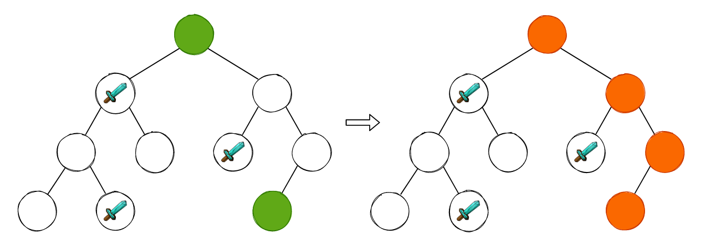
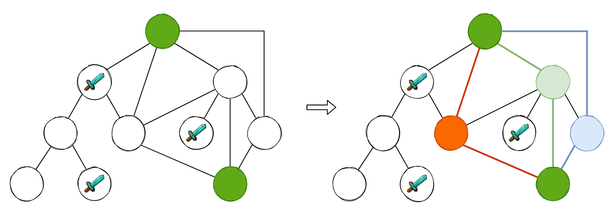
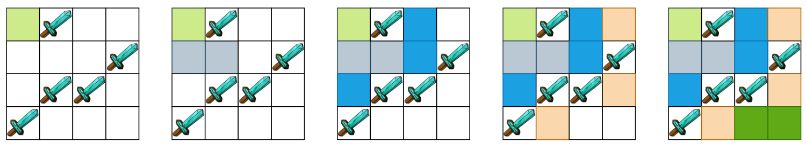
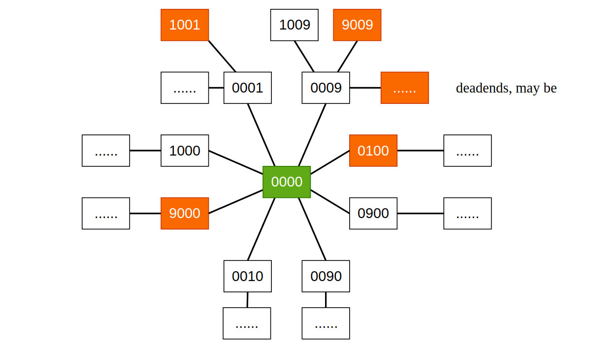
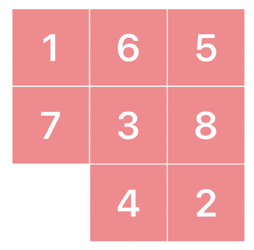

## BFS与图论问题建模

BFS（Breadth-first Search），即广度优先遍历，在二叉树相关领域的题目中可能会经常碰到，Leetcode 中也有非常多关于二叉树层序遍历的问题，例如 

- [199. Binary Tree Right Side View](https://leetcode.com/problems/binary-tree-right-side-view/)
- [102. Binary Tree Level Order Traversal](https://leetcode.com/problems/binary-tree-level-order-traversal/)
- [513. Find Bottom Left Tree Value](https://leetcode.com/problems/find-bottom-left-tree-value/)
- [515. Find Largest Value in Each Tree Row](https://leetcode.com/problems/find-largest-value-in-each-tree-row/)
- ......

这些问题都可以借助队列这一数据结构使用层序遍历的方式解决。但是，这些问题并没有揭示 BFS 的一个非常重要的特性: **无权图最短路径求解方式**。假定给你一棵二叉树，二叉树中部分节点中有专门“刀人”的邪恶机器人，再给定一个终止节点，问在该二叉树中是否存在一条从根节点到终止节点的最短路径。



如上图所示，起点和终点使用绿色进行标识，我们也能够非常轻松的找到一条能到达终止节点的路径。在一棵二叉树中，只要能找到一条路径，那么它一定就是最短路径，因为再也没有其它路径能够到达该节点了。但是，一旦我们将这棵二叉树添加几条边，将其转换成一张图的话，事情就变得微妙了起来:



如上图所示，我们可以找到 3 条从根节点到终止节点的最短路径，也就是无权图的最短路径。那么为什么 BFS 就天然地能够解决无权图最短路径问题呢? 这是因为 BFS 的遍历过程中，是一层一层的进行遍历的，就像剥洋葱一样。当我们遍历到某一层找到了终止节点时，那么其余的最短路径一定在这一层，而不是下一层。这就好比我们下楼梯找东西，我们明明在第 4 层就找到了我们想要的，那么绝对不会再去第 3 层寻找。


### 1. BFS 的基本框架

相较于二叉树的层序遍历而言，图的 BFS 没有什么太大的区别，都需要借助队列这一数据结构实现，只不过因为图的 BFS 过程中可能会出现对节点重复访问的问题，所以我们需要添加一个 `visited` 数组，来帮助我们标记哪些已经遍历过的节点，从而避免重复访问:

```cpp
void bfs(int src, int dst) {
	vector<bool> visited;
	queue<int> levelQueue;

	visited[src] = true;
	levelQueue.push(src);

	while(!levelQueue.empty()) {
		int size = levelQueue.size();

        // 非常实用的小技巧，取出每一层的数据
		for (int i = 0; i < size; i++) {
			int current = levelQueue.front();
			levelQueue.pop();

			for (int neighbor: neighbors(current)) {
				if (visited[neighbor]) continue;
				visited[neighbor] = true;
				// do something for child
				levelQueue.push(child);
			}
		}
	}
}
```

在上面的伪代码中，`visited` 数组使用 `bool` 型表示，我们同样也可以使用 `int` 来表示。例如 `-1` 则表示当前节点未曾访问过，大于 `-1` 则表示当前节点距离 `src` 节点的距离。如此一来我们不仅使用 `visited` 表示了节点是否被访问，同时也记录了每一个节点到 `src` 节点的距离，一举两得。


### 2. 直白的 BFS 问题

在文章开头所陈列的 Leetcode 上关于二叉树的 BFS 问题，个人更倾向于将其归类为“直白的 BFS 问题”，从题目描述中我们就能够很轻易的看出需要使用 BFS 进行求解。

例如 [1091. Shortest Path in Binary Matrix](https://leetcode.com/problems/shortest-path-in-binary-matrix/)，求仅包含 `0` 和 `1` 的二维矩阵中从左上角到右下角的最短路径距离，其中 `1` 表示障碍物，`0` 表示可行路径。这道题乍一看和 [63. Unique Paths II](https://leetcode.com/problems/unique-paths-ii/) 非常之类似，但是和 63 号问题不同的是，1091 号问题里面的“Robot”有 8 个前进方向，并且使用 DP 求解的时间复杂度必然是 O(n^2)，而使用 BFS 求解则只需 O(V+E) 的时间复杂度，其中 V 为顶点个数，E 为边的个数。BFS 的过程如下图所示:



求解过程如下:

```cpp
class Solution {
private:
    int m, n;
    vector<vector<int>> delta = {{-1, 0}, {-1, 1}, {0, 1}, {1, 1}, {1, 0}, {1, -1}, {0, -1}, {-1, -1}};
    bool inGrid(int x, int y) {
        return x >= 0 && x < m && y >= 0 && y < n;
    }
public:
    int shortestPathBinaryMatrix(vector<vector<int>>& grid) {
        m = grid.size(), n = grid[0].size();

        if (grid[0][0] == 1 || grid[m-1][n-1] == 1) return -1;
        if (m == 1 && n == 1) return 1;

        queue<pair<int, int>> levelQueue;
        vector<vector<int>> visited(m, vector<int>(n, -1));

        levelQueue.push(make_pair(0, 0));
        visited[0][0] = 1;

        while (!levelQueue.empty()) {
            pair<int, int> current = levelQueue.front();
            levelQueue.pop();

            int startx = current.first, starty = current.second;
            for (int i = 0; i < 8; i++) {
                int x = startx + delta[i][0], y = starty + delta[i][1];
                if (inGrid(x, y) && grid[x][y] == 0 && visited[x][y] == -1) {
                    levelQueue.push(make_pair(x, y));
                    visited[x][y] = visited[startx][starty] + 1;
                    if (x == m - 1 && y == n - 1) return visited[x][y];
                }
            }
        }
        return -1;
    }
};
```

### 3. 图论模型建模——状态转移

在 DP 领域中，有一个非常重要的概念: 状态转移方程，当我们面对一个 DP 问题的时候，只要找到了状态转移方程，基本上我们就认为已经解出了这个问题。在图论建模过程中，也存在状态转移这么个东西，只不过没有状态转移方程。

[752. Open the Lock](https://leetcode.com/problems/open-the-lock/) 要求我们求打开初始化状态为 `"0000"` 的密码锁，并且每次只能对 4 位密码锁中的一位往前拨或者是往后拨，同时存在一组 `deadends`，当我们的密码锁被拨到这些数字组合时，该密码锁将再也不能打开，求打开该密码锁所需最少的操作次数。

可以看到，这道题目就只是给了我们一个初始状态和一组“死亡数字”，既没有能够在 8 方向上移动的 Robot，也没有邻接矩阵、邻接表等能够代表图的东西。但是我们知道初始状态和结束状态，假设 `target` 为 `"1234"`，那么我们就需要找到一条“路径”，从 `"0000"` 到 `"1234"`，并且在该路径上不包含死亡数字。

对于 `"0000"` 来说，我们第一次的操作有 8 种选择: 选择哪一位，以及往前拨还是往后拨，如此一来，我们就可以得到:

- 往前拨: `"1000"`，`"0100"`, `"0010"`，`"0001"`
- 往后拨: `"9000"`，`"0900"`，`"0090"`，`"0009"`

这样的一共 8 种状态，而得到的这 8 种状态每一种又可以得到 8 种状态，只不过 `"0000"` 需要从中剔除，所以是 7 种。如此一来我们就得到了一张图。为什么不是多叉树呢? 因为 `"0000"` 能到 `"1000"`，`"1000"` 也能到达 `"0000"`。



**这其实就是自身状态的表达，每一个状态（例如`"1000"`、`"0009"`）都是图中的一个顶点，从初始的状态一步一步地到达另外一个状态。本质上仍然可以看做是“Robot千辛万苦寻找家人”的问题**。

题解可参考:

> https://github.com/SmartKeyerror/Snorlax/blob/master/leetcode/bfs/752-Open-the-Lock.cpp

我们再来看另外一个智力问题:

> 有两个水桶，一个容量为 9 升，另一个容量为 4 升，如何操作能得到 6 升水?

依然使用状态转移对这个问题进行建模，我们有两个桶，所以初始状态可以表示为 `"00"`，最终我们要得到 6 升水，那么结束状态可以表示为 `"6x"` 或者是 `"x6"`，`x` 表示另一个桶有多少水我们并不关心，只要有一个桶里面有 6 升水就好了。

我们可以像上面那道打开密码锁一样，使用字符串的方式来表示状态，但是我们也可以使用 `int` 来表示。对于两个桶，使用 `x` 表示 9 升桶所容纳的水，`y` 则表示 4 升桶所容纳的水，那么状态即为 `10x + y`，一个用十位表示，另一个则用个位表示。如果有 3 个桶 `x`、`y`、`z` 的话，那么就可以使用 `100x+10y+z` 来进行表示。现在来看状态是如何转移的，假设当前两个桶的水量为 `x`、`y`。

最简单的两种操作就是将其中一个桶装满，或者是将其中一个桶中的水倒掉，那么状态可以表示为:

- 装满其中一个桶: `9 * 10 + y`（装满 9 升桶），`10x + 4`（装满 4 升桶）
- 倒掉其中一个桶: `0 * 10 + y`（倒掉 9 升桶），`10x + 0`（倒掉 4 升桶）

另外一个操作就是将一个桶的水倒向另外一个桶内，情况稍微复杂一些:

- 将 9 升桶的水倒进 4 升桶: `10 * (9 - min(x, 4 - y)) + (y + min(x, 4 - y))`
- 将 4 升桶的水倒进 9 升桶: `10 * (x + min(y, 9 - x)) + (y - min(y, 9 - x))`

正如同状态转移方程之于 DP 问题一样，当我们找到全部的状态转移之后，就已经建立了 BFS 的图论模型，剩下的就只是按部就班的使用 BFS 求解即可。

```cpp
int bucketPuzzle() {
    queue<int> levelQueue;

    // 使用 hashmap 判定是否访问过, value 为操作次数
    unordered_map<int, int> visited;     

    levelQueue.push(0);
    visited[0] = 0;

    while (!levelQueue.empty()) {
        int current = levelQueue.front();
        levelQueue.pop();

        int x = current / 10, y = current % 10;

        vector<int> nextStatuses;

        nextStatuses.push_back(9 * 10 + y);
        nextStatuses.push_back(x * 10 + 4);

        nextStatuses.push_back(0 * 10 + y);
        nextStatuses.push_back(x * 10 + 0);

        nextStatuses.push_back(10 * (9 - min(x, 4 - y)) + (y + min(x, 4 - y)));
        nextStatuses.push_back(10 * (x + min(y, 9 - x)) + (y - min(y, 9 - x)));

        for (int next: nextStatuses) {
            if (!visited.count(next)) {
                levelQueue.push(next);
                visited[next] = visited[current] + 1;

                if (next / 10 == 6 || next % 10 == 6)
                    return visited[next];
            }
        }
    }
    return -1;
}
```

如果需要输出详细的操作过程的话，添加一个 `previous` 数组即可，在数组中记录当前状态是从哪个状态而来的，而后遍历该数组逆序输出即可。

完整代码可参考:

> https://github.com/SmartKeyerror/Snorlax/blob/master/leetcode/bfs/BucketPuzzle.cpp

### 4. 小结

BFS 由于天然地存在“无权图最短路径问题求解”这一特性，被广泛地应用在经典人工智能和搜索领域，包括我们所描述的水桶问题、打开密码锁问题，以及未提及的其它经典人工智能问题，本质上就是路径的搜索。

很多时候，可能我们并不能一眼看出某一个题目需要使用图论模型进行建模，而后使用 BFS 进行处理。但是一般来说，当题目中出现“最短”、“最少”、“最近”等关键词时，我们就可能需要考虑是否能够建立状态转移的模型，从而使用 BFS 进行求解。



