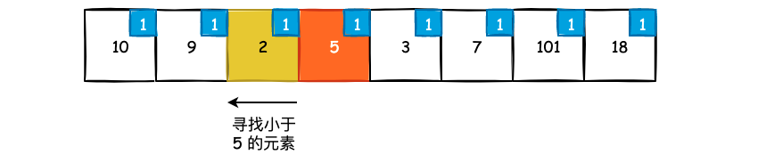

## 二分搜索

二分搜索可能是我们日常开发中使用的最多的算法之一了，不管是 Redis 中 `intset` 的查找和插入，还是 MySQL 在 内存的 page 中检索用户的某一条数据，都是使用二分搜索来实现的。二分搜索算法本身的逻辑非常简单: 每次选择不符合要求的一半数据进行丢弃，在剩下的一半数据中继续搜索。但是，接下来我们将会看到，原本简单的二分搜索可能并不简单。

### 1. 二分搜索基础

#### 1.1 基本的二分搜索实现

以最经典的二分搜索算法为例，在一个有序数组中寻找某一个 `target` 是否存在:


假如我们需要在上述有序数组中寻找 `target=6` 的话，一个最简单的方式就是从头遍历整个数组，遇到 ` target` 直接返回，这种方式的时间复杂度为 `O(n)`。

另一个方式就是使用二分搜索，首先来看整个数组的中间元素和 `target` 的关系，`nums` 数组的中间元素为 `(7-0)/2`，也就是 `nums[3]`。而 `nums[3]` 的值为 15，要比 `target=6` 还要大。由于 `nums` 数组是有序的，那么 `nums[3]` 以后的元素一定会大于等于 15，同时也肯定比 6 要大，因此我们可以直接“丢弃”掉这部分的数组元素不看，然后在 `[0, 2]` 这一闭区间进行查找。


此时我们让 `right` 指针指向 `mid` 的前一个元素，再重复上述的过程。而这次的 `mid` 值为 `(2-0)/2=1`，而 `nums[1]` 就恰好是 6，也就是说我们找到了 `target`:

```cpp
//  平均时间复杂度 O(logn)
int binary_search(vector<int>& nums, int target) {
    // 在 [left, right] 这一闭区间进行查找
    int left = 0, right = nums.size() - 1;

    while (left <= right) {
        int mid = left + (right - left) / 2;
        
        // 找了 target，直接返回
        if (nums[mid] == target) return mid;
        
        // target 比 nums[mid] 还要大，所以应该在右侧进行查找
        else if (nums[mid] < target) left = mid + 1;
        
        // target 比 nums[mid] 还要小，所以应该在左侧进行查找
        else right = mid - 1;
    }
    return -1;
}
```

理解了基础的二分搜索之后，我们就可以尝试解答 [35. Search Insert Position](https://leetcode.com/problems/search-insert-position/) 这个问题了。题目给了一个不包含重复元素的并且有序的 `nums` 数组，并给定了一个 `target`，存在以下两种情况:

- 若 `target` 在 `nums` 数组中，那么返回 `target` 所在的索引值
- 若 `target` 不在 `nums` 数组中，那么返回 `target` 插入 `nums` 数组中并且保证其有序的索引位置

```bash
Input: nums = [1,3,5,6], target = 2
Output: 1
Explanation: 元素 2 并不在 nums 数组中，因此我们需要找到 2 的插入位置。当 2 插入到索引 2，形成的 [1, 2, 3, 4, 6] 数组仍然有序，所以返回 2。
```

这个问题我们只需要将上面的 `binary_search` 函数修改一行即可完成解答:

```cpp
int binary_search(vector<int>& nums, int target) {
    int left = 0, right = nums.size() - 1;

    while (left <= right) {
        int mid = left + (right - left) / 2;
        if (nums[mid] == target) return mid;
        else if (nums[mid] < target) left = mid + 1;
        else right = mid - 1;
    }
    return left;        // 只需要修改这一行即可
}
```

当 `while (left <= right)` 循环退出时，要么 `left > right`，要么 `left < right`，那么为什么返回 `left` 就是 `target` 的插入位置呢?

我们用一个稍微简单的例子来模拟上述代码的执行过程，`nums` 数组和 `target` 如下图所示:


可以看到，`nums[2]` 要小于 `target`，所以我们让 `left` 指针指向 `mid` 的下一个位置，也就是 `left = 3`:


此时 `left` 和 `mid` 指向相同的元素，我们继续进行二分查找。由于 `nums[3]` 的值要比 14 还要大，所以我们应该让 `right` 指针向左移动，即指向 `mid` 的前一个位置:


此时 `right > left`，循环结束，可以看到，`left` 指针所指向的位置就恰好是 14 应该插入的位置，因此我们返回 `left` 所在索引即可。

上面的例子可能过于具体，我们使用一个更为抽象的方式来看这件事情。不管我们的输入数据是怎样的，假如 `target` 不在 `nums` 数组中，那么退出 `while` 循环之前的最后一刻一定是下面的 3 种情况之一:


对于这 3 种情况而言，如果 `X < target`，按照二分搜索的流程，我们应该在 `[mid+1, right]` 这一区间进行搜索，也就是执行 `left = mid + 1`，执行完状态变化如下:


由于 `target` 要小于 `X`，因此 `X` 的下一个位置其实就是 `target` 所要插入的位置，也就是 `left` 指针所指向的位置。

对于 `X > target` 的情况也是类似的，此时应该在 `[left, mid-1]` 处进行搜索，也就是执行 `right = mid - 1`。而从基本情况图中我们可以看到，此时 `X` 的位置就是 `target` 所要插入的位置，也就是 `left` 指针所指的位置。

#### 1.2 二分搜索的变体

接下来看一个稍微复杂问题，给定一个有序数组 `nums`，其中的元素可能会有重复，请找出 `target` 第一次出现的位置，如果 `nums` 数组中不存在 `target`，请返回 -1。

```bash
Input: nums = [1,3,3,3,4,4,5,6,6,7], target = 3
Output: 1
Explanation: 元素 3 第一次出现的索引为 1

Input: nums = [1,3,3,3,4,4,5,6,6,7], target = 0
Output: -1
Explanation: 元素 0 并不在 nums 数组中，因此返回 -1
```

现在题目不仅要求我们找到该元素，同时还需要找到该元素第一次出现的位置，那么此时我们就需要在原有的 `binary_search` 方法上进行修改了，关键点就在于如何更新 `left`、以及 `right` 指针，以及到底该在什么时候更新。当我们对一个问题没有思路的时候，模拟程序的运行并提取规律是一个最好的办法。


假设我们要在上图数组中寻找元素 3 首次出现的位置，初始化时 `nums[mid]` 的值已经为 3 了。那么问题来了，我们到底是向右查找，还是向左查找呢？

**这时候其实我们可以直接进行判断 `mid` 是不是最终的结果，以判断我们到底该往左边搜索还是往右边搜索。**判断过程其实非常简单，如果此时 `mid == 0` 或者是 `nums[mid-1] != nums[mid]` ，那么 `mid` 就是我们要找的位置，直接返回即可。如果 `mid != 0` 并且 `nums[mid-1] == nums[mid]` 的话，也就是上图所示的情况，那么 `mid` 一定不是我们最终想要的结果，直接丢弃不看，所以我们让 `right` 指针指向 `mid` 的前一个位置继续搜索。

因此，我们只需要改动 `nums[mid] == target` 下的代码即可解决这道题目:

```cpp
int findFirstIndex(vector<int>& nums, int target) {
    int left = 0, right = nums.size() - 1;
    
    while (left <= right) {
        int mid = left + (right - left) / 2;

        // 相等的情况我们需要判断 mid 是否就是第一个出现的位置
        if (nums[mid] == target) {
            // mid 是第一个元素，或者是 mid 的前一个元素不等于 mid
            if (mid == 0 || nums[mid-1] != nums[mid]) return mid;
            // 此时 mid 一定不是第一个位置，所以我们向左继续搜索
            else right = mid - 1;
        }
        else if (nums[mid] > target) right = mid - 1;
        else left = mid + 1;
    }
    return -1;
}
```

这种写法和我在论坛上看到的写法有着很大的差异，大佬们的写法:

```cpp
int findFirstIndex(vector<int>& nums, int target) {
    int left = 0, right = nums.size() - 1;
    
    while (left <= right) {
        int mid = left + (right - left) / 2;
        if (nums[mid] >= target) right = mid - 1;
        else left = mid + 1;
    }
    if (left < nums.size() && nums[left] == target) return left;
    return -1;
}
```

后者更为的简洁和优雅，但是对我个人而言，这种写法着实有些烧脑，我需要话一些时间才能明白这段代码到底在做什么。第一种方法虽然很啰嗦，但是我们能够很快的理解它到底在做什么，而且无需记忆，只需要简单的进行分析就可以得到答案。并且，如果题目要求我们找到最后一个等于 `target` 的元素位置的话，只需要花费一点点的心智就可以得到答案:

```cpp
int findLastIndex(vector<int>& nums, int target) {

    int left = 0, right = nums.size() - 1;
    
    while (left <= right) {
        int mid = left + (right - left) / 2;

        // 相等的情况我们需要判断 mid 是否就是最后一个出现的位置
        if (nums[mid] == target) {
            // mid 是最后一个元素，或者是 mid 的下一个元素不等于 mid
            if (mid == nums.size() - 1 || nums[mid+1] != nums[mid]) return mid;
            // 此时 mid 一定不是最后一个位置，所以我们向右继续搜索
            else left = mid + 1;
        }

        else if (nums[mid] > target) right = mid - 1;
        else left = mid + 1;
    }
    return -1;
}
```

通过 `findFirstIndex` 和 `findLastIndex` 这两个函数，我们就可以尝试去解答 [34. Find First and Last Position of Element in Sorted Array](https://leetcode.com/problems/find-first-and-last-position-of-element-in-sorted-array/) 这个问题了:

```cpp
class Solution {
public:
    vector<int> searchRange(vector<int>& nums, int target) {
        int first = findFirstIndex(nums, target);
        int last = findLastIndex(nums, target);
        return {first, last};
    }
};
```

接下来我们再看二分搜索的第三种变体，**查找第一个大于等于给定值的元素**，也就是 C++ 中的 `lower_bound()` 函数所实现的内容。此时，我们仍然可以使用上述的策略来完成，也就是在循环中来判断当前 `mid` 是否是我们要找的元素:

```cpp
int lower_bound(vector<int>& nums, int target) {
    int left = 0, right = nums.size() - 1;


    while (left <= right) {
        int mid = left + (right - left) / 2;

        // 此时我们就需要看 mid 是不是我们要找的元素
        if (nums[mid] >= target) {
            // 假如 nums 为 [1, 2, 3, 4, 5]，arget = 3，并且此时 mid = 2，那么 mid 就是结果
            if (mid == 0 || nums[mid-1] < target) return mid;
            // 否则，我们需要向左半部分中继续查找
            else right = mid - 1;
        }
        else left = mid + 1;
    }

    return -1;
}
```

如果 `nums[mid]` 比 `target` 还要小的话，那没什么好说的，结果必然在 `[mid+1, right]` 之间，所以我们更新 `left` 为 `mid + 1`。

如果 `nums[mid]` 要大于等于 `target` 的话，我们就需要判断当前 `mid` 是不是我们要查找的元素，也就是看看 `nums[mid-1]` 是不是要比 `target` 还要小，如果是的话那么 `mid` 就是答案。同时我们也需要判断 `mid` 是否等于 0。否则，`mid` 之前还有比 `target` 更大的元素，我们应该向左半部分继续查找。

那么如果我们需要**找到第一个大于给定值的元素**呢?也就是实现 C++ 中的 `upper_bound` 方法。也很简单，只需要将判断条件稍微修改即可:

```cpp
int lower_bound(vector<int>& nums, int target) {
    int left = 0, right = nums.size() - 1;


    while (left <= right) {
        int mid = left + (right - left) / 2;

        // 此时我们就需要看 mid 是不是我们要找的元素
        if (nums[mid] > target) {
            // 假如 nums 为 [1, 2, 3, 4, 5]，arget = 3，并且此时 mid = 3，那么 mid 就是结果
            if (mid == 0 || nums[mid-1] <= target) return mid;
            // 否则，我们需要向左半部分中继续查找
            else right = mid - 1;
        }
        else left = mid + 1;
    }

    return -1;
}
```

### 2. 潜藏的二分搜索

LeetCode 中被打上 Binary Search Tag 的题目一共有 114 道，能够第一眼就看出来需要使用二分搜索的题目其实并不多，大概在 20 道题左右。剩下的题目需要我们一步一步的进行分析，也就是**首先使用暴力解和次优解实现，然后从次优解中再进行优化，最终得到可以使用二分搜索的解**。

[74. Search a 2D Matrix](https://leetcode.com/problems/search-a-2d-matrix/)，在一个 m * n 的有序矩阵中查找特定的元素。`matrix` 这一矩阵的每一行都按照升序进行排列，并且下一行的第一个元素要大于上一行的最后一个元素。也就是说，我们将二维矩阵按照行展开的话，将会得到一个有序数组。

```bash
Input: matrix = [[1, 3, 5, 7],
                 [10,11,16,20],
                 [23,30,34,60]], target = 3
Output: true
```

这道题题目已经暗示的非常明显了，“有序矩阵”，“查找元素”，直接上二分搜索。一个最直观的做法就是首先确定元素在哪一行，然后再确定在哪一列，执行两次二分搜索:

```cpp
class Solution {
public:
    bool searchMatrix(vector<vector<int>>& matrix, int target) {

        if (matrix.size() == 0 || matrix[0].size() == 0) return false;

        // 搜索行
        int left = 0, right = matrix.size() - 1, mid;
        while (left <= right) {
            mid = left + (right - left) / 2;
            
            // 如果比当前行的最大元素还要大的话，那么 target 在矩阵的下半部分
            if (target > matrix[mid].back()) left = mid + 1;
            
            // 如果比当前行的最小元素还要小的话，那么 target 在矩阵的上半部分
            else if(target < matrix[mid].front()) right = mid - 1;
            
            // 此时 matrix[mid].front() <= target <= matrix[mid].back()
            // target 如果存在的话，那么就在这行里面了
            else break;
        }

        int row = mid;
        
        if (matrix[row][0] == target) return true;

        // 搜索列
        left = 0, right = matrix[mid].size() - 1;
        while (left <= right) {
            mid = left + (right - left) / 2;
            if (matrix[row][mid] == target) return true;
            else if (matrix[row][mid] > target) right = mid - 1;
            else left = mid + 1;
        }
        return false;
    }
};
```

另外一个方式就是使用线性映射，将二维数组映射到一维空间上，然后直接在这个一维空间上进行二分搜索。这里涉及到一个二维矩阵的常见处理技巧，我们可以像对待一维数组那样来对待二维数组:


```cpp
class Solution {
public:
    bool searchMatrix(vector<vector<int>>& matrix, int target) {
        int m = matrix.size(), n = matrix[0].size();

        int total = m * n;

        int left = 0, right = total - 1;

        while (left <= right) {
            int mid = left + (right - left) / 2;
            
            // 映射
            int current = matrix[mid/n][mid%n];

            if (current == target) return true;
            else if (current > target) right = mid - 1;
            else left = mid + 1;
        }
        return false;
    }      
};
```


[300. Longest Increasing Subsequence](https://leetcode.com/problems/longest-increasing-subsequence/)，最长上升子序列是一个非常经典的 DP 问题，题目要求我们在一个数组中找到严格递增的最长子序列。

```bash
Input: nums = [10,9,2,5,3,7,101,18]
Output: 4
Explanation: 最长上升子序列为 [2,3,7,101], 其长度为 4

Input: nums = [0,1,0,3,2,3]
Output: 4
Explanation: 最长上升子序列为 [0,1,2,3], 其长度为 4
```

首先来看如何使用 DP 来解决这个问题。对于数组中任意一个元素 `nums[i]` 来说，它在意的是 `[0, i-1]` 这一区间中小于 `nums[i]` 的元素，如果我们使用 `dp[i]` 来表示以 `nums[i]` 为结尾的最长上升子序列的长度的话，那么就有:

```
dp[i] = max{dp[i], dp[i-k] + 1 if nums[k] < nums[i]} for k in [0, i-1]
```


如上图所示，以 `[10,9,2,5,3,7,101,18]` 该数组为例，蓝色数字表示以当前元素为结尾的 LIS 长度。初始化时我们还没有开始进行处理，每一个元素自身都可以构成一个长度为 1 的上升子序列，所以初始数值为 1。

以 `nums[0]` 为结尾的 LIS 长度必然为 1，因为它前面儿根本就没有其它元素了，所以我们从下标 1 开始遍历。


当我们遍历到元素 9 时，需要寻找索引小于 1 并且元素值小于 9 的全部元素。9 前面只有元素 10，而 10 大于 9，也就是 `[10, 9]` 并不能组成上升序列。因此，以元素 9 为结尾的 LIS 长度为 1。遍历到元素 2 时也同样如此，所以我们直接跳到元素 5:



当我们遍历到元素 5，也就是索引为 3 时，需要在 `[0, 2]` 这一区间寻找比 5 更小的元素，我们找到了元素 2，那么 `[2, 5]` 就可以组成一个上升子序列，因此我们更新以元素 5 为结尾的 LIS 长度为 2:


元素 3 同理，只能找到元素 2 比它还要小，因此可以组成 `[2, 3]` 这一上升序列。继续向前遍历，当我们遍历到元素 7 时，会发现前面有 3 个数都比它要小:


此时我们就需要来看最长的那个上升子序列的长度。假如我们选择 2，那么可以组成 `[2, 7]` 这一上升子序列，长度为 2；假如我们选择 5，那么可以组成 `[2, 5, 7]` 这一上升子序列，长度为 3; 假如选择 3，那么可以组成 `[2, 3, 7]` 这一上升子序列，长度为 3。因此以 7 为结尾的 LIS 长度可以更新为 3:


依次类推，按照这样的方式遍历完整个数组我们将会得到:


所以，该数组中最长上升子序列的长度为 4，并且存在 2 个最长上升子序列，分别是 `[2,3,7,101]` 和 `[2, 5, 7, 18]`。代码实现如下:

```cpp
// 时间复杂度: O(n)，空间复杂度: O(n)
class Solution {
public:
    int lengthOfLIS(vector<int>& nums) {
        int n = nums.size(), result = 1;

        // dp[i] 表示以 nums[i] 为结尾的最长长生子序列的长度
        vector<int> dp(n, 1);

        for (int i = 1; i < n; i++) {
            // 在 [0, i-1] 区间内寻找小于 nums[i] 的元素
            for (int j = 0; j < i; j++) {
                if (nums[j] < nums[i]) {
                    dp[i] = max(dp[i], dp[j] + 1);
                    result = max(result, dp[i]);
                }
            }
        }
        return result;
    }
};
```

这个问题的二分思路相当巧妙，即使是看了题解，也可能一时半会儿绕不过来弯儿。代码运行本身非常简单，新建一个 `elements` 数组，用于保存最长上升子序列。遍历 `nums` 数组，使用二分查找的方式插入当前遍历的元素:

- 如果 `elements` 中的元素都比当前元素要小的话，直接追加该元素至 `elements` 末尾
- 否则，找到 `elements` 数组中第一个大于等于 `nums[i]` 的元素，并对其进行覆盖。

能够这么做的原因其实是利用了贪心的性质，如果想让上升子序列尽可能的长，那么该子序列中的末尾元素应该尽可能的小。例如 `[1, 2, 3]` 和 `[4, 5, 6]`，虽然他们的长度相同，但是由于第一个上升子序列的末尾要小于第二个上升子序列的末尾，那么它就更有可能成为下一个更长的上升子序列的前缀。

```cpp

class Solution {
public:
    int lengthOfLIS(vector<int>& nums) {
        int n = nums.size();

        vector<int> elements ;

        for (int i = 0; i < nums.size(); i++) {

            // 寻找第一个大于等于 nums[i] 的元素，进行覆盖
            auto posi = lower_bound(elements.begin(), elements.end(), nums[i]);

            // 没找到就直接追加
            if (posi == elements.end()) elements.push_back(nums[i]);
            // 否则进行覆盖更新
            else *posi = nums[i];
        }

        return elements.size();
    }
};
```

(未完待续)


