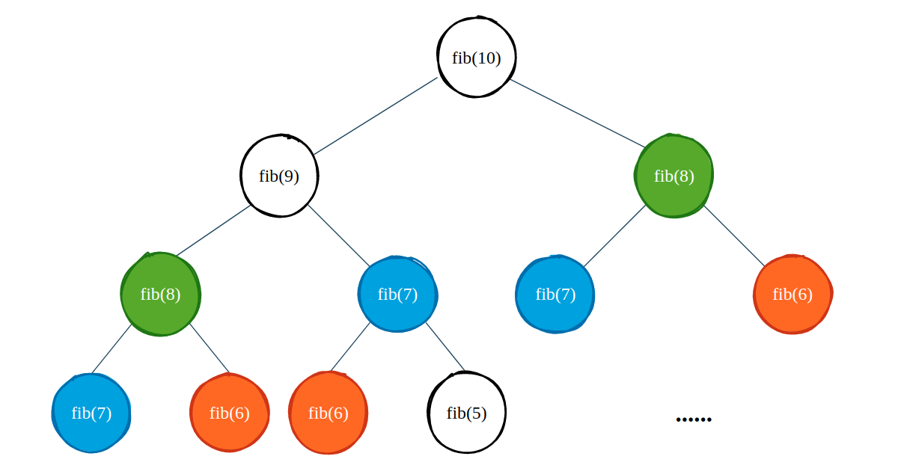
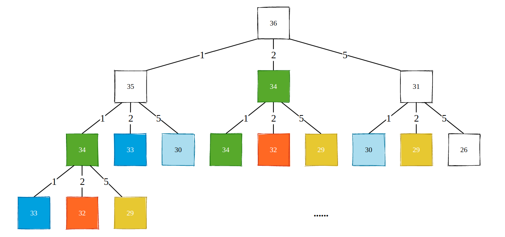
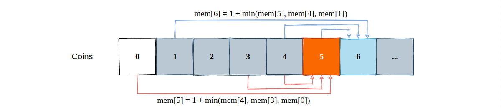
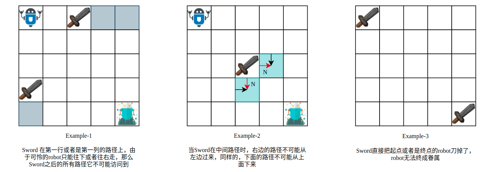

## 动态规划(01)——从斐波那契到硬币找零

### 1. 从斐波那契数列中找到 DP 模板
斐波那契数列虽然简单，但是却蕴含着求解动态规划问题最基本的“模板”。**经典问题之所以是经典问题，就是因为它足够的简单，并且能够阐述事件的本质。**

```cpp
// 计算第 n 个斐波那契数
int fib(int n) {
    if (n <= 2) return 1;
    return fib(n-1) + fib(n-2);
}
```

99% 的程序员闭着眼睛都能写出上面的递归程序，但是如果我们运行这个程序的话，就会发现当 `n` 等于 50 的时候，程序需要花费几十秒的时间才能输出结果（有没有兄弟用 Apple M1 试下...）。为什么需要这么长的时间?我们以 `fib(10)` 为例，画出递归树:



如上图所示，仅部分的递归过程我们就进行了大量的重复计算，这些重复计算正是导致 `fib()` 函数运行缓慢的根本原因。为了解决这个问题，我们通常会使用缓存的方式避免同一个值计算多次。

**上文中的“重复计算”其实就是动态规划问题中的“重叠子问题”，通过缓存的方式避免同一个值被计算多次也有一个专门的名称，称之为“记忆化搜索”。**

现在，我们来通过缓存的方式来优化我们的 `fib()` 函数。原理非常简单，我们使用一个数组来保存已经计算过的结果值。在递归过程中，如果该值已经被计算了，直接返回，否则进入计算流程:

```cpp
int fibUseMemory(int n, vector<int> &memory) {
    if (n <= 2) return 1;
    if (memory[n]) return memory[n];
    int res = fibUseMemory(n-1, memory) + fibUseMemory(n-2, memory);
    memory[n] = res;
    return res;
}
```

当我们加入了记忆化搜索以后，计算结果秒出，因为我们将时间复杂度从 O(2^n) 优化到了 O(n) 级别。**这就是求解动态规划问题的第一种方式: 自顶向下的记忆化搜索**。这种方式常常作为思考动态规划问题的首要方向，有时候我们不能一眼或者短时间内找出递推关系式，那么不妨先使用记忆化搜索的方式给出一个可行解，然后再进一步地优化。

再来看自底向上的递推实现，斐波那契的数学表达式为: `f(x) = f(x-1) + f(x-2)`，对于递归实现而言，我们可以认为是“从左至右”的实现，例如如果我们要计算 `f(5)`，得先计算 `f(4)` 和 `f(3)`，结果由操作系统栈帧临时保存，最终再汇总结果。那么同样的，如果我们已知 `f(3)` 和 `f(4)` 的结果的话，就能够推导出 `f(5)` 的值，这种递推的方式其实就是动态规划。

**说白了，动态规划就是根据已有的数据，来推导出下一个结果的值。**所以我们必须要明确值和值之间的关联关系。对于斐波那契数列而言，非常简单，毕竟推导式都告诉你了:

```cpp
int fibUseDP(int n) {
    vector<int> memory = vector<int>(n+1, 0);
    memory[1] = 1, memory[2] = 1;       // 边界情况处理
    for (int i = 2; i <= n; i++)        // 递推过程
        memory[i] = memory[i-1] + memory[i-2];
    return memory[n];
}
```

现在，我们就可以总结出动态规划问题的解题“四部曲”了:

1. 对于没有头绪的问题首先尝试“自顶向下”的递归实现，使用记忆化搜索的方式优化时间。同样地，“自顶向下”的思考也能够为我们找出递推关系式提供帮助。
2. 明确我们的题目是使用一维数组还是二维数组递推，这与题目中的变量数相关。然后确切的明白 `memory[i]` 或者是 `dp[i]` 到底表达了什么。
3. 明确 `memory[i]` 或者是 `dp[i]` 和之前数据的关联关系，这是最难的一步，也是动态规划问题灵活多变的根本原因。
4. 找到了关联关系以后，再处理一下边界情况即可。

我们尝试按照上面的步骤来解决一道非常经典的问题: [Coin Change](https://leetcode.com/problems/coin-change/)。给定一堆面额不同的硬币，每一种面额的硬币可以使用多次，现在问你如何用最少的硬币数量来凑成 `amount`。例如硬币面额有1块、2块和5块，凑够 11 块钱则最少需要3个硬币: 两个5块的，和1个1块的。

当我们什么思路都没有的时候可以先使用一些特定的实例来帮助我们打开思路。所以，我们假设硬币面额为 `[1, 2, 5]`，`amount` 为 36。

对于 36 块的总额以及三种面额的硬币，我们可以有 3 种方式去凑齐: 35 + 1，34 + 2，31 + 5。这样一来我们使用了一个硬币，换来了一个更小规模的问题，不断地递归下去，就能够得到所有解，然后我们在其中选出最小硬币数量的解即可。



递归树如上图所示，显然，这是一棵多叉树的遍历，多叉树的遍历模板是什么来着?

```cpp
void traversal(node) {
    for child in node.childs
        traversal(child);
}
```

并且，遍历的过程中有许多重复的计算，需要使用记忆化搜索的方式来优化时间，再结合上面的遍历模板，答案就呼之欲出了:

```cpp
int memorySearch(vector<int>& coins, int amount, vector<int> &memory) {
    if (amount < 0) return -1;
    if (amount == 0) return 0;

    if (memory[amount] != -2) return memory[amount];

    int res = INT_MAX;
    for (int coin: coins) {
        int sub = memorySearch(coins, amount - coin, memory);
        if (sub == -1) continue;
        res = min(res, sub+1);
    }
    memory[amount] = res == INT_MAX ? -1: res;
    return res;
}
```

我们重点关注一下下面的代码片段:

```cpp
for (int coin: coins) {
    int sub = memorySearch(coins, amount - coin, memory);
    res = min(res, sub+1);
}
```

对于当前的 `amount` 值来说，我们需要把所有的硬币都试一遍，找到最小数量的那一枚硬币面额。如此一来，我们就能够明白递推公式了:



很好理解，对于总额度为 5 来说，我们能从 4 块钱凑 1 块达到，也可以从 3 块钱凑 2 块达到，同时可以直接掏出一枚 5 块的硬币，在这 3 种可能之间找出最小值即可。所以，`memory[i]` 就表示凑够金额为 `i` 所需要的最少硬币数量，边界情况当然是 `i == 0` 了，此时不需要任何一种硬币，所以为 0。

```cpp
int coinChange(vector<int>& coins, int amount) {
    sort(coins.begin(), coins.end());       // 排序便于减枝
    vector<int> memory = vector<int>(amount+1, INT_MAX);
    memory[0] = 0;                          // 边界条件处理
    for (int i = 1; i <= amount; i++) {
        for (int coin: coins) {
            if (i - coin < 0) break;
            if (memory[i-coin] != INT_MAX)
                memory[i] = min(memory[i], memory[i-coin] + 1);
        }
    }
    return memory[amount] == INT_MAX ? -1: memory[amount];
}
```

其实，Coin Change 问题本质上就是 [Climbing Stairs](https://leetcode.com/problems/climbing-stairs/) 的改版，Climbing Stairs 也就是经典的小青蛙跳台阶问题。如果把 Coin Change 的问题换成“使用这些硬币凑够`amount`一共有多少种凑法”的话，就是妥妥的小青蛙跳台阶的多叉树版本（小青蛙跳台阶是一个二叉树遍历问题）。

别说，leetcode 上还真有这样的问题: [Combination Sum IV](https://leetcode.com/problems/combination-sum-iv/)

> 给定一个 nums 数组，其中的元素可以使用任意多次，输出和为 target 的全部组合数量

这和硬币找零问题几乎一模一样，只是换了一个问法而已。题解可见:

> https://github.com/SmartKeyerror/Snorlax/blob/master/leetcode/dynamic-programming/377-Combination-Sum-IV.cpp

### 2. 二维平面的“小青蛙跳台阶”问题

接下来我们将会看到，“小青蛙跳台阶”这一基本问题能玩儿出多少花样。

[Unique Paths II](https://leetcode.com/problems/unique-paths-ii/)，有一个机器人从一个二维平面的左上角出发，终点为右下角，机器人每次只能向下或者是向右移动，并且在该平面中存在“专刀机器人的剑”，入者必死，可怜的机器人必须要绕开这些 Sword。问机器人从起点到终点有多少条独特的路径。

既然机器人只能向右或者是向下移动，那么对于一个节点 `grid[i][j]` 而言，只有可能从上边或者是左边出现机器人的身影。而对于第 0 行的节点而言，机器人除非一路向右才有可能到达。同样的，第 0 列中的节点机器人必须一路向下才能到达。这种特殊情况就是我们在该题中需要处理的边界情况。



如上图所示，当我们分析完所有的特殊情况以后，代码的实现将会非常简单。`memory[i][j]` 则表示以当前节点为终点的独特的路径总条数。如果没有“专刀机器人的剑”或者是节点不在边界时，有:

```bash
memory[i][j] = memory[i][j-1] + memory[i-1][j]
```

完整实现代码可见:
> https://github.com/SmartKeyerror/Snorlax/blob/master/leetcode/dynamic-programming/063-Unique-Paths-II.cpp

其实，Unique Paths 问题向我们揭露了另外一种非常典型的递推关系式: **对于 memory[i][j] 而言，它的左节点(memory[i][j-1])、上节点(memory[i-1][j]) 以及左上节点(memory[i-1][j-1]) 都有极大的概率称为递推关系式中的一份子**。除开 0-1背包 问题的递推关系以外，绝大多数的二维 DP 问题都能从这 3 个节点上找到正确的递推关系式。

例如 [Maximal Square](https://leetcode.com/problems/maximal-square/) 这个问题，给定一个仅包含 '0'、'1' 的二维数组，求出仅包含字符 '1' 的最大正方形。此时，我们可以假定 `memory[i][j]` 表示以 `matrix[i][j]` 为**右下角**的最大正方形的**边**。当我们这样定义完二维数组的含义之后，分析起来就非常简单了。

如果 `memory[i][j]` 为 '0'，那么 `memory[i][j]` 就等于 0; 如果 `memory[i-1][j]`、`memory[i-1][j-1]`、 `memory[i][j-1]` 其中有一个为 '0' 的话，`memory[i][j]` 都不能构成包含 '1' 的正方形。所以，状态转移方程为: 

```bash
memory[i][j] = min(memory[i-1][j], memory[i-1][j-1], memory[i][j-1]) + 1
```

完整代码为:

```cpp
int maximalSquare(vector<vector<char>>& matrix) {
    int res = 0;
    vector<vector<int>> memory(matrix.size(), vector<int>(matrix[0].size(), 0));
    
    for (int i = 0; i < matrix.size(); i++) {
        for (int j = 0; j < matrix[0].size(); j++) {
            
            // 初始化第 0 行或第 0 列
            if (i == 0 || j == 0)
                memory[i][j] = matrix[i][j] - '0';
            
            else if (matrix[i][j] == '1')
                memory[i][j] = min(min(memory[i-1][j], memory[i-1][j-1]), memory[i][j-1]) + 1;
            
            res = max(res, memory[i][j]);
        }
    }
    return res * res;
}
```

再比如 [72. Edit Distance](https://leetcode.com/problems/edit-distance/)，该问题同样可以将 `memory[i][j]` 的关系往左边、上边以及左上这 3 个节点的方向上面靠。当我们明确了某个 DP 问题是需要使用二维数组完成，并且又不是 0-1 背包问题的时候，大胆地去找这 3 个节点的“麻烦”。

这一类问题我比较喜欢称之为“Robot Path”，相似题目有:

- [062. Unique Paths](https://leetcode.com/problems/unique-paths/)
- [064. Minimum Path Sum](https://leetcode.com/problems/minimum-path-sum/)
- [120. Triangle](https://leetcode.com/problems/triangle/)
- [221. Maximal Square](https://leetcode.com/problems/maximal-square/)
- [931. Minimum Falling Path Sum](https://leetcode.com/problems/minimum-falling-path-sum/)
- ......


### 3. 小结

不管是 [Coin Change](https://leetcode.com/problems/coin-change/) 还是 [Unique Paths](https://leetcode.com/problems/unique-paths/) 问题，本质上最核心的仍然是“小青蛙跳台阶”问题，从一个最基本的问题扩展到稍微复杂一些的问题。对这一类问题，有位老哥总结的非常之到位:

Statement
> Given a target find minimum (maximum) cost / path / sum to reach the target.

Approach
> Choose minimum (maximum) path among all possible paths before the current state, then add value for the current state.

```bash
routes[i] = min(routes[i-1], routes[i-2], ... , routes[i-k]) + cost[i]
```

原文地址为:

> https://leetcode.com/discuss/general-discussion/458695/Dynamic-Programming-Patterns
