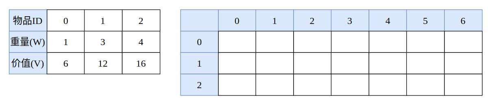
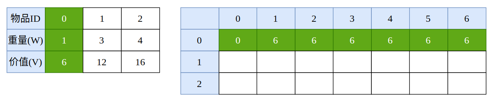
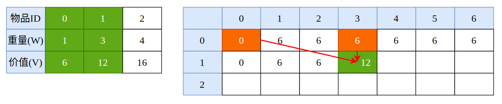
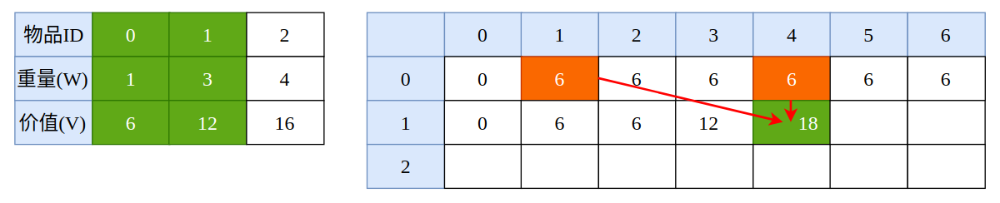
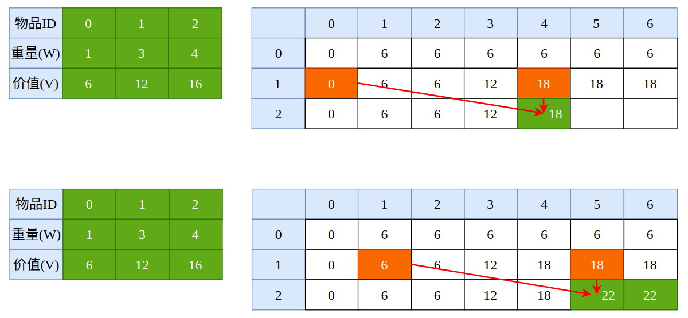
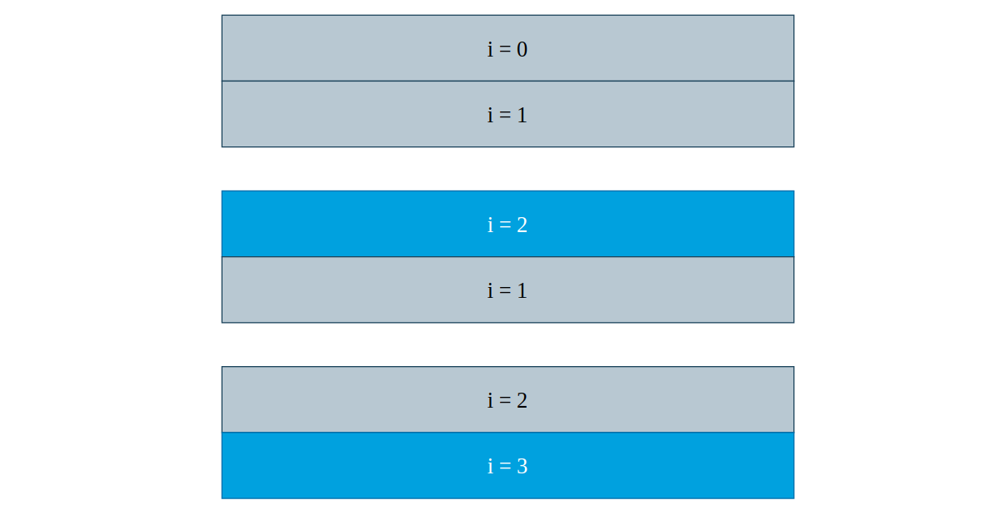

## 动态规划(02)——0-1背包问题

0-1背包问题可以说是动态规划问题中最为重要的一类问题之一，leetcode 中许许多多的 DP 问题就算不是标准的 0-1背包问题，也可以转换成 0-1背包问题来解决。

问题描述:

> 有 `n` 个物品和一个容量为 `W` 的背包，每个物品有重量 `w(i)` 和价值 `v(i)` 两种属性，并且每个物品只有一件。要求选若干物品放入背包使背包中物品的总价值最大且背包中物品的总重量不超过背包的容量。

0-1背包问题的本质可以用一句话概括: “放还是不放，这是一个问题”。假设我们将这 n 件物品在桌子上排成一排，那么对于每一件物品来说，**我们可以选择将其放入背包中，也可以选择不放入背包中**。每个物品只有这两个状态(放与不放)，如同二进制中的 0 和 1，所以称之为 0-1背包问题。

由于我们除了物品数量的限制以外，还有背包容量的限制，所以这是一个二维 DP 问题。我们假设 `f(i, W)` 表示考虑将 i 个物品放进容量为 `W` 的背包，使得背包总价值最大，那么就有:


假设我们当前已经对前 `i-1` 个物品进行了处理，现在来考虑第 `i` 个物品，状态有两种，放入背包或者不放入背包。如果第 `i` 个物品不放入背包中的话，此时相较于前 `i-1` 个物品，背包总价值、容量都没有发生改变，那么此时最大价值为 `f(i-1, W)`。如果将该物品放入背包的话(背包中有剩余容量能承载当前物品)，那么背包的总价值得加上当前物品价值，也就是 `v(i)`，同时，背包内的剩余容量需要减去当前物品的容量，也就是 `W-w(i)`，此时的背包最大价值为 `f(i-1, W-w(i))`。

如果对上方文字描述仍然感到困惑的话，没关系，我们可以画图推导，以清晰的方式来描述状态转移方程。



如上图所示，左侧表格为物品的枚举信息，包括物品编号、重量以及价值，而右侧表格就是我们将要推导的“主阵地”，其中行为物品编号，列为背包容量，所以，我们的示例背包总容量为 6。

假设我们只有编号为 0 的这一件物品，那么只要背包容量足够，我们就必须要将该物品放入背包才能达到最大价值，因为在只有一件物品的情况下不放该物品的话背包价值就是个零蛋，肯定不是我们期望的。



好了，我们已经完成了 1/3 的工作，再来看有 0 号和 1 号这两件物品时该如何推导。由于编号为 1 的物品重量为 3，所以，在这之前我们只能将上一行的内容照搬下来。

当背包容量为 3 时，我们就有了两种选择: 放入物品 1，和不放入物品 1。如果放入物品 1 的话，背包基础价值为 12，此时背包容量为 0，我们再来看当背包容量为 0 时，仅有物品 0 的情况，发现价值为 0，所以，此时放入物品 1 的总价值为: 12 + 0 = 12。而不放入物品 1 的价值就是 6，两者取较大值，结果为 12。



再来看容量为 4 的情况，当我们放入物品 1 以后，容量还剩 1，根据我们的表格来看，容量为 1、且只有物品 0 的情况下最大价值为 6，所以在容量为4、放入物品 1 的情况下背包价值为 18。如果不放入物品 1，背包价值就是放入物品 0 的最大价值(6)。所以，最大价值为 18。



以此类推，我们可以完成所有表格的推导:



因此，当背包容量为 6 时背包的最大价值为 22。我们甚至还能根据这个表格反推导出到底是哪些物品构成的背包最大价值。好了，当我们确切的明白了 0-1背包问题的状态转移方程之后，具体的实现就会简单许多。

### 1. 自顶向下的记忆化搜索

当我们有了


这个状态转移方程以后，最简单、最直观的方式就是使用自顶向下的记忆化搜索实现，简单粗暴，DEBUG 贼方便:

```cpp
// 在 [0..index] 中寻找容量为 capacity 的最优解
int bestSolution(const vector<int> &weight, const vector<int> &value, int index, int capacity) {

    if (index < 0 || capacity <= 0)
        return 0;

    if (memory[index][capacity] != -1)
        return memory[index][capacity];
    
    // 不选择当前物品
    int result = bestSolution(weight, value, index - 1, capacity);

    // 查看是否还有剩余的容量能容纳当前物品
    if (capacity >= weight[index])
        result = max(result, value[index] + bestSolution(weight, value, index - 1, capacity - weight[index]));
    
    memory[index][capacity] = result;
    
    return result;
}
```

使用递归来实现 DP 问题最大的好处就是代码结构非常清晰，缺点同样很明显，OS 创建与销毁栈帧需要额外的时间和空间，所以效率远不及自底向上的递推实现。

### 2. 自底向上的递推

同样的，当我们明确了状态转移方程以及二维数组的实际含义之后，实现起来将会非常简单，处理好边界条件即可。

```cpp
int dpSolution(const vector<int> &weight, const vector<int> &value, int capacity) {
    vector<vector<int>> memory(weight.size(), vector<int>(capacity + 1, 0));

    // 处理边界条件, 当然也可以在下面的循环中处理
    for (int i = 0; i <= capacity; i++)
        memory[0][i] = (i >= weight[0] ? value[0]: 0);
    
    for (int i = 1; i < memory.size(); i++) {
        for (int j = 0; j <= capacity; j++) {
            memory[i][j] = memory[i-1][j];
            if (j >= weight[i])
                memory[i][j] = max(memory[i][j], value[i] + memory[i-1][j-weight[i]]);
        }
    }
    return memory[weight.size()-1][capacity];
}
```

### 3. 递推实现的空间优化

从上面的状态转移方程中可以看到，第 `i` 行的结果之与第 `i-1` 行的结果相关，与第 `i-2`、`i-3` 行没有任何关系。所以，我们完全可以只是用两行空间来滚动地更新结果，使得空间复杂度降低至 `O(2*Capacity)`



如上图所示，在初始化时首先计算 `memory[0]` 的值，而后计算 `memory[1]`。当我们要计算 `memory[2]` 时，`memory[1]` 已经没有用处了，所以我们直接进行覆盖更新，以此类推。

不过，这里的空间复杂度可以进一步地进行优化，可以直接使用一行空间搞定:

```cpp
int dpSolutionOptimized(const vector<int> &weight, const vector<int> &value, int capacity) {
    vector<int> memory(capacity + 1, 0);

    for (int i = 0; i <= capacity; i++)
        memory[i] = (i >= weight[0] ? value[0]: 0);

    for (int i = 1; i < weight.size(); i++) {
        for (int j = capacity; j >= weight[i]; j--)
            memory[j] = max(memory[j], memory[j-weight[i]] + value[i]);
    }
    return memory[capacity];
}
```

### 4. leetcode 中的0-1背包问题

最著名的应该就是打家劫舍“三部曲”了。

- [198. House Robber](https://leetcode.com/problems/house-robber/)
- [213. House Robber II](https://leetcode.com/problems/house-robber-ii/)
- [337. House Robber III](https://leetcode.com/problems/house-robber-iii/)

这里就不贴原题了，还挺长的。对于最基本的 House Robber 问题来说，就是在一个连续的街道中对房屋进行洗劫，但是不能洗劫连续的房屋，也就是说，假如说我们洗劫了第一间房屋，那么第二件房屋就不能洗劫了，但是可以去洗劫后面的房屋，以此类推。问洗劫房屋的最大价值。

由于题目中存在一个最大的限制: 相邻房屋不能同时洗劫，所以情况就变得微妙起来了。对于每一个房屋而言，我们有两个选择: 洗劫或是不洗劫，那么一共有 `2^n` 种可能，暴力递归的时间复杂度为 O(n*2^n)，是一个很夸张的时间复杂度。

我们假设 `memory[i]` 表示前 `i` 个房屋能够达到的最大价值，现在来考虑第 `i` 个房屋的情况。如果我们选择洗劫该房屋的话，也就意味着第 `i-1` 个房屋注定要失之交臂，此时最大价值为 `v[i] + memory[i-2]`。如果我们不洗劫该房屋的话，那么最大价值就是 `memory[i-1]`。这样，我们就讨论完了所有的情况:

```bash
memory[i] = max(memory[i-1], v[i] + memory[i-2])
```

这就是我们的状态转移方程，可以看到，和0-1背包问题的状态转移方程非常之类似。

[House Robber II](https://leetcode.com/problems/house-robber-ii/) 和 [House Robber](https://leetcode.com/problems/house-robber/) 问题基本一样，只不过需要进行一些特殊处理而已。比较有意思的是 [House Robber III](https://leetcode.com/problems/house-robber-iii/)，在一棵二叉树中进行洗劫，不能洗劫直接相邻的两个节点，也就是父子节点，其它的节点随便抢。

对于一个节点 `Node` 而言，如果选择抢了该节点，那么该节点的左孩子节点、右孩子节点就不能再抢了，只能去抢左孩子的孩子节点，和右孩子的孩子节点。如果我们不抢该节点的话，那么我们可以抢左孩子和右孩子。所以，状态转移方程为:

```bash
f(Node) = max{ Node.val + f(Node.left.child) + f(Node.right.child), f(Node.left) + f(Node.right) }
```

### 5. 小结

如果需要用一句话来形容0-1背包问题的话，那么我的答案是:

> To be, or not to be, that is the question
