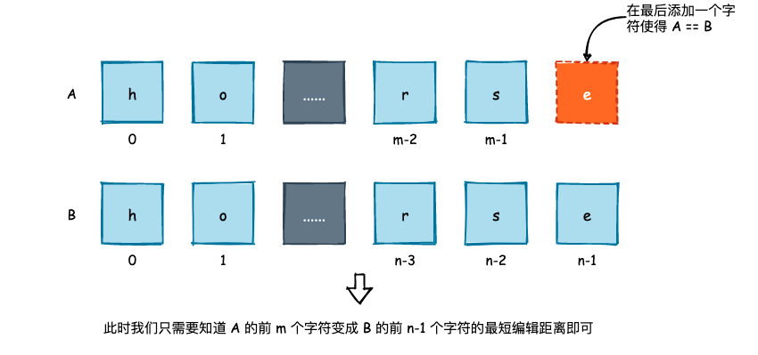
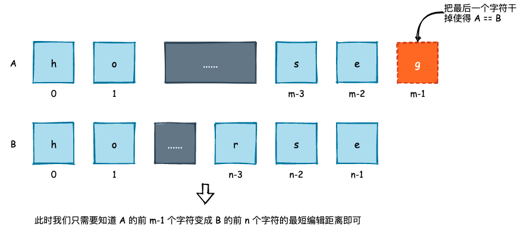
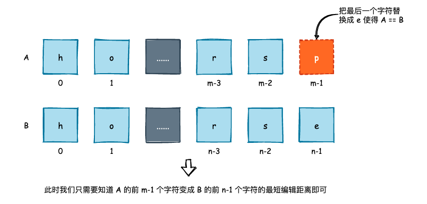

## 最短编辑距离与纠错功能的实现

### 1. 基本实现

我们常说的编辑距离是指将一个字符串变成另一个字符串所需要的操作次数，操作是指增加一个字符、删去一个字符以及替换掉一个字符。例如 "horse" 和 "ros"，我们希望通过上述的 3 个操作将 "horse" 变成 "rose"。那么我们可以这样来做:

```bash
horse -> rorse，即将 'h' 替换成 'r'
rorse -> rose，将第二个 'r' 删去
```

两个操作就可以将 "horse" 变成 "ros"。那么最短编辑距离就是将一个字符串通过增加字符、删除字符以及替换字符这 3 种方式变成另一个字符串的最少操作次数。

这既是一道 DP 的经典问题，如 [72. Edit Distance](https://leetcode.com/problems/edit-distance/)，同时也是一个工程领域中一个非常经典的问题。

和其它 DP 问题一样，我们从两个字符串的最后一个字符出发，来看看我们会有哪些情况:



首先是添加在 A 的尾巴上添加一个字符，使得最终两个字符串相等，那么我们就需要知道 A 的前 m 字符变成 B 的前 n-1 个字符需要的最短编辑距离，因为 B 的最后一个字符被我们“抓了壮丁”，并应该考虑进去。




其次就是删去 A 尾巴上的那个字符，使得两个字符串相等那么这个时候我们要考虑的就是 A 的前 m-1 个字符，和 B 的前 n 个字符。



最后则是替换，如果 A 的尾巴和 B 的尾巴一模一样，那么再往前看即可。如果它们不一样，那么也是看 A 的前 m-1 个字符和 B 的前 n-1 个字符所需的最短编辑距离。

实现如下:

```cpp
// 时间复杂度 O(MN)，空间复杂度 O(MN)
int edit_distance(const string& A, const string& B) {
    int m = A.size(), n = B.size();
    
    int dp[m+1][n+1];

    for (int i = 0; i <= m; i++) {
        for (int j = 0; j <= n; j++) {
            if (i == 0) 
                dp[i][j] = j;
            else if (j == 0) 
                dp[i][j] = i;
            else if (A[i-1] == B[j-1])
                dp[i][j] = dp[i-1][j-1];
            else 
                dp[i][j] = min(min(dp[i-1][j-1], dp[i][j-1]), dp[i-1][j]) + 1;
        }
    }
    return dp[m][n];
}
```

### 2. 纠错功能

常见的搜索引擎都会有自动纠错功能，以 Google 为例。当我们输入 "Edit Distace" 这一错误搜索词拼写时，搜索引擎会帮助我们进行纠正，如下图所示:


如果我们不考虑热点词汇、个性化搜索功能的话，如何根据用户所输入的错误单词来找到最接近的正确单词呢? 我们可以尝试去使用上面所实现的 `edit_distance` 方法，求出错误的单词和单词库中所有单词的编辑距离，然后返回编辑距离最短的单词列表，伪代码如下:

```cpp
string user_query = "Distace";
for (const string& s : words) {
    if (edit_distance(user_query, s) == 1)
        result.push_back(s);
}
```

使用一个拥有 103976 个单词的单词库进行测试，限定最短编辑距离为 1，在 NUC10i7FN 下大概需要 0.2~0.3 秒的时间才能得到结果，而且这时候的数据量只有 10 万而已。对于英文单词而言，数据量可能也就这么多了，但是对于中文而言，其数据规模大概在 800 万左右。如果仍然使用 `edit_distance` 的话，我们可能需要十几秒甚至是几十秒才能得到结果。

中文的纠错其实是一个很复杂的过程，因为中文不仅仅只是能够新增、替换和删除，还可以是同音字、同义字、同形字，所以依靠传统的算法很难有一个较优的解决方案，因为目前业界对于中文的纠错，大多采用机器学习、深度学习来优化中文文本纠错。也有小伙伴儿整理了关于中文文本纠错的开源项目，可以作为参考:

> [7.25——中文文本纠错开源项目整理](https://github.com/li-aolong/li-aolong.github.io/issues/12)

如果我们只是想简单地做一个英文单词的纠错的话，可以使用分治+多路搜索的方式来优化其运行效率。

除此以外，Trie 也可以用来进行纠错，不过 Trie 是根据前缀进行搜索的，如果我们遇到了 "qistance"，要想要通过 Trie 来得到 "distance"，还是很困难的。

(脑子里就这么点儿货了，这篇就 1700 来字，ε=(´ο｀*)))唉，后面儿再加吧)


