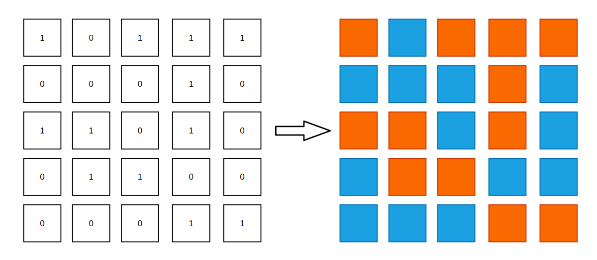
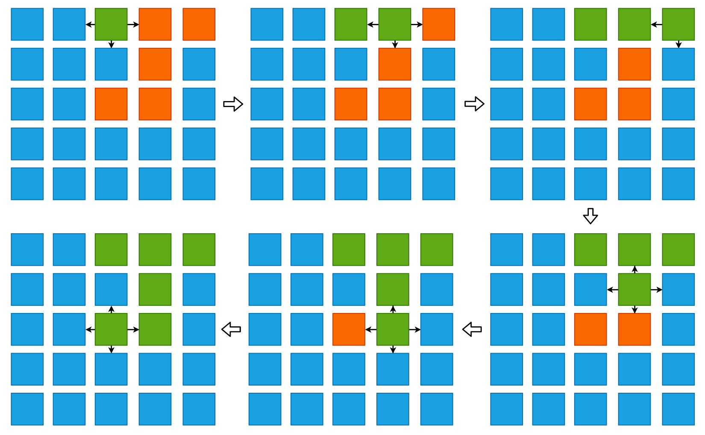

## Flood fill 算法小专题

Flood fill 算法在本项目的回溯算法中有一个简单的介绍，严格意义上来说，Flood fill 算法并不能算是回溯算法的分支，而是深度优先遍历(DFS)的一个分支。Wikipedia 是这样解释 Flood fill 算法的：

> Flood fill算法是从一个区域中提取若干个连通的点与其他相邻区域区分开（或分别染成不同颜色）的经典算法。因为其思路类似洪水从一个区域扩散到所有能到达的区域而得名。在GNU Go和扫雷中，Flood Fill算法被用来计算需要被清除的区域。

一如既往地难以理解。简单地来说，Flood fill 算法就是一种染色算法，前些年很火的“解压神器”《秘密花园》就是给定一个带有各种轮廓的白板，由用户给这些白板涂上自己喜欢的颜色:


空白的轮廓在我们看来就是一个边界，可能是条规整的直线，也可能是个不规则的弧形，我们染色的区域不能超出这个边界。但是对于计算机而言，图像是由矩阵所构成的。如果有小伙伴儿用过 OpenCV 对图片进行过图像识别的话，对这一点一定不会陌生。所以，计算中的染色实际上是对图像矩阵中一个一个的矩阵单元进行染色的。

这也是为什么 Flood fill 算法一定会出现在二维平面的原因之一: 算法源于实际生活的需求。

接下来就通过 [200. Number of Islands](https://leetcode.com/problems/number-of-islands/) 这道题目仔细的研究下 Flood fill 算法，实际上就是**无显式终止条件的深度优先遍历**。题目描述如下:

> Given an `m x n` 2d `grid` map of `'1'`s (land) and `'0'`s (water), return the number of islands.
An **island** is surrounded by water and is formed by connecting adjacent lands horizontally or vertically. You may assume all four edges of the grid are all surrounded by water.

在一个仅包含 `0` 和 `1` 的二维矩阵中求出所有岛屿的数量，岛屿由水平或者垂直相连的 `1` 构成，`0` 则表示海水，如下图所示:



也就是说，当我们遍历二维数组时，一旦发现了陆地的一角(也就是值为1)，我们就需要将这个陆地“连根拔起”，找到所有与当前陆地水平或者垂直相连的陆地，以组成更大的陆地。其实，类比于染色问题，`0` 就表示染色的边界，`1` 则表示需要染色的区域，我们在需要染色的区域内滴一滴墨水，让其自然地流淌，遇到边界则停止，直到整个需要被染色的区域完全被染色。

当我们在使用 DFS 进行遍历时，由于每一个矩阵单元在 4 个方向上都可能存在着陆地，所以在遍历的过程中很有可能出现重复遍历的情况。因此，我们需要一个 `visited` 数组来记录我们已经遍历过的区域，这和图的深度优先遍历是一样的。

说起图，Flood fill 其实也是图的遍历的应用之一，每一个矩阵单元都是图中的一个顶点，每个顶点最多有 4 条边(对应 4 个方向)。



```cpp
class Solution {
private:
    // 记录 grid 行数与列数, m为行，n为列
    int m, n;
    
    // 搜索前进时的辅助向量
    vector<vector<int>> delta = {{0, 1}, {1, 0}, {0, -1}, {-1, 0}};

    // 记录已经被标记为“岛屿”的坐标，避免重复遍历
    vector<vector<bool>> visited;

    bool inGrid(int x, int y) {
        return x >= 0 && x < m && y >= 0 && y < n;
    }

    void dfs(vector<vector<char>>& grid, int startx, int starty) {
        // floodfill 算法通常没有显式的递归终止条件，而是将递归终止条件隐藏在下一次搜索时的条件中
        for (int i = 0; i < 4; i++) {
            int newx = startx + delta[i][0];
            int newy = starty + delta[i][1];

            if (inGrid(newx, newy) && grid[newx][newy] == '1' && !visited[newx][newy]) {
                visited[newx][newy] = true;
                dfs(grid, newx, newy);
            }
        }
    }

public:
    int numIslands(vector<vector<char>>& grid) {
        m = grid.size(), n = grid[0].size();
        visited = vector<vector<bool>>(m, vector<bool>(n, false));

        int result = 0;
        for (int i = 0; i < m; i++) {
            for (int j = 0; j < n; j++) {
                // 如果此时的 grid[i][j] == '1'，并且 visited[i][j] 为 false 的话，说明我们找到了一个新的岛屿
                // 那么此时的任务就是将 grid[i][j] 这个岛屿相连接的岛屿全部标记一遍
                if (grid[i][j] == '1' && !visited[i][j]) {
                    visited[i][j] = true;
                    result++;
                    dfs(grid, i, j);
                }
            }
        }
        return result;
    }
};
```

除开一些辅助的函数和成员变量以外，核心的算法逻辑其实非常简单，就是深度优先遍历，在遍历的过程中进行“剪枝”。DFS 的递归终止条件隐含在了 `for` 循环中搜索条件中，要么下一次搜索越界，要么下一次搜索不是岛屿，或者是已经被遍历过的岛屿，在这些情况下循环将退出，递归函数也将返回。如此一来我们才能够将**所有**的岛屿都找到并进行标记。

在解决了这个问题以后，相信 [695. Max Area of Island](https://leetcode.com/problems/max-area-of-island/) 解决这个问题将会非常的简单，只不过是在 Flood fill 的过程中，记录一下每一块儿相连陆地的面积，然后取最大值而已。

### 1. Flood fill 模板

```cpp
void dfs(vector<vector<char>>& grid, int startx, int starty) {
    for (int i = 0; i < 4; i++) {
        int newx = startx + delta[i][0];
        int newy = starty + delta[i][1];
        if (inGrid(newx, newy) && grid[newx][newy] == '1' && !visited[newx][newy]) {
            visited[newx][newy] = true;
            dfs(grid, newx, newy);
        }
    }
}
```

对 Flood fill 算法来说，其实最为核心的操作就是上面的寥寥几行代码，在后面的题目中我们将会看到，很多问题其实就是对这几行代码进行修修补补，增加一些变量，修改一些判断条件，仅此而已。我们也可以认为这就是一个可能存在环的 4 叉树的遍历，所以我们又回到了那个问题: 树的遍历真的非常重要。

### 2. 在 Flood fill 模板中增加一些变量

[1254. Number of Closed Islands](https://leetcode.com/problems/number-of-closed-islands/)，我们来看下这道题，求被海水完全包围的岛屿的数量，其中 `0` 表示陆地，`1` 表示海水，和我们上面的题目是反着来的。那么什么是完全包围呢? 当陆地在二维矩阵的 4 条边上时，就算它的 3 个方向上都是海水，也不能算是被完全包围。

我们仍然使用 DFS 的方式去找到所有的岛屿，只不过在这个过程中我们需要多长一个心眼儿: 那些有挨着边儿的岛屿不计算在内。因为篇幅有限，我只将最为核心的代码贴上来:

```cpp
void dfs(vector<vector<int>>& grid, int startx, int starty, bool &flag) {
    if (inEdge(startx, starty)) flag = false;
    visited[startx][starty] = true;
    for (int i = 0; i < 4; i++) {
        int x = startx + delta[i][0], y = starty + delta[i][1];
        if (inGrid(x, y) && grid[x][y] == 0 && !visited[x][y]) {
            dfs(grid, x, y, flag);
        }
    }
}
```

完整代码可见:
> https://github.com/SmartKeyerror/Snorlax/blob/master/leetcode/flood-fill/1254-Number-of-Closed-Islands.cpp

可以看到，在我们的“模板代码”中只添加了一个变量: `flag`，这个变量就是用于标记我们当前所遍历的陆地是否有贴边儿的情况。对于外层调用者来说，一旦发现 `flag` 为 `true`，那么就不能将当前所得到的陆地群计算在“被海水完全包围的陆地”之内。同时，我们仍然需要在 `dfs` 函数中对相连的陆地进行标记，以防止重复访问，从而得到错误的结果。

理解了这个问题以后，那么 [130. Surrounded Regions](https://leetcode.com/problems/surrounded-regions/) 这个问题就很好解决了。题目描述非常简单，就是将被 `X` 完全包围的 `O` 转换成 `X`，这里的完全包围和上一题一样，4 条边并不能计算在内。

这里我选择使用“分工”的方式来解决这个问题，一拨人进行“圈地”，也就是找到被 `X` 完全包围的 `O` 片区，圈地的这波人需要避免对 4 条边上的 `O` 进行圈地。当圈好地以后，转换组就可以上场了，我们对已经圈好的地在进行一次 DFS，只不过此时的任务主要是进行转换。核心代码如下:

```cpp
// 圈地小组进行圈地
void enclosure(vector<vector<char>>& board, int startx, int starty, bool &flag) {
    visited[startx][starty] = true;
    if (inEdge(startx, starty)) flag = false;
    for (int i = 0; i < 4; i++) {
        int x = startx + delta[i][0], y = starty + delta[i][1];
        if (inBoard(x, y) && board[x][y] == 'O' && !visited[x][y])
            enclosure(board, x, y, flag);
    }
}

// 转换小组进行转换
void transform(vector<vector<char>>& board, int startx, int starty) {
    board[startx][starty] = 'X';
    for (int i = 0; i < 4; i++) {
        int x = startx + delta[i][0], y = starty + delta[i][1];
        if (inBoard(x, y) && board[x][y] == 'O')
            transform(board, x, y);
    }
}
```

完整代码可见:
> https://github.com/SmartKeyerror/Snorlax/blob/master/leetcode/flood-fill/130-Surrounded-Regions.cpp

可以预见地，当外层循环在调用 `enclosure()` 方法时，只有在 `flag` 结果为 `true` 的情况下才会让转换小组上场，也就是执行 `transform()` 方法。 


### 3. 小结

对于 Flood fill 算法来说，其实我们只要理解了那个最为基础的模板，其它的问题无非就是增加一些变量、多一些判断条件而已，本质上就是一个**无显式终止条件的DFS**，终止条件通过 `visited` 数组和我们自身的逻辑进行控制。

除了上面所描述的 Flood fill 问题以外，Leetcode 上还有许多类似的问题:

- [463. Island Perimeter](https://leetcode.com/problems/island-perimeter/)
- [529. Minesweeper](https://leetcode.com/problems/minesweeper/)
- [733. Flood Fill](https://leetcode.com/problems/flood-fill/)
- [827. Making A Large Island](https://leetcode.com/problems/making-a-large-island/)
- [1034. Coloring A Border](https://leetcode.com/problems/coloring-a-border/)
- ......

下面是我对一些问题的题解:

> https://github.com/SmartKeyerror/Snorlax/tree/master/leetcode/flood-fill
