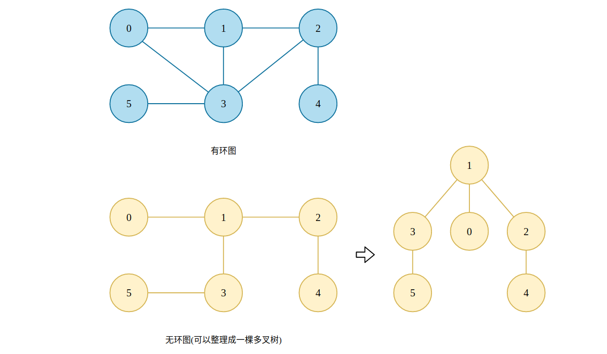
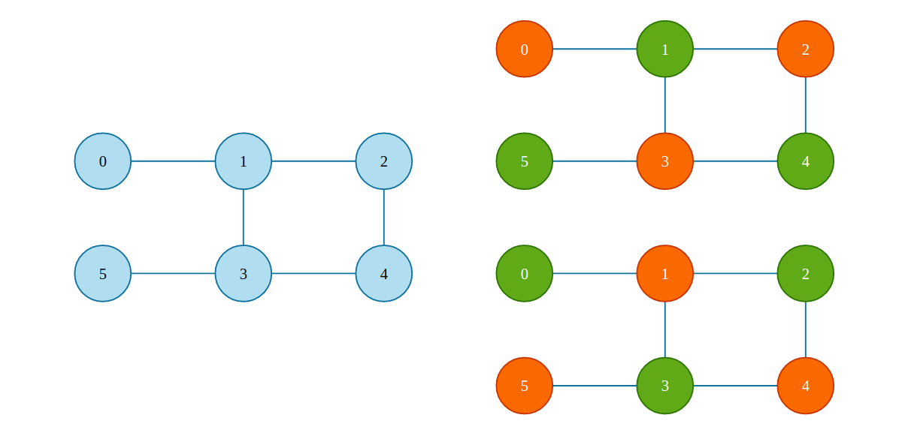

## 图的二三事——基本概念与基础问题

在我看来，图（Graph）或许是数据结构中最为强大的框架，在我们的日常开发中可能很少直接和图打交道，但是在日常生活中，无数的系统都能够抽象成图结构。例如城市交通，社交网络，网络通信，电网组成，等等等等。可以说，有“连接”的地方就会有图。

图的组成其实非常简单，顶点（Vertex）和边（Edges）。在一个城市交通抽象图中，顶点可以认为是建筑，而边则表示连接建筑之间的道路。在社交网络中，顶点可以认为是用户，边则代表用户和用户的之间的关系，这可以是关注、Block等乱七八糟的关系。

### 1. 图的分类

通常而言，我们会从两个维度上对图进行分类：是否存在方向、是否带有权值，两两组合，我们就可以得到无向无权图、无向有权图、有向无权图以及有向有权图，如下图所示：


也有一些地方会进而区分稠密图和稀疏图，但是，一个图结构到底是稀疏还是稠密是相对的，并没有一个严格的界定标准，故不再考虑。

对于无向无权图来说，没有方向，也没有权值，仅仅是描述两个节点之间存在连接关系，可以应用在网络连接、社交关系的简单表示中。无向有权图则可以应用在城市交通、路径距离等场所中，每一个顶点表示一座城市，而权值则表示连接这些城市道路的实际距离。

有向无权图着重描述方向，所以可以用在 Follow、Following 这样的场合中，例如微博的关注与被关注、Github 的 Follow 与 Following。有向有权图在带有方向的基础之上增加了权值，权值可以代表非常多的东西，例如两地之间的机票价格、完成任务所需要花费的时间、一个人对另一个人的喜爱程度，等等等等。

除了方向和权值这两个维度的分类以外，还有一个非常重要的分类维度：图中是否存在环。



可以看到，对于无环图来说其实就是一棵多叉树。而对图中是否存在环的算法通常称之为环检测，在实际应用中有着非常重要的价值。

### 2. 图的表示

#### 2.1 Edge lists

图可以使用多种数据结构进行表示，图由顶点以及顶点之间的边所组成，那么一个最直接的方式就是给出顶点个数以及顶点所组成的边:

```bash
vertices: 5
edges: [[0,1], [1,3], [2,4], [4,5], [3,5]]
```

上述内容即表示一个图中存在 5 个顶点，并且具有 5 条边。`[0,1]` 既可以表示有向图，也可以表示成无向图。如果是有向图的话，我们可以指定 `edges[i][0]` 到 `edges[i][1]` 存在方向，反过来则没有。Leetcode 中大部分关于 Graph 的题目通常都会以这样的形式给出原始数据，一般称为 Edge lists。

如果需要表示有权图的话，可以在 `edges[i]` 中再添加一个元素表示权值，例如 `[0,1,2]`，可以解读成:
- 无向图中存在一条顶点 0 到顶点 1 的边，权值为 2。
- 有向图中存在一条顶点 0 指向顶点 1 的边，权值为 2。

#### 2.2 邻接矩阵

另一个思路就是使用 `V * V` 的一个二维矩阵进行表示，其中 `V` 表示图中的顶点个数。`matrix[i][j]` 的值既可以表示顶点 `i` 与顶点 `j` 之间是否存在边，同时也可以表示这两条边之间的权值。例如 `matrix[i][j] == -1` 表示两条边之间无连接，`matrix[i][j] == 2` 表示两个顶点之间有连接且权值为 2。

对于无向图而言，`matrix[i][j]` 和 `matrix[j][i]` 的值必然相等，也就是说 `matrix` 是对角线对称的，那么此时我们将会浪费掉一半的空间。因此，对于无向图而言，我们很少会使用邻接矩阵的方式进行表示。


#### 2.3 邻接表

邻接表更加直接，直接给出某一个顶点所相邻顶点与权值，"表"可以使用数组、链表、哈希表甚至是哈希集合实现。和邻接矩阵不同的是，邻接表中存储的是某一个顶点的相邻顶点有哪些。如下图所示:


对于顶点 `0` 而言，其相邻顶点为 `1`、`3`、`4`，至于我们是用 `vector` 还是 `list`，亦或是 `unordered_set`、`unordered_map` 来存储其相邻的顶点，由具体的情况而定。例如当我们表示有权图时，`unordered_map` 就是很好的选择，其 `key` 为顶点编号，`value` 为权值。如果要表示无权图并且原始输入数据会有重复的时候，使用 `unordered_set` 则可以很好的完成去重工作。

更多内容可查看 Leetcode 官方给出的文章:

> [Representing graphs](https://www.khanacademy.org/computing/computer-science/algorithms/graph-representation/a/representing-graphs)

### 3. 图的深度优先遍历与广度优先遍历

和树结构相同，图中顶点的遍历是解决图论相关问题的一个非常重要的手段，例如接下来将会讨论的判图中连通分量的个数、环检测、二分图检测等问题都可以使用 DFS 以及 BFS 解决。

由于 BFS 有着图论模中一个非常重要的性质，所以在其它篇章中介绍，感兴趣的小伙伴儿可以移步: [BFS与图论问题建模](https://github.com/SmartKeyerror/Snorlax/tree/master/algorithm/bfs#bfs%E4%B8%8E%E5%9B%BE%E8%AE%BA%E9%97%AE%E9%A2%98%E5%BB%BA%E6%A8%A1)，此处不再赘述。

图的 DFS 完全可以看作是一棵多叉树的遍历，基本框架为:

```cpp
void dfs(int src) {
    visited[src] = true;
    for (int next : graph[src]) {
        if (!visited[next])
            dfs(next);
    }
}
```

我们之所以要添加一个 `visited` 数组，是因为图并不像树那样具有单向性质，即一个孩子节点只会存在 0 个或者 1 个父节点。而图中的顶点可以和任意顶点相邻，因此我们需要一个判断当前顶点是否被访问过，以避免重复访问的问题。DFS 的过程可参考下方过程图:


当我们递归地调用 `dfs()` 函数并来到顶点 `1` 时，它有 3 个相连的顶点，分别是 `0`、`2` 以及 `3`，而顶点 `0` 从函数调用上来说是调用方，也就是说顶点 `1` 是从顶点 `0` 那里过来的，此时 `0` 必然已经被遍历过了，所以我们应该避免再去访问它。

### 4. 计算图中连通分量的个数

连通分量（Connected Component）是无向图中所特有的性质，有向图中不讨论连通分量，而是讨论强连通分量，在后续的文章中将会详述。连通分量其实可以简单地认为就是一个图中“子图”的数量，顶点 `u` 到顶点 `v` 之间存在可达路径时我们称其在同一个连通分量中，反之则不在同一个连通分量中:


如上图所示，在一个包含 9 个顶点的图中共包含两个连通分量。计算图中的连通分量个数有非常多的方法，DFS、BFS 或者 Union-Find 都能完成这件事，且时间复杂度均为 `O(V+E)`。其实，计算连通分量的个数不就是 `Number of islands` 吗? 只不过是从一个二维矩阵中到一个图中而已。不熟悉 `Number of islands` 可参考这篇文章: [Flood fill 算法小专题](https://github.com/SmartKeyerror/Snorlax/tree/master/algorithm/flood-fill)。

所以，我们只需要对图中未遍历的所有顶点进行一个 DFS 即可:

```cpp
int count = 0;
for v in vertices {
    if (!visited[v]) {
        dfs(v);
        count ++;
    }
}
```

Leetcode 中也有许多本质上是求一个图中连通分量个数的题目，例如 [547. Number of Provinces](https://leetcode.com/problems/number-of-provinces/)，[841. Keys and Rooms](https://leetcode.com/problems/keys-and-rooms/)，[1319. Number of Operations to Make Network Connected](https://leetcode.com/problems/number-of-operations-to-make-network-connected/)。难度虽然都是 Medium，但是一旦我们明白其背后的建模思想，将会变得非常简单。

### 5. 环检测

前面我们提到过，判断一个图中有没有环在实际中有着非常重要的应用，那么有哪些场景会用到环检测呢? 对于 Python 开发者而言，避免循环引用是一个工程项目中非常重要的一环，一旦项目中出现了循环应用就说明部分模块儿的设计是不合理的。环检测其实就可以应用在判断是否存在循环引用中，此时应建模成有向图。

另外，在课程学习、工作任务完成等模型中环检测也有应用，例如学习某一个课程会有前置学习课程，如果我们对这些课程以图的方式建模并发现存在环时，我们就知道了我们不可能学习完全部的课程。同时，这也是 Leetcode 中的一道题目: [207. Course Schedule](https://leetcode.com/problems/course-schedule/)，题目的 Hide Hint 也给出了需要使用环检测来解决这个问题:

> This problem is equivalent to finding if a cycle exists in a directed graph. If a cycle exists, no topological ordering exists and therefore it will be impossible to take all courses.


#### 5.1 无向图的环检测

无向图的环检测可以说就是在 DFS 的代码基础之上进行稍加修改而得，对于 DFS 而言，我们需要使用 `visited` 数组来记录哪些我们已经遍历过的顶点。那么在 DFS 的过程中，如果当前顶点的某一个邻接顶点已经被遍历过，并且该顶点并不是当前顶点的“父亲顶点”的话，就说明图中有环。所谓“父亲顶点”是指当前节点是从哪个节点来的。


如上图所示，对于顶点 `1` 来说，虽然相邻的顶点 `0` 已经被遍历过，但是由于顶点 `0` 是顶点 `1` 的“调用方”，所以不应被计入在内。伪代码实现如下:

```cpp
bool dfs(int src, int parent) {
    visited[src] = true;
    for (int next : graph[src]) {
        if (visited[next] && next != parent)
            return true;
        else if (!visited[next]) {
            if (dfs(next, src)) return true;
        }
    }
    return false;
}
```

因篇幅有限，故完整代码放置于:

> [undirected_cycle_detection](https://github.com/SmartKeyerror/Snorlax/blob/master/src/graph/src/undirected_cycle_detection.cpp)


#### 5.2 有向图环检测

前面提到的循环引用的检测、学习计划能否完成都是建立在有向图模型之上的，而对于有向图而言，因为其具有“方向”这一特殊点，所以我们不能直接复用无向图的环检测代码。这是因为当我们遍历到某一个顶点时，就算其邻接顶点被遍历过，也不能说明它真的存在环，如下图所示:


假设 DFS 此时来到了顶点 `3`，橙色的节点表示已经被遍历过，所以 `visited[2] = true`，绿色节点则是当前所处理的顶点。顶点 `3` 的一个邻接顶点为顶点 `2`，尽管此时已经顶点 `2` 已经被遍历过了，但是图中并没有环。

所以，对于有向图而言，我们需要在同一条路径上去看有没有环。同一条路径其实就可以理解成二叉树中从根节点到叶子节点上全部节点所组成的路径。在上图中，`0->1->2->4` 属于同一条路径，`0->1->3->5` 属于同一条路径，甚至 `0->1->3->2->4` 也属于同一条路径。如果在同一条路径中发现已经被遍历过的话，我们就可以说该有向图是存在环的。

```cpp
bool dfs(int src) {
    visited[src] = 1;
    for (int next : graph[src]) {
        if (visited[next] == -1) {
            if (dfs(next)) return true;
        }
        else if (visited[next] == 1) return true;
    }
    visited[src] = 2;
    return false;
}
```

这里我们不再使用 `bool` 类型的 `visited` 数组，而是改用 `int` 型的数组，其中 `-1` 表示当前顶点未访问过；`1` 表示当前顶点正在某一条路径上，还在进行处理；`2` 则表示当前顶点已经处理过了，且该顶点的路径上并不存在环。当递归函数开始返回的时候我们就知道在当前路径是否存在环了，如果不存在，需要将当前路径上的所有顶点从当前路径中移去。

因篇幅有限，故完整代码放置于:

> [directed_cycle_detection](https://github.com/SmartKeyerror/Snorlax/blob/master/src/graph/src/directed_cycle_detection.cpp)

### 6. 二分图检测

二分图检测也是图论领域中一个非常重要的判断图性质的一个手段，在匹配问题或者是完美匹配问题中，一个图是否是二分图将直接决定能否在该图中解决匹配问题。二分图的概念本身很简单，就是每一条边的另个顶点分属于不同的部分，如下图所示:



解法其实和上图中描述的几乎一样，就是利用 `visited` 数组对图中的顶点进行染色，什么蓝绿染色、红蓝染色，挑一个你喜欢的颜色:

```cpp
// 这里 0 表示蓝色，1 表示红色，-1 表示未被遍历过
int dfs(int src, int color) {
    visited[src] = color;
    for (int next : graph[src]) {
        if (visited[next] == -1) {
            if (!dfs(next, 1 - color)) return false;
        }
        else if (visited[next] == color) return false;
    }
    return false;
}
```

递归执行过程参考下图:


因篇幅有限，故完整代码放置于:

> [bipartition](https://github.com/SmartKeyerror/Snorlax/blob/master/src/graph/src/bipartition.cpp)

同样地，Leetcode 上也存在和二分图相关的题目，例如: [785. Is Graph Bipartite?](https://leetcode.com/problems/is-graph-bipartite/)，[886. Possible Bipartition](https://leetcode.com/problems/possible-bipartition/)。


### 7. 小结

在计算连通分量的个数、环检测以及二分图检测中均使用 DFS 实现，值得一提的是这些问题也可以使用 BFS 实现。这些问题本质上其实就是对图进行遍历，在遍历的过程中对某些变量进行修修改改，这些变量其实最为核心的就是 `visited` 数组。正是因为对 `visited` 数组需要进行频繁的操作，所以在某些场景下我们会使用 Bit Manipulation 来代替数组的方式，对 `visited` 数组进行状态压缩，以获得更少的操作时间以及更多的内存空间。

同时，这些问题虽然基础，但是 Leetcode 上由非常多的问题都是围绕着这些基础内容所展开的，这些问题也是最短路径问题、最大流问题以及匹配问题的基础。


