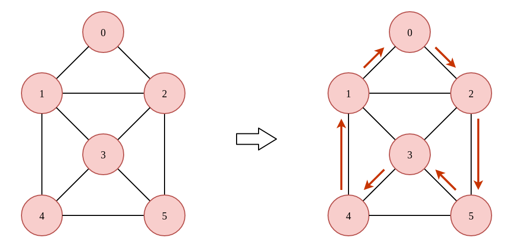
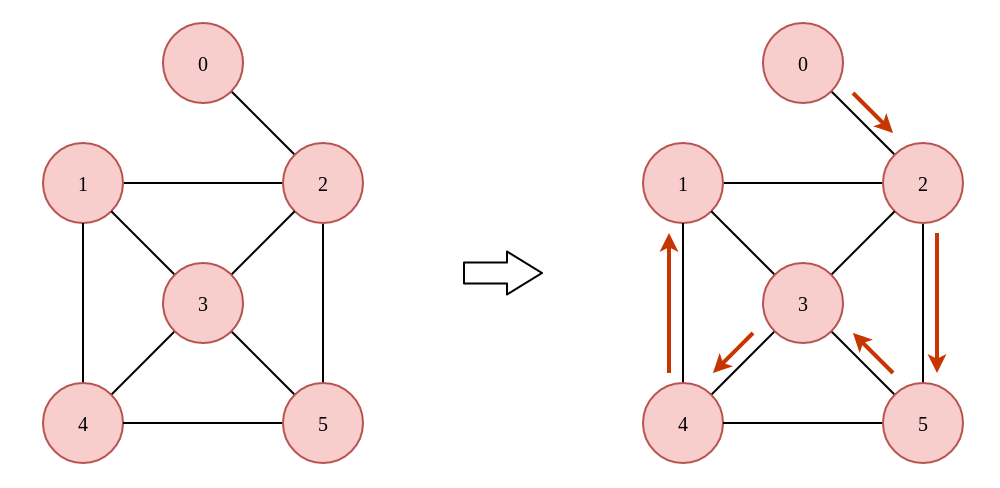
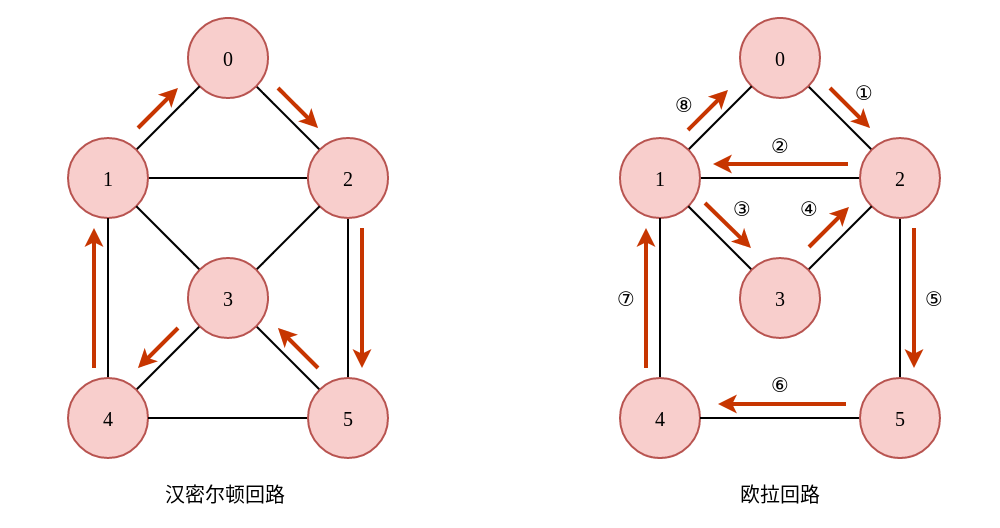
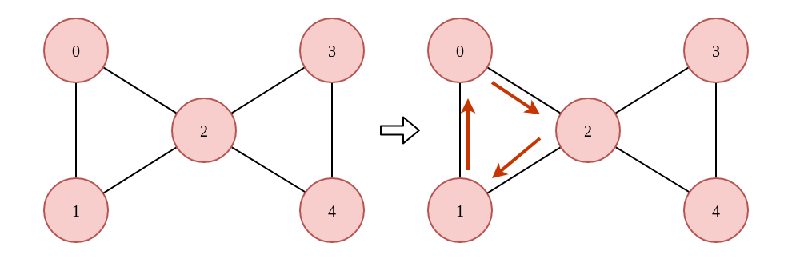
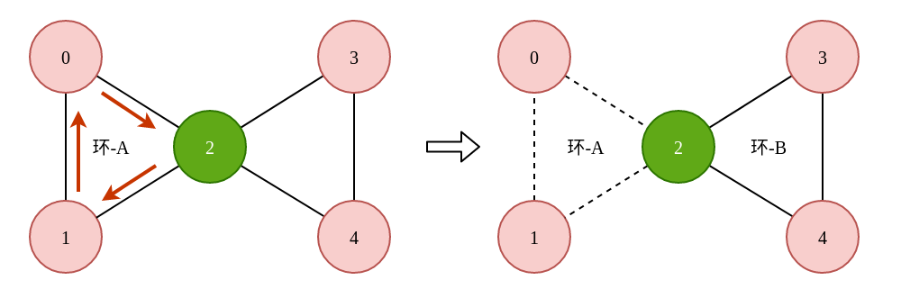
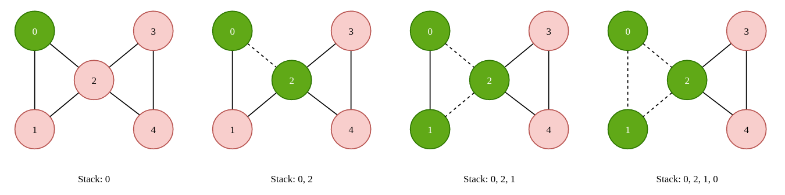
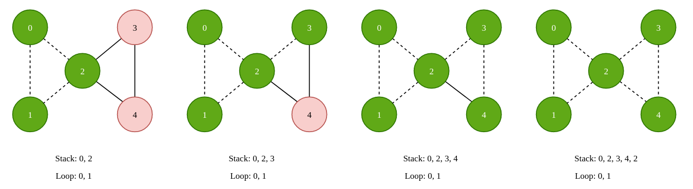
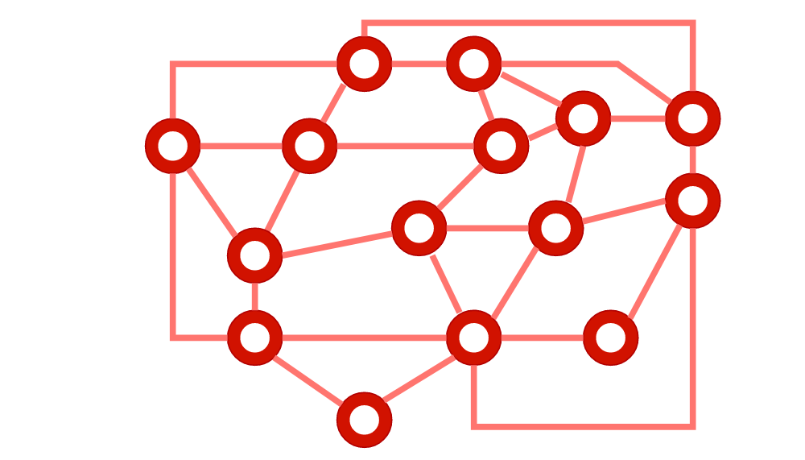

## 汉密尔顿回路与欧拉回路

汉密尔顿回路和欧拉回路是图论领域中一个非常有趣的话题，接下来我们将会看到，尽管它们的定义非常之类似，但是求解过程却完全不同。算法的时间复杂度也千差万别，一个是指数爆炸级，而另一个则可以在多项式级别内完成。


### 1. 汉密尔顿回路与汉密尔顿路径

#### 1.1 定义

汉密尔回路是指从图中的一个顶点出发，经过每一个**顶点**，并且每个**顶点**只经过一次。



如上图所示，我们可以找到 `0->2->5->3->4->1->0` 这样的一条回路，该回路中包含了图中所有的顶点，并且除了起始顶点以外，每一个顶点均只经过了一次，这样的回路我们就称之为汉密尔顿回路。回路是指从一个顶点出发，途经部分的顶点，再次回到起始点的一条路径，如上图所示的从顶点 `0` 出发，之后又可以回到顶点 `0`，而汉密尔顿路径则不要求如此。

对于汉密尔顿路径而言，我们只需要找到一条路径，使其包含图中的所有顶点，并且每个顶点只出现一次即可，并不要求再次回到起始点，如下图所示:



该图中并不存在汉密尔顿回路，因为顶点 `0` 的度为 1，而一进一出必然要消耗顶点的 2 个度。但是却存在汉密尔顿路径，如 `0->2->5->3->4->1`，或者是 `0->2->1->4->3->5`。我们可以有这样的结论，当一个图中存在汉密尔顿回路的时候，必然存在汉密尔顿路径。但是若存在汉密尔顿路径，并不能说图中一定存在汉密尔顿回路。

狄拉克给出了快速判断一个图中是否**必然**存在汉密尔顿回路的方法：

> 在一个包含 N 个顶点的无向图中，若所有顶点的度均大于等于 N/2（当 N 为奇数时结果向上取整），则汉密尔顿回路一定存在。

需要注意的是，狄拉克定理并不是一个“二分定理”，也就是说，假如一个图中的某一个顶点的度小于 N/2 的话，我们不能够说在该图中一定不存在汉密尔顿回路。例如上面给出的例子，图中一共有 6 个顶点，节点 `0` 的度为 2，小于 6/2，但是依然存在汉密尔顿回路。

#### 1.2 求解

求解汉密尔顿回路只能采用暴力回溯的方式解决，也就是说这是一个 NP 难的问题，时间复杂度为指数级别。回溯的过程非常简单，从任意一个顶点出发，当相邻顶点未被遍历过即可添加至当前路径中，直到所有的顶点都被遍历过并且能够回到起始节点。代码如下:

```cpp
class HamiltonLoop {
private:
    vector<bool> visited;
    vector<unordered_set<int>> graph;
    vector<vector<int>> loops;

    void backtracking(int src, int current, int left, vector<int>& path) {
        if (left == 0 && current == src) {
            loops.push_back(path);
            return ;
        }
        for (int next : graph[current]) {
            if (!visited[next]) {
                left --;                                // 选择
                visited[next] = true;                   
                path.push_back(next);        

                backtracking(src, next, left, path);

                left ++;                                // 撤销选择
                visited[next] = false;
                path.pop_back();
            }
        }
    }

public:
    vector<vector<int>> getAllLoop(int vertices, vector<vector<int>> edges) {
        visited = vector<bool>(vertices, false);
        graph = vector<unordered_set<int>>(vertices);       // 转换成邻接表的形式

        for (auto edge : edges) {
            graph[edge[0]].insert(edge[1]);
            graph[edge[1]].insert(edge[0]);
        }

        vector<int> loop;
        loop.push_back(0);
        backtracking(0, 0, vertices, loop);

        return loops;
    }
};
```

Leetcode 中的 [980. Unique Paths III](https://leetcode.com/problems/unique-paths-iii/) 本质上就是一个汉密尔顿路径问题，求解过程就是暴力回溯。题解可参考:

> https://github.com/SmartKeyerror/Snorlax/blob/master/leetcode/backtracking/980-Unique-Paths-III.cpp


### 2. 欧拉回路与欧拉路径

欧拉回路与汉密尔顿路径的定义非常之类似，汉密尔顿回路是指从一个**顶点**出发，经过所有的**顶点**一次再回到起始点的一条回路。而欧拉路径则是从一个顶点出发，经过所有的**边**一次再回到起始点的一条回路。



欧拉回路源自于德国格尼斯堡七桥问题，感兴趣的小伙伴儿可以 Google 一下。欧拉在解决这个问题时并不是证明这个问题有解，而是去证明这个问题无解。最终得到了欧拉回路存在的充分必要条件：

对于一个顶点，进去一次然后再出去一次，必然“消耗”两条边。如果想要将所有的边都走一遍然后回到原点，每一个顶点都必须有进有出。也就是说，**每一个顶点的度必须是偶数**，这就是欧拉回路存在的充分必要条件。

汉密尔顿回路是没有充分必要条件的，只有充分条件（所有顶点的度大于等于 N/2），而欧拉回路存在充分必要条件。

#### 2.1 求解思路

欧拉回路的求解过程非常巧妙，其重点就在于寻找环。假设我们从任意一个节点出发，随便的找一个环，如果这个环就是原图的话，那么可以说找到了欧拉回路。否则，剩下的边一定和我们找到的这个环相连接，并且剩下的顶点的度也必然是偶数，同样存在环。

此时我们找到的这两个环之间必然存在公共顶点，该顶点其实就是连接两个环的枢纽。通过该顶点遍历完另一个环，再回到原来的环进行遍历，即可找到欧拉路径。我们以一个稍微简单的图为例：



如上图所示，假设从顶点 `0` 出发，随意的找到了一个环，这个环由 `0`、`2`、`1` 这三个顶点组成。现在，我们将这个环中的所有边删去，然后在图中寻找另一个环，可以找到由顶点 `2`、`3`、`4` 所组成的环，如下图所示：



很明显地，顶点 `2` 就是两个环的枢纽，当我们在遍历环 A 时，遇到顶点 `2` 之后再去遍历环 B，遍历完环 B 以后接着遍历环 A。最终我们就可以得到 `0-2-3-4-2-1-0` 这样的一条路径，而这正是欧拉路径，这也是 Hierholzer 算法的基本过程。

#### 2.2 Hierholzer 算法的实现

前面我们提到了 Hierholzer 算法的基本思想：寻找环的连接点。但是，在具体的代码实现中，我们该如何去寻找环与环的连接点呢? 答案是使用栈这一数据结构，在寻找环的过程中，每经过一个顶点，我们都将其压入栈中，同时将我们遍历过的边删去。可以预见的，当栈中保存着一个环以后，将再也没有路径可走了，此时我们就可以不断的弹出顶点，直到弹出的顶点还有其它路可走。



当我们到达顶点 `0` 时，由于在遍历的过程中将 `0-2` 这条边删去，导致此时已经无路可走了。此时我们将 Stack 中的顶点弹出并保存到另一个数组中，直到弹出的顶点仍然有其它路可走：



此时顶点 `2` 也没路可走了，所以将 Stack 中的顶点 pop 进 Loop 数组中，将会得到 `[0, 1, 2, 4, 3, 2, 0]`。实现过程如下:

```cpp
class EulerLoop {
private:
    vector<unordered_set<int>> graph;
    vector<int> loop;
public:
    bool hasEulerLoop() {
        // 计算每一个顶点的度，如果某一个顶点的度为奇数的话，不存在欧拉回路
        for (auto edges : graph) {
            if (edges.size() & 1) return false;
        }
        return true;
    }

    vector<int> getEulerLoop(int vertices, vector<vector<int>> edges) {
        loop.clear();
        graph = vector<unordered_set<int>>(vertices);

        for (auto edge : edges) {
            graph[edge[0]].insert(edge[1]);
            graph[edge[1]].insert(edge[0]);
        }

        if (!hasEulerLoop()) return loop;

        stack<int> path;
        int current = 0;
        path.push(current);

        while (!path.empty()) {
            if (graph[current].size() != 0) {
                path.push(current);
                // 随便找一个 current 的相邻顶点，C++可用迭代器实现。删边
                int random = *graph[current].begin();
                graph[current].erase(random);
                graph[random].erase(current);
                current = random;
            }
            else {
                loop.push_back(current);
                current = path.top();
                path.pop();
            }
        }
        return loop;
    } 
};
```

在明白了如何求解欧拉回路以后，妈妈再也不用担心我收不到 QQ 的一笔画红包了。



### 3. 小结

Ba 说了，QQ 收红包去了。
