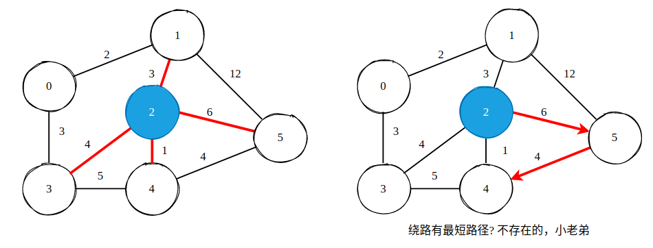
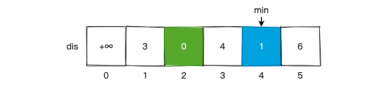
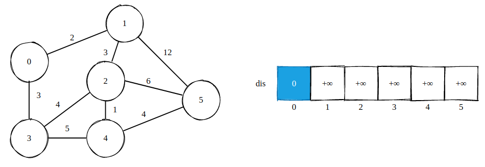
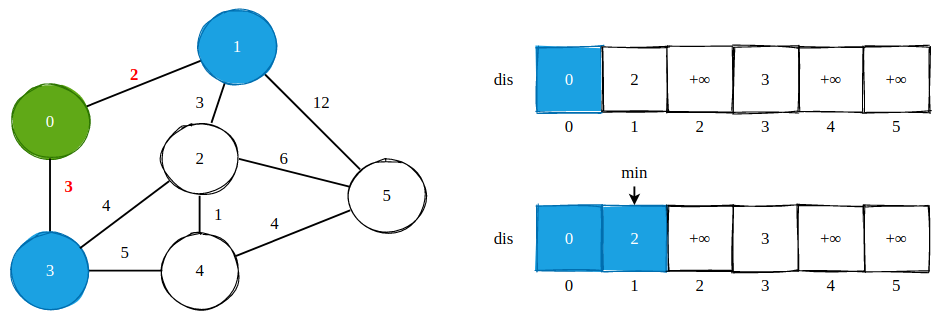
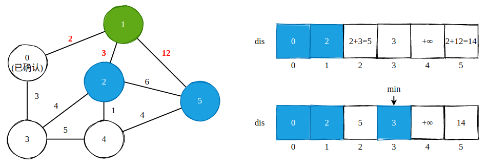
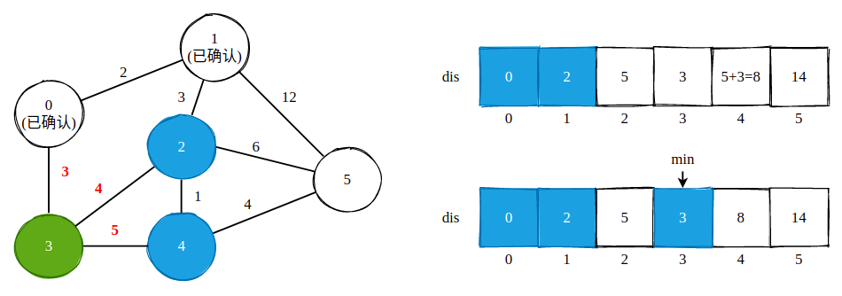
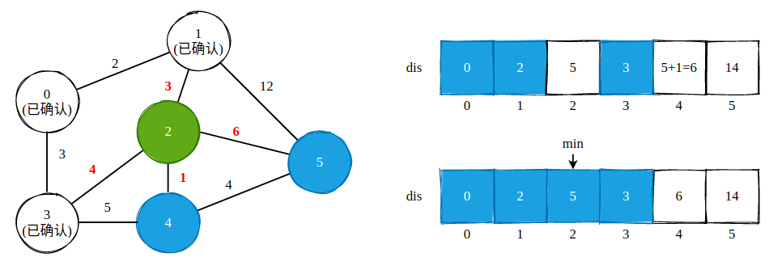
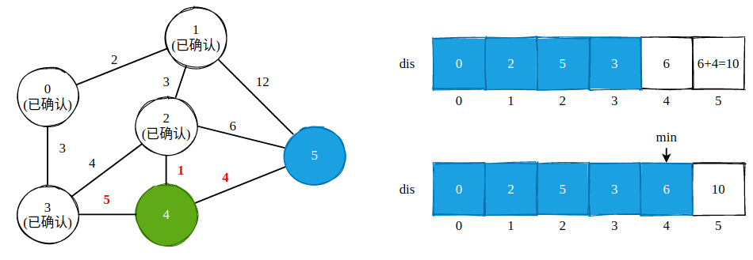
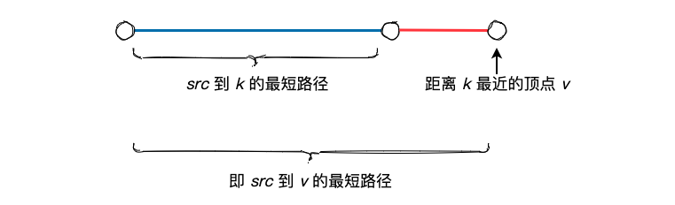

## Dijkstra 算法


### 1. Dijkstra 算法利用的基本事实

Dijkstra 算法利用了这样的一个事实:

在一个不含有负权边的带权图中，对于一个顶点 `v0` 来说，其相邻顶点分别为 `v1`、`v2`、... `vn`，并且 `v0` 到这些顶点的权重为 `w1`、`w2`、... `wn`，**若 `wk` 为其中的最小值，那么我们就可以断定: 顶点 `v0` 到顶点 `vk` 的最短路径就是 `wk`**。不可能存在其它顶点，使得 `v0` 经过这一顶点再到达 `vk` 的路径和小于 `wk`。


上面儿的一段话听起来可能有点儿绕，我们用一个简单的例子来解释:



如上图所示，对于顶点 2 而言，其相邻顶点为 1、3、4、5，对应路径权重分别为 3、4、1、6。通过我们的肉眼观察就可以知道顶点 4 到顶点 2 的权重最小，或者说距离最短。那么我们就可以认定，顶点 2 到顶点 4 的最短路径就是 1。这是因为在无负权边的情况下，我们不可能再通过顶点 3、顶点 1 或者是顶点 5 绕一圈儿再回到顶点 4，使其路径更短。

如果我们用过路费来表示权重的话，如果我们选择顶点 3，一开始就花了 4 块钱， 剩下的路径中又不会给你发钱，就算是免费公路，花的钱也要比直接到顶点 4 来的多。这也是为什么 Dijkstra 算法不能处理负权边的原因: 对于负权边而言，真的会给你发钱。

我们把上面的例子稍微抽象化一些，使用 `dis[i]` 数组来表示顶点 i 到顶点 2 的最短路径，那么我们可以得到下面的 `dis` 数组:



除开顶点 2 自身以外，`dis` 数组中的最小值为 1，现在我们已经知道了这就是顶点 2 到顶点 4 的最短路径。这个东西其实就是 Dijkstra 算法，只不过我们需要动态更新这个 `dis` 数组而已，基本原理完全一样。

### 2. Dijkstra 算法过程

还是上面儿那张图，我们以求顶点 0 到其它所有顶点的最短路径为例，按部就班的执行 Dijkstra 算法:



`dis[i]` 数组仍然表示顶点 0 到顶点 i 的最短路径，在一开始，`dis[0] = 0`，其余为正无穷。那么从顶点 0 开始出发，首先找到其相邻的所有顶点:



与顶点 0 相邻的顶点有 2 个，使用蓝色进行标记，分别为顶点 1 和顶点 3。我们可以直接更新 `dis` 数组，因为这两个顶点就是从起点过来的，如此一来我们就得到了上图中的第一个 `dis` 数组。然后，在该数组中找到最小值，并且是没有被蓝色标记过的。**因为被蓝色标记过的是已确认顶点，我们不应该重复遍历**。该最小值必然是最短路径中的组成部分，原因已经在上面阐明了: 我们不可能再找到一个顶点，绕一圈儿有更短的路径。因此，我们可以确认路径长度为 2 就是顶点 0 到顶点 1 的最短路径。



当我们确定下顶点 1 到顶点 0 的最短路径以后，从顶点 1 再次出发，找到与其相邻的所有边。在上图中可以看到顶点 1 有 3 条边，分别为 `1->0`、`1->2` 以及 `1->5`，顶点 0 已被确认，所以我们忽略。对于顶点 2 来说，从顶点 1 出发到达顶点 2 的路径长度总和为 `dis[1] + w[1][2]`，结果为 5，小于 `dis[2]` 的正无穷，即 `dis[1] + w[1][2] < dis[2]`，因此我们更新其值。

`dis[1] + w[1][2] < dis[2]` 这个操作有一个专有名词，叫做“松弛”。也就是我们找到了一条更短的路径到达顶点 2，这条路径为 `1->2`。顶点 5 做同样的处理。



更进一步地，我们找到了 `dis` 数组中未确认顶点的最小值，为 3，也就是顶点 3，那么我们再从顶点 3 出发，看能不能执行松弛操作。



对顶点 2 相邻的顶点执行松弛操作。




对顶点 4 的相邻顶点执行松弛操作，这一步执行完毕后我们就将图中所有的顶点全部确认了一遍，那么也就得到了顶点 0 到其它各个顶点的最短路径，算法过程到此结束。

从这个过程中我们可以看到，**Dijkstra 算法的过程和求解最小生成树的算法非常之类似，每一次我们都选择距离 src 顶点最短的那个顶点进行操作。因为我们知道，最短 + 最短才有最短路径**。



因此，说 Dijkstra 算法有贪心思想也可以，说它有动态规划思想同样可以。


### 3. Dijkstra 算法的实现

```cpp
class Dijkstra {
public:
    // 图以 Edge lists 的方式传入，每个顶点编号为 0 - vertices-1。edges[i][0] 与 edges[i][1] 表示连接的两个顶点，edges[i][2] 表示距离
    vector<int> dijkstra(int vertices, vector<vector<int>> edges, int src) {
        // 使用邻接表的方式来表示无向有权图
        vector<unordered_map<int, int>> graph(vertices);
        for (int i = 0; i < edges.size(); i++) {
            int u = edges[i][0], v = edges[i][1], dis = edges[i][2];
            graph[u].insert({v, dis}), graph[v].insert({u, dis});
        }

        // distance 数组中记录了顶点 src 到其它顶点的最短路径，初始化成 INT_MAX
        vector<int> distance(vertices, INT_MAX);
        distance[src] = 0;
        
        // visited 用来记录哪些节点到 src 的最短路径已经被确认
        vector<bool> visited(vertices, false);

        // 使用最小堆以 O(logn) 的时间复杂度找到最小值
        priority_queue<pair<int, int>, vector<pair<int, int>>, greater<pair<int, int>>> heap;
        heap.push({0, src});

        while (!heap.empty()) {
            int current = heap.top().second;
            heap.pop();

            visited[current] = true;

            for (auto next : graph[current]) {
                int node = next.first;
                
                if (visited[node]) continue;
                
                // 松弛操作
                else if (distance[current] + graph[current][node] < distance[node]) {
                    distance[node] = distance[current] + graph[current][node];
                    heap.push({distance[node], node});
                }
            }
        }
        return distance;
    }
};

```


### 4. Dijkstra 算法的应用

Dijkstra 算法是求解**单源**最短路径的算法，也就是**只能求解某一个顶点到其它所有顶点的最短路径，而无法求解出任意两个顶点间的最短路径，并且图中没有负权边。**但是由于现实生活中的问题通常都不会具有负权边，并且求解所有顶点间的最小距离这一需求比较罕见。因此，Dijkstra 算法通常作为我们求解一般问题的首选算法。

[743. Network Delay Time](https://leetcode.com/problems/network-delay-time/) 以及 [1631. Path With Minimum Effort](https://leetcode.com/problems/path-with-minimum-effort/) 这两个问题可以直接套用 Dijkstra 算法模板解决，没有什么特殊的地方。

[787. Cheapest Flights Within K Stops](https://leetcode.com/problems/cheapest-flights-within-k-stops/) 这道题要更有意思一些。题目大意如下:

> 有 n 个城市通过 m 个航班连接。每个航班都从城市 u 开始，以价格 w 抵达 v。
现在给定所有的城市和航班，以及出发城市 src 和目的地 dst，你的任务是找到从 src 到 dst 最多经过 k 站中转的最便宜的价格。如果没有这样的路线，则输出 -1。

这道题不仅要求我们求 src 到 dst 的最短路径，还要求我们至多经过 k 个中转站，这个限制条件有些类似于 BFS 中的“层数”。我们依然使用 Dijkstra 算法求解最短路径，只不过，对于每一个节点而言，我们还需要记录下其经过了多少个中转站。

也就是说，对于边 u-v 而言，若我们有一条路径，使得 `w[u][t] + w[t][v] < w[u][v]`，那么我们就更新 `dis[v]` 的值，这是 Dijkstra 算法中的基本松弛操作。但是在这一道题目中，我们还需要考虑到达顶点 u 已经中转了几次，或者说途径了几个机场。只有在中转次数小于 K 的情况下我们才可以进行松弛操作。

```cpp
class Solution {
public:
    int findCheapestPrice(int n, vector<vector<int>>& flights, int src, int dst, int K) {
        vector<unordered_map<int, int>> graph(n);
        for (int i = 0; i < flights.size(); i++)
            graph[flights[i][0]].insert({flights[i][1], flights[i][2]});

        priority_queue<vector<int>, vector<vector<int>>, greater<vector<int>>> heap;

        heap.push({0, src, K});

        while (!heap.empty()) {
            int currentDis = heap.top()[0], currentNode = heap.top()[1], remainK = heap.top()[2];
            heap.pop();

            if (currentNode == dst) return currentDis;

            if (remainK >= 0) {
                for (auto next : graph[currentNode]) {
                    int node = next.first, weight = next.second;
                    heap.push({currentDis + weight, node, remainK - 1});
                }
            }
        }
        return -1;
    }
};
```

### 5. 小结

由于 Dijkstra 算法本身就要比一般的算法更为复杂以及难以理解，所以 Leetcode 上的大多数最短路径问题只会在原有最短路径问题上稍加修改、变换，题目更多的考察对 Dijkstra 算法本身的理解。也就是说，只要明白了 Dijkstra 算法怎么写，题目也就能做出来了，这样的问题本身是 “Easy” 的。

