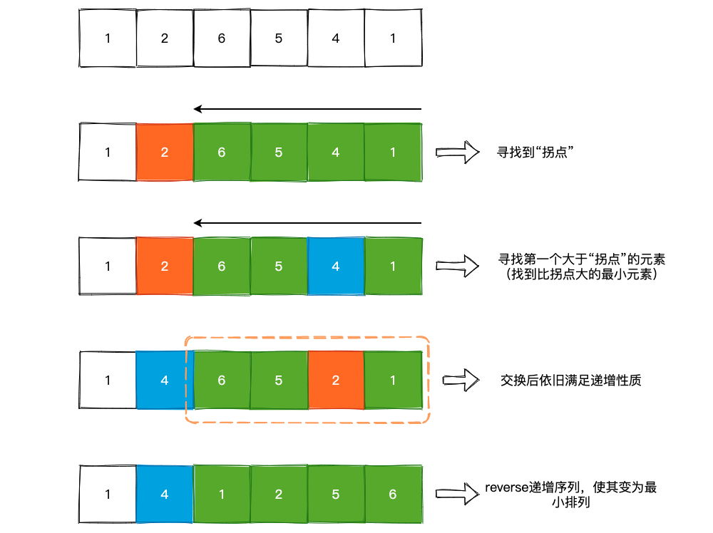
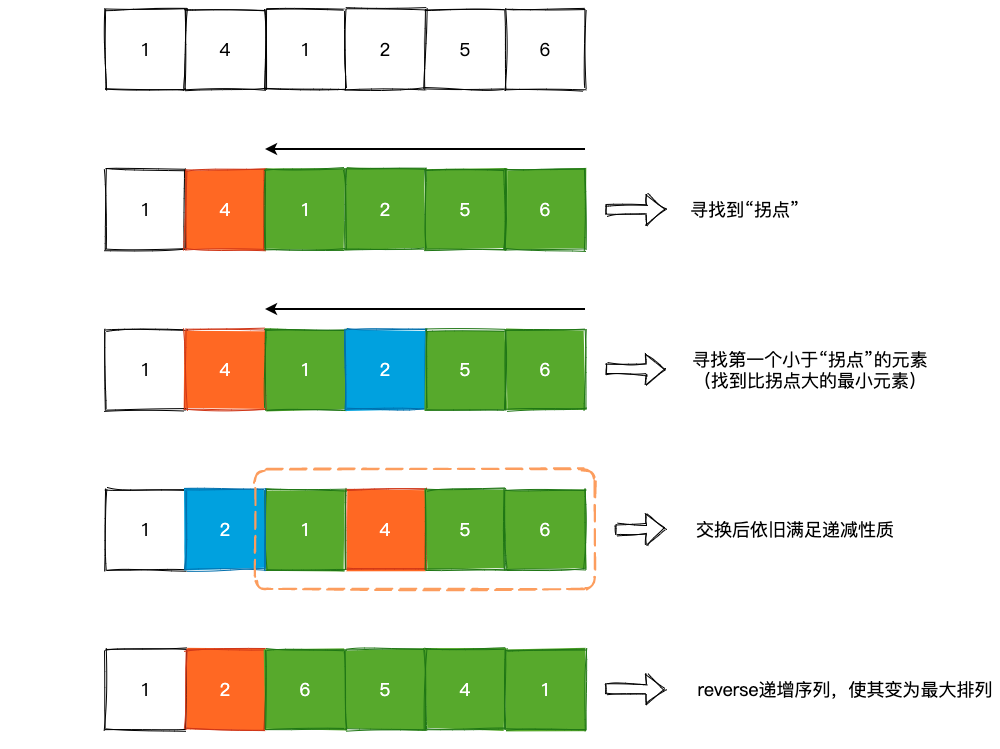

## Leetcode 中的排列问题

### 1. 全排列问题

可参考往期文章:

> [回溯与剪枝: 《明日边缘》or《源代码》](https://github.com/SmartKeyerror/Snorlax/tree/master/algorithm/backtracking)

### 2. 下一个排列

[31. Next Permutation](https://leetcode.com/problems/next-permutation/):

> 实现获取 下一个排列 的函数，算法需要将给定数字序列重新排列成字典序中下一个更大的排列。
如果不存在下一个更大的排列，则将数字重新排列成最小的排列（即升序排列）。

题意也很好理解，给定一个 `nums` 数组，求这个数组字典序中下一个更大的排列，例如 `[1, 2, 6, 5, 4，1]` 的下一个排列为 `[1, 4, 1，2, 5, 6]`。如果我们将 `nums` 数组变成一个整型的话，可能会更加的直观:

```bash
[1, 2, 6, 5, 4, 1] => 126541
[1, 4, 1, 2, 5, 6] => 141256
[1, 4, 1, 2, 6, 5] => 141265
[1, 4, 1, 5, 2, 6] => 141526
```

可以看到，nums 所代表的整型数字不断地增大，并且每次增大时都是以最小“步伐”增大的。

解决这个问题的思路也很简单，以 `[1, 2, 6, 5, 4, 1]` 为例，从数组的末尾往前看，会发现数字大小是逐渐增大的，那么我们第一步要做的事情就是**找到这个连续序列的“下降点”**，也就是从哪个数字开始不满足递增这一特性。在这个例子中为 `2`，前面 4 个元素 `[1, 4, 5, 6]` 递增，到元素 `2` 时递增序列停止。

为什么我们要找这个“下降点”呢? 因为我们需要求的是 Next Permutation，字典序需要递增，而 `[6, 5, 4, 1]` 已经是这 4 个数所能组成的最大值了，我们无法对这 4 个数进行重新排列，然后得到更大的数。所以，我们需要对 `[2, 6, 5, 4, 1]` 进行重新排列，得到下一个更大的数字。那么如何排列呢?

**我们再次从数组的末尾开始，寻找第一个大于 `2` 的元素，这个元素将作为新的排列的首个元素**，为 `4`，然后交换 `2` 和 `4` 两个元素的位置，使得我们最开始找到的那个递增序列依然满足递增的性质，并且新的排列领头儿的那个是 `2` 最近的元素。此时 `nums` 变成了 `[1, 4, 6, 5, 2, 1]`，那么此时只需要将连续递增的序列 `reverse` 一下，变成连续递减的序列即可。也就是 `[1, 4, 1, 2, 5, 6]`，得到我们需要的下一个排列。



题解如下:

```cpp
class Solution {
public:
    void nextPermutation(vector<int>& nums) {
        for (int i = nums.size() - 2; i >= 0; i--) {
            if (nums[i+1] > nums[i]) {
                for (int j = nums.size() - 1; j > i; j--) {
                    if (nums[j] > nums[i]){
                        swap(nums[i], nums[j]);
                        break;
                    }
                }
                reverse(nums.begin() + i + 1, nums.end());
                return;
            }
        }
        reverse(nums.begin(), nums.end());
    }
};
```

顺带一提，Leetcode 上 [556. Next Greater Element III](https://leetcode.com/problems/next-greater-element-iii/) 这一道题目完全可以转换成 Next Permutation 问题进行解决。

### 3. 上一个排列

在理解了下一个排列问题以后，那么上一个排列问题就可以信手拈来，例如 `[1, 4, 1, 2, 5, 6]` 的上一个排列为 `[1, 2, 6, 5, 4, 1]`，我们只需要将**在递增序列中寻找拐点**变成**在递减序列中寻找拐点**，将**从末尾寻找第一个大于拐点的元素**变成**从末尾寻找第一个小于拐点的元素**即可，然后交换两个元素，将递减序列 `reverse` 成递增序列。图示如下:



题解如下:

```cpp
class Solution {
public:
    void previousPermutation(vector<int>& nums) {
        for (int i = nums.size() - 2; i >= 0; i--) {
            if (nums[i+1] < nums[i]) {
                for (int j = nums.size() - 1; j > i; j--) {
                    if (nums[j] < nums[i]){
                        swap(nums[i], nums[j]);
                        break;
                    }
                }
                reverse(nums.begin() + i + 1, nums.end());
                return;
            }
        }
        reverse(nums.begin(), nums.end());
    }
};
```

Leetcode 中并没有 Previous Permutation 这个问题，如果对这个问题感兴趣的话，可以去 [LintCode](https://www.lintcode.com/) 上提交，只不过需要对上述代码的返回值进行一个小的改动:

> [51. Previous Permutation](https://www.lintcode.com/problem/previous-permutation/description)

### 4. 第 k 个排列

[60. Permutation Sequence](https://leetcode.com/problems/permutation-sequence/):

> 给定一个 [1, 2, 3, ..., n] 的数组，求出该数组字典序的第 k 个排列

这个问题和 Next Permutation 问题一样，我们依然可以使用回溯 + 剪枝的方式求出第 k 个排列，但是其时间复杂度为 `O(n!)`，当然题目中也给出了 `n <= 9` 这个限制条件，使得阶乘的复杂度能够完成。不过，这其中依然可以通过找规律的方式实现，不受阶乘时间复杂度的限制。

以 `[1, 2, 3, 4]` 这 4 个数字为例，一共有 4!，即 24 种排列，因为一共有4 个数字，所以每个数字开头的有 6 种可能:

```bash
1 + permutation(2, 3, 4);
2 + permutation(1, 3, 4);
3 + permutation(1, 2, 4);
4 + permutation(1, 2, 3);
```

假设 `k` 为 15 的话，我们就可以知道它在 15 / 6 = 2，即在以 3 开头的排列中。并且还能知道是在 `permutation(1, 2, 4)` 的第 3 个排列中（15 - 12 = 3）。因此，现在问题就转换成了求解 `permutation(1, 2, 4)` 的第 3 个排列，依次类推。

```cpp
class Solution {
public:
    string getPermutation(int n, int k) {

        // 维护一个阶乘的缓存，避免后续的重复计算
        vector<int> fac(n + 1, 1);
        for (int i = 1; i <= n; i++)
            fac[i] = fac[i-1] * i;
        
        // nums 备选数组，也就是 1,2,3,4,5...
        vector<char> nums(n + 1);
        for (int i = 0; i < n; i++)
            nums[i] = i + 1 + '0';
        
        k --;
        string result = "";

        for (int i = 1; i <= n; i++) {
            int j = k / fac[n-i];       // 确定区间
            k %= fac[n-i];              // 更新 k 的值
            result += nums[j];
            nums.erase(nums.begin() + j);
        }
        return result;
    }
};
```

### 5. 带有相斥或者相吸的排列

在某些场景下，我们并不能对所给的数字或者是其它东西进行随意的排列，假设我们需要对 `[1, 2, 3, 4]` 进行排列，并且规定 `1` 和 `2` 必须相邻，`3` 和 `4` 不能相邻，给出全部的排列方式。对于这种情况，我们可以得到:

```bash
[3, 1, 2, 4]
[3, 2, 1, 4]
[4, 1, 2, 3]
[4, 2, 1, 3]
```

一共 4 种排列方式。Leetcode 上就有这样的问题，[1220. Count Vowels Permutation](https://leetcode.com/problems/count-vowels-permutation/):

> Given an integer n, your task is to count how many strings of length n can be formed under the following rules:
- Each character is a lower case vowel ('a', 'e', 'i', 'o', 'u')
- Each vowel 'a' may only be followed by an 'e'.
- Each vowel 'e' may only be followed by an 'a' or an 'i'.
- Each vowel 'i' may not be followed by another 'i'.
- Each vowel 'o' may only be followed by an 'i' or a 'u'.
- Each vowel 'u' may only be followed by an 'a'.

题目中的限制条件比举例中的限制条件多得多，并且给出了 `1 <= n <= 2 * 10^4` 这样的限制条件，无法使用回溯解决。

题目中的 Hide Hint 已经给出了提示: 使用 DP 解决。递推公式也很简单，假设 `dp[i][j]` 表示第 `i` 个位置摆放第 `j` 个元音字母，那么当我们第 `i` 个位置摆放字母 `u` 时，第 `i-1` 个元素只能摆放 `o` 或者是 `i`，也就是 `dp[i]['u'] = dp[i-1]['o'] + dp[i-1]['i']`。最后计算一下 `dp[n-1]` 的总和即可。

题解如下:

```cpp
class Solution {
public:
    int countVowelPermutation(int n) {
        int mode = 1e9 + 7;
        vector<vector<long>> dp(n, vector<long>(5, 0));
        unordered_map<char, int> vowels = {{'a', 0}, {'e', 1}, {'i', 2}, {'o', 3}, {'u', 4}};

        // init
        dp[0][0] = dp[0][1] = dp[0][2] = dp[0][3] = dp[0][4] = 1;

        for (int i = 1; i < n; i++) {
            for (auto vowel : vowels) {
                int j = vowel.second;
                switch (vowel.first) {
                case 'a':
                    dp[i][j] += dp[i-1][vowels['e']] % mode;
                    dp[i][j] += dp[i-1][vowels['u']] % mode;
                    dp[i][j] += dp[i-1][vowels['i']] % mode;
                    break;
                case 'e':
                    dp[i][j] += dp[i-1][vowels['a']] % mode;
                    dp[i][j] += dp[i-1][vowels['i']] % mode;
                    break;
                case 'i':
                    dp[i][j] += dp[i-1][vowels['e']] % mode;
                    dp[i][j] += dp[i-1][vowels['o']] % mode;
                    break;
                case 'o':
                    dp[i][j] += dp[i-1][vowels['i']] % mode;
                    break;
                case 'u':
                    dp[i][j] += dp[i-1][vowels['i']] % mode;
                    dp[i][j] += dp[i-1][vowels['o']] % mode;
                    break;
                }
            }
        }
        long long res = 0;
        for (int i = 0; i < 5; i++)
            res += dp[n-1][i] % mode;
        return res % mode;
    }
};
```

### 6. 小结

对于全排列问题，我们不可能在多项式级别内输出，这是因为 `P(n, r)` （从 `n` 个数中取出 `r` 个数进行排列） 本身就是一个阶乘级别的计算公式。因此，此类问题我们只能通过回溯类的方式解决，时间复杂度自然而然就是 `O(n!)`。但是，对于 Next Permutation 或者是 Previous Permutation 问题而言，我们可以通过观察其内部规律得到 `O(n)` 的解法。同样地，对于带有相斥或者相吸的排列可以通过 DP 的方式得到 `O(n)` 的解答。

其实，C++ 其实在内建函数中已经提供了 Next Permutation 和 Previous Permutation 的 API，实现在 `<algorithm>` 中。对其内部实现感兴趣的小伙伴儿可查阅其源码:

```cpp
#include <vector>
#include <algorithm>

using namespace std;

class Solution {
public:
    void nextPermutation(vector<int>& nums) {
        next_permutation(nums.begin(), nums.begin() + nums.size());
    }

    void prevPermuation(vector<int>& nums) {
        prev_permutation(nums.begin(), nums.begin() + nums.size());
    }
};
```
