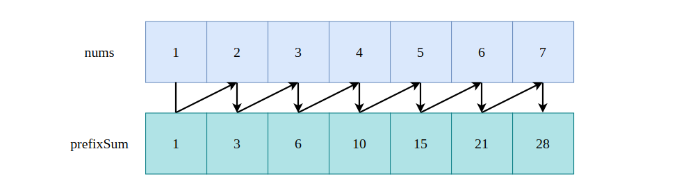
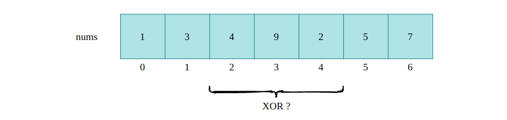
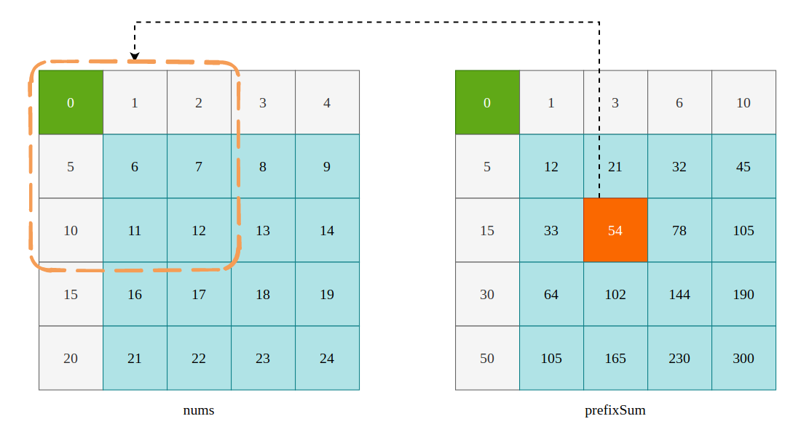

## Prefix Sum

Prefix Sum，常常又被称之为前缀和，是解决“数组中子数组的和”问题的一大利器。前缀和的概念其实非常简单，对于 `prefixSum[i]` 而言，其值为 `nums[0] + nums[1] + ... + nums[i]`，也就是从数组第 `0` 个元素开始，到数组的第 `i` 元素之间的元素和。

```bash
prefixSum[0] = nums[0]
prefixSum[1] = nums[0] + nums[1]
prefixSum[2] = nums[0] + nums[1] + nums[2]
......
prefixSum[i] = prefixSum[i-1] + nums[i]
```




因此，我们可以在 `O(n)` 的时间复杂度内通过原有数组构建出 Prefix Sum 数组:

```cpp
vector<int> GenPrefixSum(const vector<int> &nums) {
    int n = nums.size();
    vector<int> prefixSum(n);
    prefixSum[0] = nums[0];

    for (int i = 1; i < n; i++)
        prefixSum[i] = prefixSum[i-1] + nums[i];
    
    return prefixSum;
}
```

在有了 `prefixSum` 数组以后，我们就可以在 `O(1)` 的时间内计算任意两个索引间子数组的和了。例如计算 `nums[5]...nums[10]` 之间，长度为 6 的子数组的和，就可以使用 `prefixSum[10] - prefixSum[4]` 进行计算。更进一步地，若想要求 `nums[i]` 到 `nums[j]` 之间 `j - i + 1` 个数的数组和，使用 Prefix Sum 为: `prefixSum[j] - prefix[i-1]`，当然，前提条件是 `i != 0`。


在有了这些基础之后，就可以很轻松的解决 Leetcode 中关于子数组和的这一类问题了。首先来看 [1524. Number of Sub-arrays With Odd Sum](https://leetcode.com/problems/number-of-sub-arrays-with-odd-sum/)，题目描述如下:

> Given an array of integers arr. Return the number of sub-arrays with odd sum.
As the answer may grow large, the answer must be computed modulo 10^9 + 7.

给定一个整数数组 `arr`，求出所有和为奇数的子数组的数目:

```bash
Input：arr = [1,3,5]
Output：4
Explanation：所有的子数组为 [[1],[1,3],[1,3,5],[3],[3,5],[5]] 。
所有子数组的和为 [1,4,9,3,8,5]。奇数和包括 [1,9,3,5] ，所以答案为 4 。
```

既然要求子数组的和，那么可以先将 `arr` 的 `prefixSum` 求出来，然后观察 `prefixSum` 的规律，来得到问题的解。以 `[1,3,5]` 为例，得到的 `prefixSum` 为 `[1,4,9]`，奇偶性质为 `[奇数，偶数，奇数]`。我们知道 偶数 - 奇数 = 奇数，奇数 - 偶数 = 奇数，所以我们只需要统计一下前面出现的奇数数量和偶数数量即可。

当 `prefixSum[i]` 为偶数时，结果需要加上前面出现的奇数前缀和个数。而当 `prefixSum[i]` 为奇数时，结果需要加上前面出现的偶数前缀和个数。这个过程完全可以在构建 `prefixSum` 数组的过程中进行，所以算法的时间复杂度为 `O(n)`。题解如下:

```cpp
class Solution {
public:
    int numOfSubarrays(vector<int>& arr) {
        long long result = 0;
        int oddCounts = 0, evenCounts = 0, n = arr.size(), mode = 1e9 + 7;
        vector<int> prefixSum(n, 0);
        prefixSum[0] = arr[0];

        // 对 arr[0] 特殊处理
        if (arr[0] & 1) {
            oddCounts ++, result ++;
        }
        else evenCounts ++;

        for (int i = 1; i < n; i++) {
            prefixSum[i] = prefixSum[i-1] + arr[i];

            // 当 prefixSum[i] 为 奇数 时，我们更关注它之前一共有多少个偶数
            if (prefixSum[i] & 1) {
                result += evenCounts + 1;
                oddCounts ++;
            } else {                        // 当 prefixSum[i] 为 偶数 时，我们更关注它之前一共有多少个奇数
                result += oddCounts;
                evenCounts ++;
            } 
        }
        return result % mode;
    }
};
```

### 1. 一维数组下的 Prefix Sum

接下来看一个稍微复杂一点儿的问题，[560. Subarray Sum Equals K](https://leetcode.com/problems/subarray-sum-equals-k/)，题目描述如下:

> Given an array of integers nums and an integer k, return the total number of continuous subarrays whose sum equals to k.

给定一个整数数组 `nums` 和一个整型 `k`，求出所有和为 `k` 的连续子数组的数量:

```bash
Input: nums = [1,2,3], k = 3
Output: 2
Explanation: [1,2] 和 [3] 这两个子数组的和为 3，所以结果为 2。
```

我们同样使用 Prefix Sum 这一技巧进行求解，当我们得到了 `prefixSum` 数组之后，就可以将其转换成 Two Sum 问题进行思考了。假设当前第 `i` 个元素的前缀和为 `prefixSum[i]`，我们目标是找到一个 `j(j < i)`，使得 `prefixSum[i] - prefix[j] = k`，由于 `k` 由题目给定，所以我们只需要看 `prefixSum[i] - k` 是否出现过即可，这不就是典型的 Two Sum 问题吗? 题解如下:

```cpp
class Solution {
public:
    int subarraySum(vector<int>& nums, int k) {
        // key: prefixSum, value: frequency of prefixSum
        // 当 i = 0的时候，prefixSum 为 0，此时也有一个频次
        unordered_map<int, int> frequency = {{0, 1}};

        int result = 0, currentSum = 0;
        for (int i = 0; i < nums.size(); i++) {
            currentSum += nums[i];
            // 现在让我们看看 currentSum - k 在 frequency 中的频率，这个频率就是一个结果
            result += frequency[currentSum - k];
            frequency[currentSum] ++;
        }
        return result;
    }
};
```

### 2. 一维数组下的 Prefix XOR

我们之所以能够使用 `prefixSum` 数组来计算数组中任意区间连续子数组的和，是因为减法的一个特殊性质: `A - A = 0`，即当两个数相同时它们相减的结果为 0。而异或（XOR）也满足这个性质，并且满足交换律和结合率，所以我们完全可以构建一个 Prefix XOR 数组，来求解数组任意区间下的异或结果。



如上图所示，现在我们需要求索引在 `[2, 4]` 之间所有元素的异或值，可以按照如下方式进行:

```bash
prefixXOR[1] = nums[0] ^ nums[1]
prefixXOR[2] = nums[0] ^ nums[1] ^ nums[2]
prefixXOR[3] = nums[0] ^ nums[1] ^ nums[2] ^ nums[3]
prefixXOR[4] = nums[0] ^ nums[1] ^ nums[2] ^ nums[3] ^ nums[4]
```

如果我们想要求 `nums[2] ^ nums[3] ^ nums[4]` 的话，可以通过 `prefixXOR[4]` “消除”掉 ` nums[0] ^ nums[1]`，又因为异或操作满足交换律、结合律，以及其它特殊的性质，使得我们可以通过 `prefixXOR[4] ^ prefixXOR[1]` 来得到 `nums[2] ^ nums[3] ^ nums[4]` 的值。关于异或操作的特殊性质，可以参考此篇文章: [位操作那些事儿](https://github.com/SmartKeyerror/Snorlax/tree/master/algorithm/bit-manipulation#3--xor)。

Leetcode 中 [1310. XOR Queries of a Subarray](https://leetcode.com/problems/xor-queries-of-a-subarray/) 这个问题就是在问如何快速的求解数组中某一个区间内连续元素的异或值:

> Given the array arr of positive integers and the array queries where queries[i] = [Li, Ri], for each query i compute the XOR of elements from Li to Ri (that is, arr[Li] xor arr[Li+1] xor ... xor arr[Ri] ). Return an array containing the result for the given queries.

题解如下:

```cpp
class Solution {
public:
    vector<int> xorQueries(vector<int>& arr, vector<vector<int>>& queries) {
        int n = arr.size();
        vector<int> prefixXOR(n, 0);
        prefixXOR[0] = arr[0];

        for (int i = 1; i < n; i++) 
            prefixXOR[i] = prefixXOR[i-1] ^ arr[i];

        vector<int> result;
        for (auto query : queries) {
            int start = query[0], end = query[1];
            if (start == 0)
                result.push_back(prefixXOR[end]);
            else
                result.push_back(prefixXOR[end] ^ prefixXOR[start - 1]);
        }
        return result;
    }
};
```

### 3. 二维数组下的 Prefix Sum 与 Prefix XOR

Prefix Sum 与 Prefix XOR 在二维数组下同样适用，原理都是一样，从 `[0, 0]` 开始累加或者累积 XOR。以 Prefix Sum 为例，如下图所示:



当 `i !=0 ` 且 `j != 0`时，`prefixSum[i][j]` = `prefixSum[i][j-1]` + `prefixSum[i-1][j]` - `prefixSum[i-1][j-1]` + `nums[i][j]`。只需要减去重复计算的元素即可。

[1738. Find Kth Largest XOR Coordinate Value](https://leetcode.com/problems/find-kth-largest-xor-coordinate-value/)，这个问题就是二维数组中的 Prefix XOR 问题，Prefix XOR 和 Prefix Sum 在原理上没什么区别。我们首先求出 二维的 Prefix XOR 数组，然后再使用堆求出第 `K` 大的值即可，题解过程如下:

```cpp
class Solution {
public:
    int kthLargestValue(vector<vector<int>>& matrix, int k) {
        int m = matrix.size(), n = matrix[0].size();
        
        vector<int> coordinates;
        vector<vector<int>> prefixXOR(m, vector<int>(n, 0));

        for (int i = 0; i < m; i++) {
            for (int j = 0; j < n; j++) {
                if (i == 0 && j == 0) prefixXOR[i][j] = matrix[0][0];
                else if (i == 0 && j != 0) prefixXOR[i][j] = prefixXOR[i][j-1] ^ matrix[i][j];
                else if (i != 0 && j == 0) prefixXOR[i][j] = prefixXOR[i-1][j] ^ matrix[i][j];
                else prefixXOR[i][j] = prefixXOR[i-1][j] ^ prefixXOR[i][j-1] ^ prefixXOR[i-1][j-1] ^ matrix[i][j];
            }
        }

        priority_queue<int, vector<int>, greater<int>> minHeap;

        for (int i = 0; i < m; i++) {
            for (int j = 0; j < n; j++) {
                if (minHeap.size() == k) {
                    if (prefixXOR[i][j] > minHeap.top()) {
                        minHeap.pop();
                        minHeap.push(prefixXOR[i][j]);
                    }
                }
                else minHeap.push(prefixXOR[i][j]);
            }
        }

        return minHeap.top();
    }
};
```

### 4. 小结

一图胜千言:


