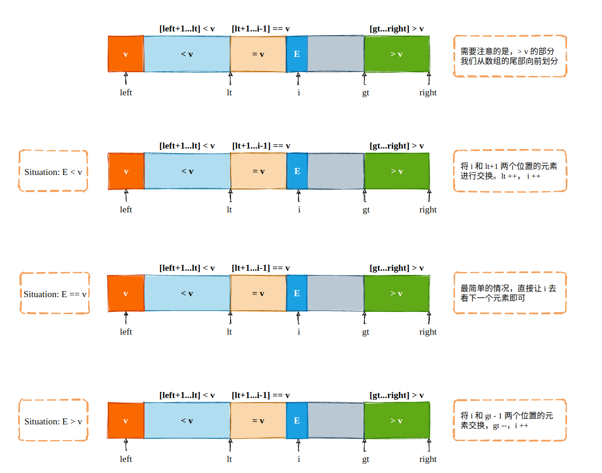

## 排序: 经典排序算法的思想随处可见

排序这一算法应该是我们日常开发中使用的最频繁的算法之一了，例如数组的去重，排行榜的计算，数据展示的顺序等等。在标准库实现的排序算法背后，蕴含着非常多的我们能够应用在其它领域的思想。

例如冒泡排序，虽然平均时间复杂度为 O(n^2)，却可以非常轻松的找到最大、第二大，或者第三大的元素。

插入排序则隐藏了一个非常重要的思想: 假设一部分元素已经有序，而后再考察下一个元素。在许多算法题目中，都可以使用这一思路完成解题。

选择排序通常会作为小范围数量的元素排序，通常我们在使用归并排序或者是快速排序时，当只剩下一小部分的元素需要排序时，就可以使用选择排序进行优化和加速。

归并排序自然不用多说，Divide And Conquer 算法最为直观的应用之一。

快速排序则被称之为“20世纪最伟大的算法之一”，目前绝多数标准库中所内置的 `sort` 模块均由快速排序所实现，其重要地位不言而喻。

对于一个算法而言，除了考虑其平均时间复杂度、平均空间复杂度以外，另一个最为重要的事情就是考虑其应用场景。在某些场景下，O(nlogn) 的算法并不一定比 O(n^2) 的算法更适合被选取。这也是我认为“不以平均时间复杂度论英雄”的原因之一。

这里推荐一个算法可视化的网站:

> https://visualgo.net/zh/sorting

### 1. 冒泡排序

冒泡排序只会操作数组中相邻的两个元素，每次冒泡的操作都尝试着对相邻两个元素进行交换，如果满足交换条件(如 `a[i] < a[i+1]`)则进行交换，直到最大值或者最小值落到数组末尾。重复这个过程 n 次，我们就能够对 n 个元素进行排序了。


```cpp
void bubbleSort(int array[], int n) {
    if (n <= 1) return;

    for (int i = 0; i < n; i++) {
        bool swaped = false;
        for (int j = 0; j < n - 1 - i; j++) {
            if (array[j] > array[j+1]) {
                swap(array[j], array[j+1]);
                swaped = true;
            }
        }
        if (!swaped) break;
    }
}
```

冒泡排序的本质就是**将最重要的元素先挑出来**，这其实非常符合人类的思考习惯: 爱情、亲情、友情、财富、荣誉、权利，相信大多数人在进行“排序”的时候都会将最重要的挑选出来，然后在剩下的选项中挑选次要的。

### 2. 归并排序

归并排序遵循分而治之的思想，将一组数据从中间进行分割，直到无法继续分割，也就是单个元素，然后再将这些单个元素逐一的归并，得到了一段一段的有序序列，而后将这些有序子序列再进行合并。

归并排序最为复杂的过程就是合并的过程，也就是将两个有序数组合并成一个有序数组。在 leetcode 中的 [88. Merge Sorted Array](https://leetcode.com/problems/merge-sorted-array/) 和 [21. Merge Two Sorted Lists](https://leetcode.com/problems/merge-two-sorted-lists/) 就直接考察了合并过程。

**对于数组元素的归并，我们需要借助额外的辅空间**，辅助空间中保存原有的两个数组元素，其中 `left` 指针指向第一个有序子数组，`right` 指向第二个有序子数组，索引 `k` 则是原数组中写入下一个元素的指针。归并过程如下:


归并排序的源代码稍微有点儿长，不再赘述，相信绝大多数的算法书书籍中均有提及。

在熟悉了合并这个过程以后，就可以很轻松的解决这道难度为 Medium 的链表排序了: [148. Sort List](https://leetcode.com/problems/sort-list/)，这道题算是下面两道题的组合体: 
- [Middle of the Linked List](https://leetcode.com/problems/middle-of-the-linked-list/)
- [Merge Two Sorted Lists](https://leetcode.com/problems/merge-two-sorted-lists/)

另外一个关于归并过程的题目就是逆序对问题:

> 给定一个数组 nums，求它的逆序对数，即有多少个有序对 (i, j)，使得 i < j 但是 nums[i] > nums[j]，数组长度最大为 10^6。

该题摘录自《算法入门竞赛经典》，并且在 leetcode 中也有类似的题目: [493. Reverse Pairs](https://leetcode.com/problems/reverse-pairs/)，不过所求的是“important reverse pair”，也就是 `nums[i] > 2*nums[j]` 的逆序对数，不过本质上是一样的，都是在 merge 的过程中做文章，只不过具体的实现细节有较大的不同，下面我们将会看到为什么不能直接使用求解逆序对的方式来求解“important reverse pair”问题。


如上图所示，在归并的过程中我们其实就已经能够知道一些逆序对了，我们使用从小到大的方式对数组进行归并排序，在归并过程中，`left` 所指向的元素一旦大于 `right` 所指向的元素，那么我们就至少找到了一对逆序对。并且，左侧数组为升序排列，那么 `left` 元素之后的所有元素都能与当前 `right` 组成逆序对，我们只需要求解长度即可。

但是对于“important reverse pair”，我们却不能这样处理，就以题目的示例数组 `[1, 3, 2, 3, 1]`为例，并且我们已经完成了左半部分和右半部分的归并排序，剩下最后两个子数组进行归并:


所以，此时我们应该在实际的归并过程之前来对这两个更小的数组使用 O(mn) 的方案确定“important reverse pair”的数量:

```cpp
void mergeSort(vector<int> &nums, int left, int right) {
    if (left >= right) return ;

    int mid = left + (right - left) / 2;

    mergeSort(nums, left, mid);         // 对左半部分进行归并排序
    mergeSort(nums, mid + 1, right);    // 对右半部分进行归并排序

    // 在合并之前确定两个子数组的逆序对
    int j = mid + 1;
    for (int i = left; i <= mid; i++) {
        while (j <= right && (long long)nums[i] > (long long)2 * nums[j])
            j ++;
        result += j - (mid + 1);
    }

    merge(nums, left, mid, right);
}
```

完整代码可见: 
> https://github.com/SmartKeyerror/Snorlax/blob/master/leetcode/sort/493-Reverse-Pairs.cpp


### 3. 快速排序

快速排序的本质和归并排序类似，都是划分问题，递归求解，最后在进行合并。只不过相较于归并排序而言，快速排序的着重点在于如何对元素进行划分。


如上图所示，快速排序在对数组划分时将其划分成 3 部分: 小于 v 的，等于 v 的，以及大于 v 的。划分完成以后，对左边和右边分别继续划分，如此往复。最终，我们并不需要合并，此时元素已然有序。



上述过程称之为“分片”(Partition)，所选取的元素 `v` 称之为“锚定点”，锚定点的选择将会直接影响快速排序实际的执行效率。所以，在绝大多数时候，锚定点的选择都是随机化的，即随机选择数组中的某一个元素作为当前分片的锚定点。

```cpp
void __quickSort(int array[], int left, int right) {

    if (left >= right) return;

    // 首先，随机选择 left 到 right 间的元素作为锚定点
    int anchor = left + rand() % (right-left+1);
    int v = array[anchor];

    // 将锚定点置于首位
    swap(array[left], array[anchor]);

    // 初始化时 array[left+1...lt] 均小于 v，所以初始化为left，表示未有lt区间, gt同理
    int lt = left;
    int gt = right + 1;

    int current = left + 1;

    while (current < gt) {
        // 最简单的情况, array[current] == v
        if (array[current] == v) current ++;
        
        // current < v，将 lt + 1 元素置换过来
        else if (array[current] < v) {
            swap(array[lt+1], array[current]);
            lt ++, current ++;
        }
        else {
            swap(array[gt-1], array[current]);
            gt --;
        }
    }

    // 循环结束后将 anchor 置于正确的位置
    swap(array[left], array[lt]);

    __quickSort(array, left, lt-1);
    __quickSort(array, gt, right);

}

void quickSort(int array[], int n) {
    srand(time(NULL));
    __quickSort(array, 0, n-1);
}
```

快速排序除了对整个数组进行排序非常好用以外，对于能够在内存中完整存储的数组寻找第 k 大元素也有着用武之地。Top-K 一直是日常开发以及面试时出现的高频问题，对于海量数据而言，通常采用最小堆实现，时间复杂度为 O(nlongn)。而对于少量数据而言，使用 Partition 的方式可以在 O(n) 的级别内完成，具体原理如下图所示:


同时，这也是 leetcode 中的一道题目，被分类在 Divice And Conquer 以及 Heap 的 topic 之下: [215. Kth Largest Element in an Array](https://leetcode.com/problems/kth-largest-element-in-an-array/)，使用堆和 Partition 的方式均能解决该问题，题解地址如下:

> https://github.com/SmartKeyerror/Snorlax/blob/master/leetcode/heap/215-Kth-Largest-Element-in-an-Array.cpp

leetcode 的 [75. Sort Colors](https://leetcode.com/problems/sort-colors/) 就可以完美的使用快速排序的“分片”思想完成，当然也可以使用计数排序实现。

### 4. 小结

排序这一话题在各大算法与数据结构的书籍中都占据了相当重要的地位，不仅仅是因为排序本身相当重要，排序算法背后所蕴含的基本思想却更为重要。

插入排序和选择排序这两个算法本身比较简单，同时在算法题目中也没有过多的应用，因此省略。


