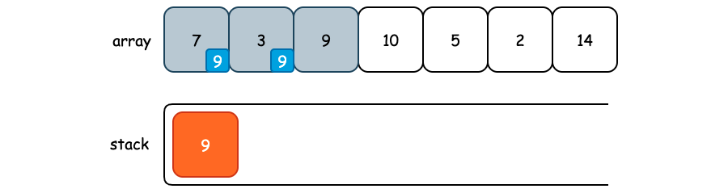

## 从栈的“消除”到单调栈

栈这种数据结构，在计算机中有着广泛地运用，比如编程语言中函数的调用、操作系统中从用户态到内核态寄存器的保存、网络消息的处理等都会用到栈。除了“先进后出”这一基本特性以外，栈还有着“消除”的功能，以及单调栈这样一个神级辅助数据结构。

### 1. 栈的“消除”

括号匹配算是栈应用的一个最典型的问题了，给定一个仅包含 `(` 和 `)` 所组成的字符串，验证该字符串的的括号是否正确匹配。例如 `(()()(` 就是不正确的匹配，而 `(()())` 就是一个正确的括号匹配。

在进行括号匹配时，永远都是一个 `(` 和一个 `)` 进行匹配，并且遵循的原则是最后一个出现的 `)` 永远和第一个出现的 `(` 进行匹配，并且对于已经匹配的括号我们需要从字符串中“消去”，从而让其它的括号有机会能够进行匹配。

因此，我们可以使用栈来保存 `(`，每当出现一个 `)`，我们就尝试对其进行匹配，也就是拿出栈中的一个 `(` 。如果此时栈为空，那么给定字符串就不是一个正确的匹配。同时，当我们遍历完整个字符串以后栈不为空，也就是还有 `(` 没找到匹配，那么也应该返回 false。

```cpp
#include <stack>
#include <string>

using namespace std;

bool isValidParentheses(const string& s) {
    if (s.size() == 0) return true;
    if (s.size() & 1) return false;
    stack<char> st;
    for (int i = 0; i < s.size(); i++) {
        if (s[i] == '(') st.push('(');
        else {
            if (st.empty()) return false;
            st.pop();
        }
    }
    return st.empty();
}
```

**括号匹配问题的本质其实就是消除**，每当我们遇到一个能够配对的字符，我们都将其从原有字符串中删去，然后看剩下的能不能匹配。由于 `string` 对象删除一个指定位置的字符平均时间复杂度为 O(n)，所以我们需要借助其他手段来记录下已经遍历过的 `(`。

实际上，对于简单括号匹配而言，由于我们的栈仅保存了 `(`，所以我们完全可以使用整型变量来代替栈，进一步优化空间，使用 O(1) 的额外空间即可完成:

```cpp
bool isValidParentheses(const string& s) {
    if (s.size() == 0) return true;
    if (s.size() & 1) return false;
    int left = 0;
    for (int i = 0; i < s.size(); i++) {
        if (s[i] == '(') left ++;
        else {
            if (!left) return false;
            left --;
        }
    }
    return left == 0;
}
```

进一步而言，如果给定字符串 `s` 中有 `{}`、`[]`、`()` 以及 `<>` 多种括号的话，那么使用栈要更方便一些。同样栈中仅保存左括号，遇到右括号时弹出，也就是从字符串 `s` 中“消除”这一对括号。

再来看另外一道稍微复杂点儿的括号问题，是一道 Leetcode 的原题: [678. Valid Parenthesis String](https://leetcode.com/problems/valid-parenthesis-string/)，题目描述如下:

给定一个只包含三种字符的字符串：`(`，`)` 和 `*`，写一个函数来检验这个字符串是否为有效字符串。有效字符串具有如下规则：
1. 任何左括号 `(` 必须有相应的右括号 `)`。
2. 任何右括号 `)` 必须有相应的左括号 `(`。
3. 左括号 `(` 必须在对应的右括号之前 `)`。
4. `*` 可以被视为单个右括号 `)`，或单个左括号 `(`，或一个空字符串。


在原有简单括号匹配的基础之上增加了一个通配符 `*`，既可以作为 `(`，又可以作为 `)`，或者什么都不表示。首先我们来看 `*` 的位置影不影响括号的匹配: `()(*` 和 `()*(` 都是由相同的成分所组成，但是前者为有效字符串，后者为无效字符串，也就是说，`*` 的位置影响着最终的结果。

然后我们再来看一下 `()(*` 是如何得出有效这一结论的。当我们遇到一个问题没有什么思路的时候，找一个测试用例模拟一遍过程，然后再找出普遍的规律，多半就是题解了。

- 从头开始遍历，遇到了左括号，`left++`，继续。
- 遍历到第二个字符时遇到了右括号，并且此时 `left != 0`，我们可以消除掉这一对括号，也就是 `left--`，操作后 `left` 的值为 0。
- 紧接着又遇到了左括号，`left++`，此时 `left` 的值为 1。
- 遇到了 `*` 通配符，并且此时 `left` 的值不为 0，那么我们就将 `*` 看作是 `)`，消除掉一个左括号，`left--`，运算结束后其值为 0。
- 遍历结束，没有多余的左括号，也没有多余的右括号，所以给定字符是有效的。

再来看 `()*(` 为什么是无效的。当我们遍历到 `*(` 时，`left` 为 0，继续向前遍历，遇到了 `*`，所以记录下 `*` 出现的位置，索引为 2。继续向前遍历，得到 `(`，因此 `left++`，结果为 1，同时整个字符串遍历结束。

紧接着我们就需要看剩下的 `left` 和 `wildcard` 是否能够匹配了，有一个非常重要的规律就是**`*` 必须要出现在 `(` 的右边儿**，否则将会出现 `*(` 的情况，而此时我们是无法得到正确的匹配结果的。

```cpp
class Solution {
public:
    bool checkValidString(string s) {
        stack<int> leftPar, wildcard;

        for (int i = 0; i < s.size(); i++) {
            int current = s[i];
            if (current == '(') leftPar.push(i);
            else if (current == '*') wildcard.push(i);
            else {
                if (!leftPar.empty()) leftPar.pop();            // 自己能匹配 ')'
                else if (!wildcard.empty()) wildcard.pop();     // 自己匹配不了，通配符来凑一个 '(' 进行匹配
                else return false;
            }
        }

        // 假设 s = "(*"，那么此时 leftPar 中存在一个 '('，wildcard 中存在一个 '*'
        // * 的位置必须要出现在 '(' 的右边儿，因为此时不能再有更多的 '(' 了，'*' 只能表示 ')'
        while (!leftPar.empty() && !wildcard.empty()) {
            if (leftPar.top() > wildcard.top()) return false;
            leftPar.pop(), wildcard.pop();
        }
        return leftPar.empty();
    }
};
```

最后来看一道很有趣的问题，大鱼吃小鱼:

在水中有许多鱼，可以认为这些鱼停放在 x 轴上。再给定两个数组 `fishSize`，`fishDirection`，`fishSize[i]` 表示第 `i` 条鱼的大小，`fishDirection[i]` 表示鱼的方向 （0 表示向左游，1 表示向右游）。这两个数组分别表示鱼的大小和游动的方向，并且两个数组的长度相等。鱼的行为符合以下几个条件:

1. 所有的鱼都同时开始游动，每次按照鱼的方向，都游动一个单位距离；
2. 当方向相对时，大鱼会吃掉小鱼；
3. 鱼的大小都不一样。

对于这道问题，大鱼吃掉了小鱼，所以仍然可以认为这是一个消除的问题，所以可以尝试使用栈实现。

首先，如果第 `i` 条鱼往右边游动的话，那么我们可以直接将其压栈，因为在此时此刻这条鱼不可能被吃掉。因为如果栈里面还有其它鱼的话，如果这条鱼往左游，那么和当前的鱼游的方向是相对的，它们根本就不会相遇。如果栈顶的鱼往右边游，方向相同，它们游动的距离是相同的，所以也不会被吃掉。

接着，如果第 `i` 条鱼往左边游，并且栈顶的鱼往右游动的话，那么根据题目描述，一定会有一条鱼被吃掉。如果栈顶的鱼更小，那么栈顶的鱼将会被吃掉；如果第 `i` 条鱼更小，那么这条鱼就会被栈顶的鱼吃掉。

```cpp
int solution(vector<int>& fishSize, vector<int>& fishDirection) {
    int totals = fishSize.size();

    if (totals <= 1) return totals;

    stack<int> st;

    int left = 0, right = 1;

    for (int i = 0; i < totals; i++) {
        int curSize = fishSize[i];
        int curDir = fishDirection[i];

        // 当前的鱼是否被吃掉
        bool beingEaten = false;

        // 如果当前的鱼往左边游，并且栈中的鱼往右游动，那么就一定会有鱼被吃掉
        while (!st.empty() && fishDirection[st.top()] == right && curDir == left) {
            // 如果栈顶的鱼更大，那么当前的鱼就会被吃掉
            if (fishSize[st.top()] > fishSize[i]) {
                beingEaten = true;
                break;
            } 
            // 否则，栈顶的鱼被吃掉
            else {
                st.pop();
            }
        }

        if (!beingEaten) st.push(i);
    }

    return st.size();
}
```


### 2. 单调栈

单调栈本身似乎并没有严格的定义，有的人认为从栈顶到栈底递增的叫单调递增栈，有的人认为从栈底到栈顶递增的叫做单调递增栈。我个人比较习惯栈顶到栈底递增的栈叫递增栈的说法，因为这样在画图的时候理解起来更容易。


**在括号匹配中，我们消除的是单个元素，而在单调栈中，我们通常会消除掉多个元素，并且我们是根据元素的大小以及题目要求来选择如何消除的**。

> 给定一个不含有重复值的数组 `arr`，找到每一个 `i` 位置右边离 `i` 位置最近且值比 `arr[i]` 大的位置

LeetCode 中与之相关的问题为 [496. Next Greater Element I](https://leetcode.com/problems/next-greater-element-i/) 以及 [503. Next Greater Element II](https://leetcode.com/problems/next-greater-element-ii/)。


假设我们的初始数据如上图所示，并且创建了一个栈，只不过这个栈是横着放的，就像这样: _(:з」∠)_。

开始遍历 `array` 数组，当栈为空的时候直接向其中添加数据，并且当要添加的元素小于栈顶元素时，也将其放入栈中:


当我们遍历到元素 9 时，如果将其放入栈中的话，那么栈顶从栈底的元素为 `[9, 3, 7]`，此时并不能满足从栈顶到栈底单调递增的性质，所以我们需要“消除”掉栈中的数据，也就是 pop 出元素 3。

当我们弹出元素 3 时，它可能会有疑问，我为什么会被弹出来？“因此现在有一个比你还大的元素准备入栈，你要是不出来的话就破坏了单调栈的性质”，“等会儿，比我大的元素？而且还在我右边儿，并且这应该是离我最近的比我大的元素吧？”，那么此时，元素 3 就找到了它右边儿离它最近且比它还要大的元素了。


当元素 3 被弹出以后，我们还要继续来看栈顶元素和 9 之间的大小关系。此时栈顶元素为 7，要比 9 小，所以 7 也找到了它右边儿离它最近且比它还要大的元素，也就是元素 9。



剩下的元素按照上面的流程继续往下走即可找到所有元素的 Next Greater Number。**Next Greater Number 我们可以使用单调递增栈完成，Next Smaller Number 我们可以使用单调递减栈来完成**。

```cpp
#include <vector>
#include <stack>
#include <iostream>

using namespace std;

class Solution {
public:
    vector<int> nextGreaterNumber(vector<int> &nums) {
        int n = nums.size();

        vector<int> result(n, -1);

        // 单调递增栈，栈中保存的是元素索引
        stack<int> st;

        for (int i = 0; i < n; i++) {
            while (!st.empty() && nums[st.top()] < nums[i]) {
                int cur = st.top();
                st.pop();
                result[cur] = i;        // 此时栈顶元素的右侧最近最大值的索引即为 i
            }
            st.push(i);
        }

        // 结束后栈可能并不为空，因此我们还需要将其取出
        while (!st.empty()) {
            int cur = st.top();
            st.pop();
            result[cur] = -1;
        }
        return result;
    }
};


int main() {
    vector<int> nums {1, 5, 7, 2, 4, 42, 30, 4, 8};
    auto res = Solution().nextGreaterNumber(nums);

    for (auto index : res) {
        cout << index << ", " << endl;
    }
}
```

接下来看一个稍微复杂一点儿的问题，[84. Largest Rectangle in Histogram](https://leetcode.com/problems/largest-rectangle-in-histogram/)，也就是在一个直方图中求解最大的矩形面积:

> Given an array of integers `heights` representing the histogram's bar height where the width of each bar is 1, return the area of the largest rectangle in the histogram.


当我们没有思路的时候首先可以尝试使用暴力解来进行模拟，从而看看能不能找到客观规律:


可以看到，对于每一个柱子 `k` 来说，其高度为 `heights[k]`，那么我们从这根柱子向两边出发，一直到出现了小于 `heights[k]` 的柱子 `i`、`j` 即可停止，那么此时完全包含 `k` 的最大矩形面积就是 `heights[k] * (j - i - 1)`。我们对所有的柱子都进行这样的操作就可以找到最大矩形了:

```cpp

class Solution {
public:
    int largestRectangleArea(vector<int>& heights) {
        int res = 0;

        for (int k = 0; k < heights.size(); k++) {
            int i = k, j = k;
            
            // 找到左边比当前柱子更小的柱子
            while (i > 0 && heights[i - 1] >= heights[k]) i --;

            // 找到右边比当前柱子更小的柱子
            while (j < heights.size() - 1 && heights[j + 1] >= heights[k]) j++;

            // 计算矩形面积
            int width = j - i + 1;
            res = max(res, width * heights[k]);
        }

        return res;
    }
};
```

不过，比较遗憾的是，这个答案只能通过 87 / 96，第 88 个测试用例则超时。原因在于暴力解的时间复杂度为 O(n^2)，但是 `heights` 数组的长度却可以达到 `100000`。

但是，从暴力解中我们得到了一解题的关键: **也就是对于每一个柱子 `K`，需要找到左边第一个小于它的元素，以及右边第一个小于它的元素**。对于右边第一个小于它的元素，我们可以使用刚才讨论的单调栈来实现，只不过是使用单调递减栈而已。那么对于左边第一个小于它的元素，我们又该如何寻找呢? 

同样可以使用单调递减栈来实现，假如我们的输入数组中不包含重复元素，如下图所示:


当我们遍历到元素 `1` 时，若将其压栈，则将不满足“栈顶到栈底单调递减”的性质，所以将元素 `4` 弹出。当我们弹出元素 `4` 时，栈顶元素为 `3`，而元素 `3` 恰好就是元素 `4` 左边第一个小于它的元素。**因此，如果此时栈内还有元素的话，栈顶的元素就是当前弹出元素左边第一个小于它的元素，前提是栈中的元素不会重复**。那如果有重复呢? 我们仍然可以使用单调递减栈，只不过需要进行一些额外的处理，也就是栈中不再保存单个元素，而是保存数组，数组中保存着具有相同值的元素:


弹栈时弹出的其实是一个数组，那么此时数组中每一个元素右边第一个比它小的元素就是当前准备入栈的元素，即 `3`。数组中每一个元素左边第一个比他小的元素其实就是**位于下面位置的数组中的最后一个元素**，如下图所示:


```cpp
#include <vector>
#include <vector>
#include <stack>
#include <iostream>

using namespace std;

// 获取 nums 数组中每一个元素左边第一个比它小的元素索引，以及右边第一个比它小的元素索引。
// 若不存在，则使用 -1 表示，nums 中可能包含重复元素
vector<vector<int>> getLesser(vector<int>& nums) {

    vector<vector<int>> result(nums.size(), vector<int>(2, -1));

    if (nums.size() == 0) return result;

    // 使用单调递减栈实现，并且相同值的元素索引放入到同一个数组中
    stack<vector<int>> st;

    for (int i = 0; i < nums.size(); i++) {

        // 当前遍历元素不满足“从栈顶到栈底单调递减的性质”
        while (!st.empty() && nums[i] < nums[st.top().back()]) {
            vector<int> needPop = st.top();
            st.pop();

            // 此时, needPop 数组中的所有元素的右边第一个比它小的元素就是 nums[i]
            int rightLessIndex = i;

            // 如果当前栈不为空的话，那么 needPop 数组中的所有元素的左边第一个比它小的元素就是栈顶数组的最后一个元素
            int leftLessIndex = st.empty() ? -1 : st.top().back();

            // 遍历 needPop 数组，进行赋值
            for (auto index : needPop) {
                result[index][0] = leftLessIndex;
                result[index][1] = rightLessIndex;
            }
        }

        // 与栈顶索引所对应的元素值相同
        if (!st.empty() && nums[i] == nums[st.top().back()]) {
            st.top().push_back(i);
        } else {
            vector<int> arr {i};
            st.push(arr);
        }
    }

    // 遍历完成后栈可能并不为空，所以我们需要继续处理。
    // 此时位于栈中的索引所代表的元素的右边一定不会存在比它小的元素了，因为这是一个单调递减栈
    while (!st.empty()) {
        vector<int> needPop = st.top();
        st.pop();

        // 如果当前栈不为空的话，那么 needPop 数组中的所有元素的左边第一个比它小的元素就是栈顶数组的最后一个元素
        int leftLessIndex = st.empty() ? -1 : st.top().back();

        // 遍历 needPop 数组，进行赋值
        for (auto index : needPop) {
            result[index][0] = leftLessIndex;
            result[index][1] = -1;
        }
    }

    return result;
}


int main() {
    vector<int> nums {3, 1, 3, 4, 3, 5, 3, 2, 2};

    auto res = getLesser(nums);

    for (auto item : res) {
        cout << "left: " << item[0] << ", " << "right: " << item[1] << endl;
    }
}
```

在有了这个问题的模板以后，那么解决 [84. Largest Rectangle in Histogram](https://leetcode.com/problems/largest-rectangle-in-histogram/) 就只是套模板的问题了。

那么我们现在就获得了一个基础问题的解题模板，如果以后发现了可以使用单调栈解决的题目时，可以直接进行套用: **给定一个含有重复值的数组 `nums`，找到每一个 `i` 位置左边和右边离 `i` 位置最近且值比 `nums[i]` 小/大的位置，返回所有位置相应的信息。**

找第一个较小值就用单调递减栈，找第一个较大值就用单调递增栈，这里的递减是指从栈顶到栈底元素严格递减。

