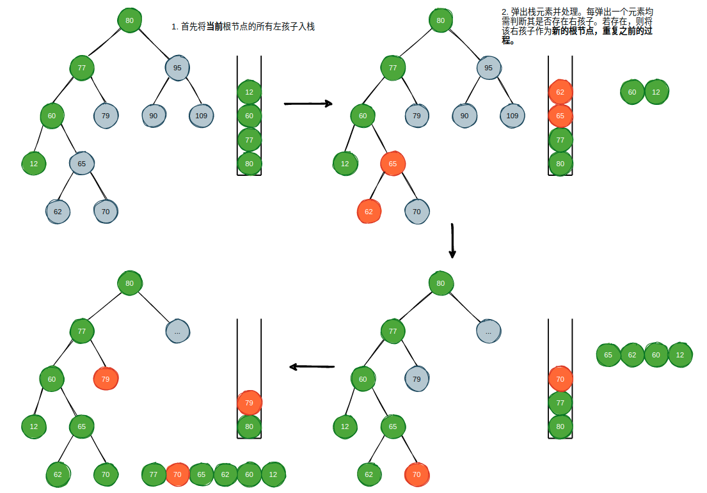
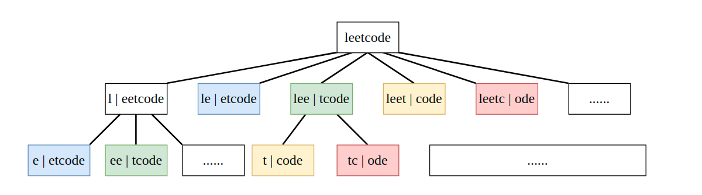
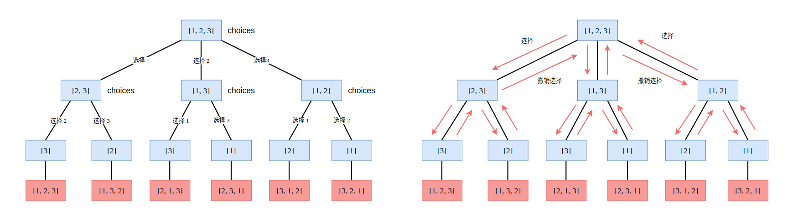
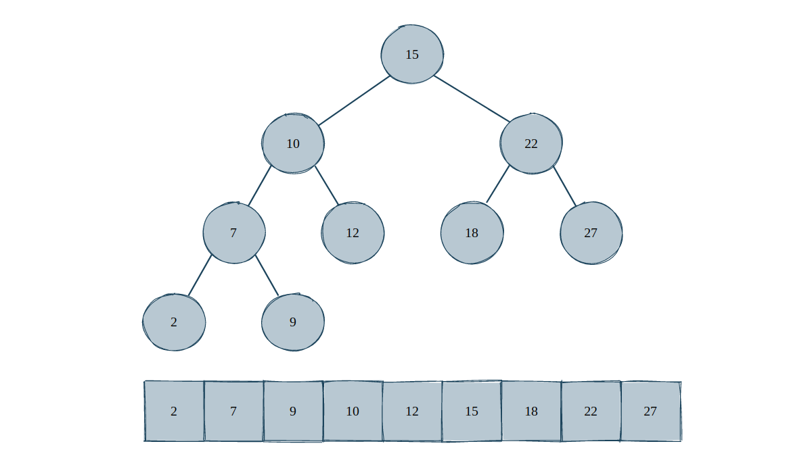
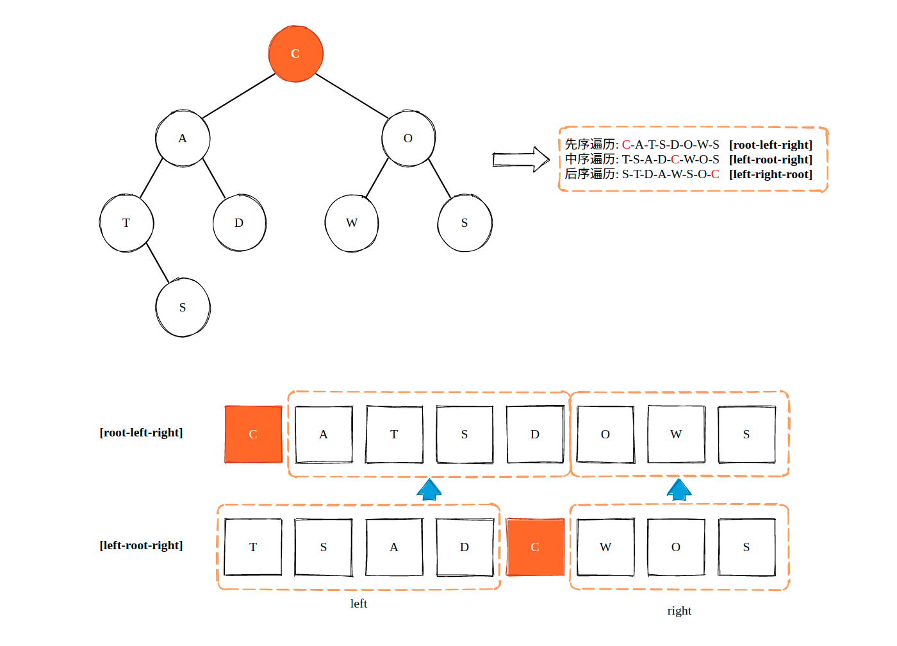

## 二叉树与递归: DP、回溯、DFS、BFS，一个通用的算法框架

对于一棵二叉树的遍历，相信只要了解过二叉树的程序员都能够用递归的方式写出其前序遍历、中序遍历和后序遍历:

```cpp
struct TreeNode {
    int val;
    TreeNode *left;
    TreeNode *right;
};

void traversal(TreeNode *root) {
    if (root == nullptr)
        return ;

    // 前序遍历
    traversal(root->left);
    // 中序遍历
    traversal(root->right);
    // 后序遍历
}
```

我们可以使用“递归”这一神奇的机制非常轻松的完成二叉树的深度优先遍历。那么，如果使用递归，又该如何实现呢? 此时，我们就需要借助“栈”这一数据结构来完成。

由于我们在最开始的时候只有根节点，但是深度优先遍历却要求我们最先访问最底层的节点(中序和后序遍历)，并且还需要记录下沿途访问过的节点。而栈是一种先进后出的数据结构，和二叉树的深度优先遍历简直就是天生一对。



上图描述了使用栈实现的中序遍历过程，实际上，递归实现的中序遍历中，操作系统所创建栈帧和销毁栈帧的过程与之完全相同。具体的节点入栈和出栈细节上图已经给出，不再赘述，下面是实现过程:

```cpp
vector<int> inorderTraversal(TreeNode* root) {
    
    vector<int> result;
    stack<TreeNode *> depthStack;

    if (root == nullptr) return result;

    TreeNode *curRoot = root;
    depthStack.push(curRoot);

    while (!depthStack.empty()) {
        
        while (curRoot->left != nullptr) {
            depthStack.push(curRoot->left);
            curRoot = curRoot->left;
        }

        TreeNode *current = depthStack.top();
        result.push_back(current->val);
        depthStack.pop();

        if (current->right != nullptr) {
            depthStack.push(current->right);
            curRoot = current->right;
        }
    }
    return result;
}
```

之所以要使用栈来实现二叉树的中序遍历，是因为通过这个过程我们能够对二叉树的深度遍历过程更进一步地熟悉，从而进一步理解递归实现的深度优先遍历执行过程。

自顶向下的DP问题、回溯问题，甚至是归并排序问题，其实都是二叉树以及多叉树的遍历问题。以最经典的小青蛙跳台阶问题为例，当我们不使用记忆化搜索和递推来实现时，它是这个样子的:

```cpp
int climbStairs(int n) {
    if (n <= 2)
        return n;
    return climbStairs(n-1) + climbStairs(n-2);
}
```

我们对上面的代码进行稍许的修改:

```cpp
int climbStairs(int n) {
    if (n <= 2)
        return n;
    int left = climbStairs(n-1);
    int right = climbStairs(n-2);
    return left + right;
}
```

可以看到，这个过程实际上就是一棵二叉树的后序遍历。当然，小青蛙跳台阶问题本质上就是斐波那契数列问题，也就是说，自顶向下地求解斐波那切数列其实也是二叉树的后序遍历。

再来看 leetcode 上 [139. Word Break](https://leetcode.com/problems/word-break/) 这道 DP 问题，通过分析，我们可以得到这样的一棵树:



本质上就是一棵多叉树求解路径的问题，同样是一个深度优先遍历问题。

最后来看回溯问题中较为经典问题，求解全排列问题: [46. Permutations](https://leetcode.com/problems/permutations/)。我们能够轻易地画出求解问题的过程和思路:



这还是一个多叉树深度优先遍历问题，将多叉树的每一条“路径”塞到结果中，就可以得到某一个数组的全排列。

**这些看似不同的问题中都隐藏了一个相同的问题: 二叉树与多叉树的深度优先遍历问题。**

### 1. 简单地二叉树遍历问题

首先来看 [230. Kth Smallest Element in a BST](https://leetcode.com/problems/kth-smallest-element-in-a-bst/) 这个问题，给定一棵二分搜索树(Binary Search Tree, BST)，求该树中第 k 小的元素。对于一棵 BST 而言，其中序遍历结果就是一个从小到大排序完成的数组。



也就是说，中序遍历结果的第一个元素就是第 1 小的元素，第二个元素就是第 2 小的元素，以此类推，第 k 个元素就是第 k 小的元素:

```cpp
class Solution {
private:
    vector<int> result;
    void inorder(TreeNode* root, int k) {
        if (root == NULL) return;
        
        inorder(root->left, k);
        
        // 中序遍历访问节点
        result.push_back(root->val);
        if (result.size() == k) return;
        
        inorder(root->right, k);
    }
public:
    int kthSmallest(TreeNode* root, int k) {
        midorder_dfs(root, k);
        return result[k-1];
    }
};
```

[226. Invert Binary Tree](https://leetcode.com/problems/invert-binary-tree/)，反转一棵二叉树，使得所有节点的左子节点变成右子节点，右子节点变成左子节点。据说是 Max Howell 未能加入 Google 的直接原因，不过这我是不相信的，个人更倾向于认为是 Max Howell 和 Google 在面试的内容产生了分歧: 反转二叉树有个锤子用? 能反转二叉树的人就能写出 Homebrew 了?

从题目描述中可以看到，需要反转某个节点的左、右子节点，那么必然地，我们得访问到左、右子节点，然后才能对其进行操作，所以这是一个后序遍历的问题。

```cpp
struct TreeNode* invertTree(struct TreeNode* root){

    if (root == NULL) return NULL;

    root->left = invertTree(root->left);
    root->right = invertTree(root->right);

    struct TreeNode *temp = root->left;
    root->left = root->right;
    root->right = temp;
    
    return root;
}
```

[114. Flatten Binary Tree to Linked List](https://leetcode.com/problems/flatten-binary-tree-to-linked-list/)，题目要求将一棵二叉树展开成一个链表形式的树，如下所示:

```bash
Input:
    1
   / \
  2   5
 / \   \
3   4   6

Output: 
1
 \
  2
   \
    3
     \
      4
       \
        5
         \
          6
```

从结果上来看，是二叉树前序遍历所得到的结果，但是我们并不能使用前序遍历的方式来完成。这道题本质上和上面那道反转二叉树是一样的: 使用后序遍历的方式首先处理左、右子节点，再将结果返回给根节点。

首先使用临时变量来保存右子节点，然后断开当前节点与右子节点的连接，将左子节点套在右子节点上，再然后把使用临时变量存储的右子节点套在新的右子节点的最后一个右子节点上。

```cpp
void flatten(TreeNode* root) {
    if (root == nullptr) return;

    if (root->left != nullptr)
        flatten(root->left);
    
    if (root->right != nullptr)
        flatten(root->right);
    
    TreeNode *temp = root->right;
    
    root->right = root->left;
    root->left = nullptr;

    // 找到新的右子节点的最后一个右子节点
    while (root->right != nullptr)
        root = root->right;
    
    root->right = temp;
}
```

### 2. 通过 DFS 结果恢复二叉树

- [105. Construct Binary Tree from Preorder and Inorder Traversal](https://leetcode.com/problems/construct-binary-tree-from-preorder-and-inorder-traversal/)
- [106. Construct Binary Tree from Inorder and Postorder Traversal](https://leetcode.com/problems/construct-binary-tree-from-inorder-and-postorder-traversal/)
- [889. Construct Binary Tree from Preorder and Postorder Traversal](https://leetcode.com/problems/construct-binary-tree-from-preorder-and-postorder-traversal/)

上面的问题都是从 DFS 的结果中恢复一棵二叉树，不过通过前序遍历和后序遍历的结果所恢复的二叉树可能有多个，因为无法确切的计算出左子树和右子树到底有多少个元素。

以前序遍历和中序遍历结果恢复一棵二叉树为例，对于前序遍历结果而言，数组的第一个元素一定是根节点，根据该根节点我们就可以在中序遍历结果中找到哪些是左子树节点，哪些是右子树节点了。递归地执行这个过程，就能够构建出原有二叉树，如下图所示:



```cpp
class Solution {
private:
    TreeNode *traverse(vector<int>& preorder, int preLeft, int preRight, vector<int>& inorder, int inLeft, int inRight, unordered_map<int, int> &inHashmap) {
        
        if (preLeft > preRight || inLeft > inRight)
            return nullptr;
        
        TreeNode *root = new TreeNode(preorder[preLeft]);
        
        int inRootIndex = inHashmap[root->val];
        int leftNums = inRootIndex - inLeft;

        root->left = traverse(preorder, preLeft + 1, preLeft + leftNums, inorder, inLeft, inRootIndex - 1, inHashmap);
        root->right = traverse(preorder, preLeft + leftNums + 1, preRight, inorder, inRootIndex + 1, inRight, inHashmap);

        return root;
    }
public:
    TreeNode* buildTree(vector<int>& preorder, vector<int>& inorder) {

        unordered_map<int, int> inHashmap;

        for (int i = 0; i < inorder.size(); i++)
            inHashmap[inorder[i]] = i;
        
        return traverse(preorder, 0, preorder.size() - 1, inorder, 0, inorder.size() - 1, inHashmap);
    }
};
```

可以看到，恢复一棵二叉树的过程仍然是一个二叉树的遍历过程，很明显地，这是一个前序遍历过程。


### 3. 二叉树路径和问题

关于二叉树的路径和，例如求从根节点到叶子节点的最大加权路径和([112. Path Sum](https://leetcode.com/problems/path-sum/))，输出所有根节点到叶子节点的路径([113. Path Sum II](https://leetcode.com/problems/path-sum-ii/))等问题既可以认为是一个二叉树遍历问题，也可以认为是回溯问题，故不再赘述，可参考:

> [二叉树中的回溯](https://github.com/SmartKeyerror/Snorlax/blob/master/algorithm/backtracking/backtracking.md#6-%E4%BA%8C%E5%8F%89%E6%A0%91%E4%B8%AD%E7%9A%84%E5%9B%9E%E6%BA%AF)

### 4. 二叉树层序遍历问题

相较于二叉树的深度优先遍历问题，二叉树的层序遍历要简单许多。二叉树的层序遍历又称之为广度优先遍历、宽度优先遍历，此时我们需要借助队列这一先进先出数据结构完成。当然，用栈也能够完成，只是不够直观而已，反正就是需要一个额外的空间进行节点存储。

层序遍历问题并不复杂，所以只给出 leetcode 上关于层序遍历一些问题:

- [102. Binary Tree Level Order Traversal](https://leetcode.com/problems/binary-tree-level-order-traversal/)
- [103. Binary Tree Zigzag Level Order Traversal](https://leetcode.com/problems/binary-tree-zigzag-level-order-traversal/)
- [107. Binary Tree Level Order Traversal II](https://leetcode.com/problems/binary-tree-level-order-traversal-ii/)
- [116. Populating Next Right Pointers in Each Node](https://leetcode.com/problems/populating-next-right-pointers-in-each-node/)
- [117. Populating Next Right Pointers in Each Node II](https://leetcode.com/problems/populating-next-right-pointers-in-each-node-ii/)
- [515. Find Largest Value in Each Tree Row](https://leetcode.com/problems/find-largest-value-in-each-tree-row/)

### 4. 小结

对于二叉树的深度优先遍历，我们可以有这样的框架:

```cpp
void traversal(TreeNode *root) {
    if (root == nullptr) return ;
    // 前序遍历
    traversal(root->left);
    // 中序遍历
    traversal(root->right);
    // 后序遍历
}
```

对于多叉树的遍历深度优先遍历，同样地:

```cpp
void traversal(TreeNode *root) {
    for (auto child: TreeNode->childs)
        traversal(child);
}
```

这个通用的框架能够为我们解决自顶向下的 DP 问题，回溯问题，递归等问题提供一个方向，我们只需要理清问题中的一些细节之后，就可以使用这一“模板”进行解决。

leetcode 关于二叉树这一话题的全部题目:

> https://leetcode.com/tag/tree/

我个人对其中一些题目的解:

> https://github.com/SmartKeyerror/Snorlax/tree/master/leetcode/tree
https://github.com/SmartKeyerror/Snorlax/tree/master/leetcode/binary-search-tree


