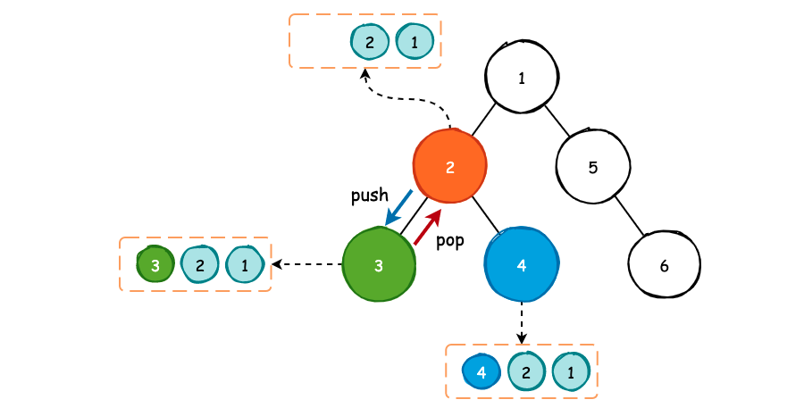
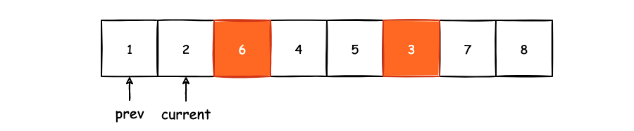
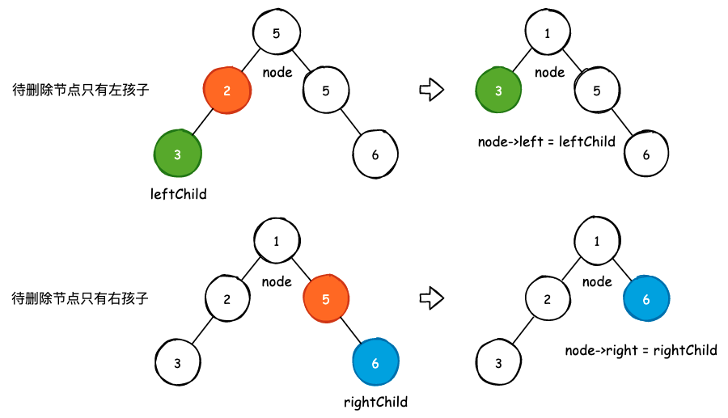
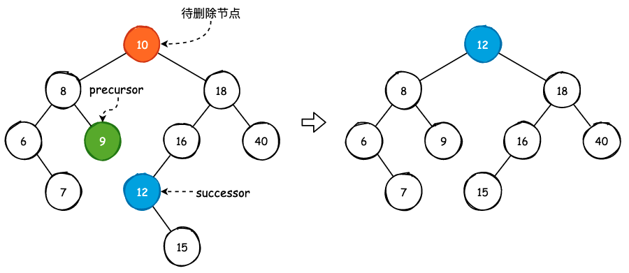
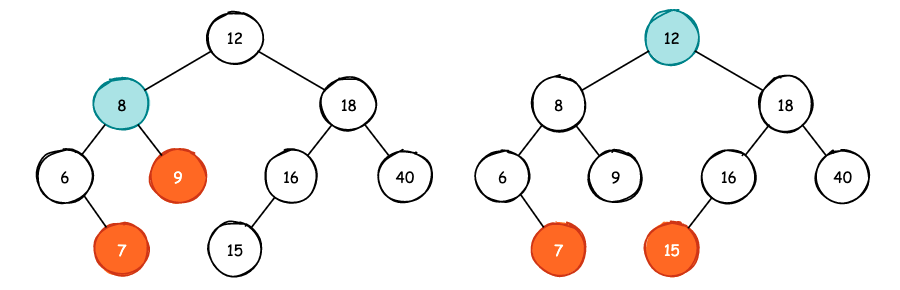
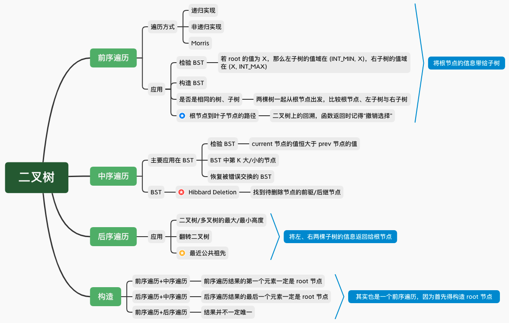

## 理解二叉树的遍历

树结构在应用程序中非常常见，例如 C++ 中的 `map` 和 `set` 就是使用红黑树实现的，Linux、Nginx 等“史诗级”开源项目也重度依赖了红黑树。并且，MySQL 使用 B+Tree 来存储索引和数据，MongoDB 则使用 B-Tree。二叉树是这些树结构的基本组成单元，并且和链表一样，天然的具有递归特性。因此，不管是从何种角度来说，二叉树都是必须掌握的数据结构。

与二叉树相关的问题主要包括二叉树的遍历和构造，其中二叉树的构造也是基于二叉树的遍历所实现的。因此，我们需要深度理解二叉树的遍历。


对于一棵二叉树的遍历，相信只要了解过二叉树的程序员都能够用递归的方式写出其前序遍历、中序遍历和后序遍历:

```cpp
struct TreeNode {
    int val;
    TreeNode *left;
    TreeNode *right;
};

// 二叉树的遍历，时间复杂度为 O(n)，空间复杂度为 O(h)
void traversal(TreeNode *root) {
    if (root == nullptr)
        return ;

    // 前序遍历
    traversal(root->left);
    // 中序遍历
    traversal(root->right);
    // 后序遍历
}
```


上图描述了使用栈实现的中序遍历过程，实际上，递归实现的中序遍历中，操作系统所创建栈帧和销毁栈帧的过程与之完全相同。具体的节点入栈和出栈细节上图已经给出，不再赘述，下面是实现过程:

```cpp
vector<int> inorderTraversal(TreeNode* root) {
    
    vector<int> result;
    stack<TreeNode *> depthStack;

    if (root == nullptr) return result;

    TreeNode *curRoot = root;
    depthStack.push(curRoot);

    while (!depthStack.empty()) {
        
        while (curRoot->left != nullptr) {
            depthStack.push(curRoot->left);
            curRoot = curRoot->left;
        }

        TreeNode *current = depthStack.top();
        result.push_back(current->val);
        depthStack.pop();

        if (current->right != nullptr) {
            depthStack.push(current->right);
            curRoot = current->right;
        }
    }
    return result;
}
```

不管是使用递归实现还是使用栈实现，因为二叉树中的每一个节点只访问了一次，所以时复杂度为 `O(n)`。空间复杂度的计算与创建栈的最大容量有关，也就是与二叉树的高度有关，那么空间复杂度为 `O(h)`。

自顶向下的DP问题、回溯问题，甚至是归并排序问题，其实都是二叉树以及多叉树的遍历问题。以最经典的小青蛙跳台阶问题为例，当我们不使用记忆化搜索和递推来实现时，它是这个样子的:

```cpp
int climbStairs(int n) {
    if (n <= 2)
        return n;
    return climbStairs(n-1) + climbStairs(n-2);
}
```

我们对上面的代码进行稍许的修改:

```cpp
int climbStairs(int n) {
    if (n <= 2)
        return n;
    int left = climbStairs(n-1);
    int right = climbStairs(n-2);
    return left + right;
}
```

可以看到，这个过程实际上就是一棵二叉树的后序遍历。当然，小青蛙跳台阶问题本质上就是斐波那契数列问题，也就是说，自顶向下地求解斐波那切数列其实也是二叉树的后序遍历。

再来看 leetcode 上 [139. Word Break](https://leetcode.com/problems/word-break/) 这道 DP 问题，通过分析，我们可以得到这样的一棵树:


本质上就是一棵多叉树求解路径的问题，同样是一个深度优先遍历问题。

最后来看回溯问题中较为经典问题，求解全排列问题: [46. Permutations](https://leetcode.com/problems/permutations/)。我们能够轻易地画出求解问题的过程和思路:


这还是一个多叉树深度优先遍历问题，将多叉树的每一条“路径”塞到结果中，就可以得到某一个数组的全排列。

**这些看似不同的问题中都隐藏了一个相同的问题: 二叉树与多叉树的深度优先遍历问题。**

### 1. 二叉树的前序遍历

前序遍历以这样的方式遍历二叉树而所有节点:

- 首先遍历二叉树的根节点
- 若根节点存在左子树，那么以左子树的根节点进行遍历
- 若根节点存在右子树，那么以右子树的根节点进行遍历


前序遍历的非递归实现其实就是用栈来模拟函数调用栈，从递归函数调用中我们可以看到，首先处理根节点，然后如果有左子树的话，那么就需要一直将其压入栈中，右子树同理。

```cpp
void preorder(TreeNode *root) {
    if (root == nullptr) return;
    
    TreeNode *current = root;
    stack<TreeNode *> st;
    st.push(current);
    
    while(!st.empty()) {
        current = st.top();
        st.pop();
        
        cout << current->val << ", ";
        
        // 因为栈是先进后出的，所以应该现将右子树压栈
        if (current->right)
            st.push(current->right);
        
        // 左子树压栈，出栈时将首先被处理
        if (current->left)
            st.push(current->left);
    }
    return;
}
```

#### 1.1 前序遍历的基本应用

此时我们就可以解决 LeetCode 中 [144. Binary Tree Preorder Traversal](https://leetcode.com/problems/binary-tree-preorder-traversal/) 前序遍历二叉树的问题了。前序遍历另一个非常重要的应用就是判断两棵二叉树是否相等，正如 [100. Same Tree](https://leetcode.com/problems/same-tree/) 所描述的一样:

> 给定两棵二叉树 `p` 和 `q`，判断它们的结构以及对应节点的值是否相等，即两棵二叉树是否完全相同。

对于 `p` 和 `q` 而言，我们让它们一起从根节点开始出发，判断根节点的值是否相同，然后再判断 `p` 和 `q` 的左子树是否相同，接着就是右子树是否相同。可以想象成有一个质检员，这个质检员依次地比较 `p`、`q` 两棵二叉树的所有节点，然后检验它们是否相同。


```cpp
// 时间复杂度 O(n)，空间复杂度 O(h)
class Solution {
public:
    bool isSameTree(TreeNode* p, TreeNode* q){

        // 若其中一个为空，那么比较它们是否相等即可
        if (p == nullptr || q == nullptr) return p == q;

        if (p->val != q->val) return false;

        // 比较左子树是否相同以及右子树是否相同
        return isSameTree(p->left, q->left) && isSameTree(p->right, q->right);
    }
};
```

更进一步地，我们还可以判断一棵二叉树是否为另一棵二叉树的子树，也就是 [572. Subtree of Another Tree](https://leetcode.com/problems/subtree-of-another-tree/)。如果 `subRoot` 是 `root` 的子树的话，那么在 `root` 中一定存在一个或者多个节点，假设这个节点叫做 `rootNode`，使其值等于 `subRoot` 的根节点的值。那么我们只需要判断以 `rootNode` 为根节点的子树是否和以 `subRoot` 为根节点的二叉树是否相等即可，也就是完全可以复用上面编写的 `isSameTree()` 方法。

```cpp
// 时间复杂度 O(mn)，空间复杂度 O(h)，h 为 p、q 的最大树高
class Solution {
public:
    bool isSameTree(TreeNode* p, TreeNode* q){

        // 若其中一个为空，那么比较它们是否相等即可
        if (p == nullptr || q == nullptr) return p == q;

        if (p->val != q->val) return false;

        // 比较左子树是否相同以及右子树是否相同
        return isSameTree(p->left, q->left) && isSameTree(p->right, q->right);
    }
    bool isSubtree(TreeNode* root, TreeNode* subRoot) {
        if (root == nullptr) return false;

        if (subRoot == nullptr) return true;

        // 找到了一个与 subRoot 根节点具有相同值的节点，
        // 看看以此时 root 为根节点的子树和 subRoot 这棵树是否相同
        if (root->val == subRoot->val) {
            if (isSameTree(root, subRoot)) 
                return true;
        }

        return isSubtree(root->left, subRoot) || isSubtree(root->right, subRoot);
    }
};
```

除此以外，我们还可以通过前序遍历的方式将一个有序数组构造成一棵平衡二叉树（BST），也就是 [108. Convert Sorted Array to Binary Search Tree](https://leetcode.com/problems/convert-sorted-array-to-binary-search-tree/)。因为题目要求我们所构建的 BST 必须是平衡的，那么我们需要从有序数组的中间元素开始进行构建，每一次选取的构造元素都需要是当前数组区间的中间节点。

```cpp
// 时间复杂度 O(n)，空间复杂度 O(logn)
class Solution {
public:
    // 以 nums 数组的 [left, right] 这一闭区间内构造平衡二叉树
    TreeNode *buildBST(vector<int>& nums, int left, int right) {
        // 终止条件
        if (left > right) return nullptr;

        // 选择当前所要构建的元素，也就 [left, right] 的中间节点
        int mid = left + (right - left) / 2;

        // 构建根节点
        TreeNode *root = new TreeNode(nums[mid]);

        // 构建左、右子树
        root->left = buildBST(nums, left, mid - 1);
        root->right = buildBST(nums, mid + 1, right);

        return root;
    }
    TreeNode* sortedArrayToBST(vector<int>& nums) {
        return buildBST(nums, 0, nums.size() - 1);
    }
};
```

时间复杂度为 `O(n)`，空间复杂度为 `O(logn)`。之所以是 `O(logn)` 的原因在于对于一棵平衡二叉树而言，假如它的高度为 `h`，那么它的节点数大概是 `2^h`，如果是满二叉树的话，那么节点数量就是 `2^h - 1`。因此，如果有 `n` 个节点的话，那么高度大概是 `logn`，而前序遍历的空间复杂度与树高有关，所以使用有序数组构建 BST 的空间复杂度为 `O(logn)`。

#### 1.2 根节点到叶子节点的路径问题

除此以外，二叉树上的回溯问题也需要使用前序遍历，或者说，**回溯问题本质是就是一棵二叉树或者是多叉树的前序遍历**。下面这些问题都需要使用二叉树的回溯模板来解决:

- [257. Binary Tree Paths](https://leetcode.com/problems/target-sum/)
- [112. Path Sum](https://leetcode.com/problems/path-sum/)
- [113. Path Sum II](https://leetcode.com/problems/path-sum-ii/)
- [437. Path Sum III](https://leetcode.com/problems/path-sum-iii/)
- [988. Smallest String Starting From Leaf](https://leetcode.com/problems/smallest-string-starting-from-leaf/)
- ......

首先来看 113 号问题，需要我们返回从根节点到叶子节点的路径和等于 `targetSum` 的所有路径。

在一开始的前序遍历中，我们是使用一个数组来保存遍历过程中产生的节点，每遍历一个节点，我们就将其添加至结果集中。但是对于回溯问题而言，我们不仅仅需要记录遍历的节点，还需要记录下遍历过程中产生的路径，其实很简单，多定义一个 `path` 数组即可。**当我们遍历这个节点时，需要将其添加至 `path` 数组中，同时，当我们离开这个节点时，也需要将这个节点从 `path` 中移除。**所谓的离开这个节点，其实就是递归过程中函数调用的返回。



如上图所示，当我们遍历到节点 `2` 时，`path` 中的值为 `[1, 2]`。当遍历进入到节点 `3` 时，此时必然会有函数调用栈的产生，同时我们将节点 `3` 保存在 `path` 的末尾。因为节点 `3` 已经是叶子节点了，所以需要返回，在递归调用返回时，我们必须将节点 `3` 从 `path` 数组中移除，否则遍历到节点 `4` 时将会得到 `[1, 2, 3, 4]` 这样的一个错误答案。**回溯的本质就是做出选择-验证-撤销选择的过程。**

```cpp
// 时间复杂度 O(nlogn)，空间复杂度 O(h)
class Solution {
private:
    vector<vector<int>> result;     // 保存结果的二维数组

    void backtracking(TreeNode* root, int targetSum, vector<int>& path, int curSum) {
        if (root == nnullptr) return;

        path.push_back(root->val);
        curSum += root->val;

        // 判断是否达到叶子节点
        if (root->left == nullptr && root->right == nullptr) {
            // 找到了一个结果
            if (curSum == targetSum) result.push_back(path);
        } else {
            // 没有到叶子节点，左、右子树分别看看
            backtracking(root->left, targetSum, path, curSum);
            backtracking(root->right, targetSum, path, curSum);
        }

        // 函数返回时将推入的元素 pop 出去
        path.pop_back();
    }
public:
    vector<vector<int>> pathSum(TreeNode* root, int targetSum) {
        vector<int> path;
        backtracking(root, targetSum, path, 0);
        return result;
    }
};
```

### 2. 二叉树的中序遍历

中序遍历更多的是应用在二分搜树中，因为对于一棵二分搜索树来说，其左子树上的节点均小于根节点，右子树上的节点均大于根节点。那么按照左子树-根节点-右子树的遍历方式进行遍历时，将会得到一个有序的结果。

中序遍历的递归实现:

```cpp
void inorder(TreeNode *root) {
    if (root == nullptr) return;

    // 遍历左子树
    inorder(root->left);
    // 遍历根节点
    cout << root->val << ", ";
    // 遍历右子树
    inorder(root->right);
}
```

中序遍历的非递归实现:

```cpp
void inorder(TreeNode *root) {
    if (root == nullptr) return;

    TreeNode *current = root;
    stack<TreeNode *> st;
    st.push(current);

    while (!st.empty()) {
        // 既然是先遍历左子树，那么就需要把所有的左孩子节点入栈
        while (current->left) {
            st.push(current->left);
            current = current->left;
        }

        current = st.top();
        st.pop();

        cout << current->val << endl;

        // 处理右子树
        if (current->right) {
            st.push(current->right);
            current = current->right;
        }

    }    
}
```

#### 2.1 中序遍历的应用

中序遍历的一个最直观应用就是以升序或者是降序的方式输出二叉搜索树上的全部节点，基于这个特性我们就可以使用中序遍历的方式来验证一棵二分搜索树是否是正确的。

[98. Validate Binary Search Tree](https://leetcode.com/problems/validate-binary-search-tree/)，给定一棵二叉树，判断这棵二叉树是否是有序的。对于一个数组而言，我们可以通过遍历整个数组，并且判断当前元素是否大于前一个元素来验证数组是否有序，那么 BST 也是一样的:


```cpp
class Solution {
private:
    bool answer;
    TreeNode *prev;     // 保存上次遍历得到的节点，相当数组中的 i-1

    void validate(TreeNode *root) {
        if (root == nullptr || !answer) return;

        // 验证左子树
        validate(root->left);

        // 验证当前 root 节点
        if (prev && prev->val >= root->val) {
            answer = false;
            return;
        }
        prev = root;

        // 验证右子树
        validate(root->right);
    }

public:
    
    bool isValidBST(TreeNode* root) {
        prev = nullptr;
        answer = true;
        validate(root);
        return answer;
    }
};
```

顺着这个思路，假如说二分搜索树中有两个节点被错误地交换了，现在我们需要恢复这二叉搜索树，也就是 [99. Recover Binary Search Tree](https://leetcode.com/problems/recover-binary-search-tree/) 这个问题。

如果一开始没有任何头绪的话，那么完全**可以将 BST 想象成一个有序数组，数组从前往后遍历得到有序排列，二分搜索树中序遍历得到有序排列，它们的本质都是遍历**。




如上图所示，有序数组中元素 `6` 和元素 `3` 被错误地交换了，我们可以使用 `prev` 和 `current` 这两个指针来找到这两个错误元素。对于升序数组来说，`nums[current] > nums[prev]` 恒成立，一旦这个条件被破坏了，那就说明我们找到了一个错误元素。**另外一点需要注意的是，对于第一个错误的元素，也就是 `current` 遍历到元素 4 ，`prev` 指针遍历到元素 `6` 时，错误的元素是 `prev` 指针指向的元素。而对于第二个错误元素，其实是 `current` 指针指向的元素，因此我们还需要做一层判断**。 

```cpp
vector<int> recoverSortedNums(vector<int>& nums) {
    if (nums.size() <= 1) return nums;

    int first = -1, second = -1;

    int prev;

    for (int current = 1; current < nums.size(); current++) {
        prev = current - 1;

        // 找到了一个错误元素，但是它第一个还是第二个?
        if (nums[current] < nums[prev]) {

            // 若 first 的索引为 -1，那么说明当前找到的错误元素是第一个错误元素
            if (first == -1) {
                first = prev;
            }
            // 不管我们当前找到的错误元素是第几个，都将 current 赋给 second
            // 因为如果找到的错误元素是第一个，那么 second 还会在第二个错误元素中被赋值
            // 并且对于 [2, 1] 这样的情况，current 就是第二个错误元素
            second = current;
        }
    }
    swap(nums[first], nums[second]);
    return nums;
}

int main() {
    vector<int> nums {1, 2, 6, 4, 5, 3, 7, 8};
    auto recovered = recoverSortedNums(nums);
    for (auto num : recovered) cout << num << ", ";
    cout << endl;
}
```

因此，对于 BST 来说，我们只需要将 `for` 循环改成中序遍历，将 `first`、`second` 这两个索引改成指针即可:


```cpp
// 时间复杂度 O(n)，空间复杂度 O(logn)。最坏情况 O(n)，此时 BST 退化成链表
class Solution {
private:
    TreeNode *prev;
    TreeNode *first, *second;

    void inorder(TreeNode *root) {
        if (root == nullptr) return;

        inorder(root->left);

        if (prev && prev->val > root->val) {
            if (first == nullptr) first = prev;
            second = root;
        }
        prev = root;

        inorder(root->right);
    }

public:
    void recoverTree(TreeNode* root) {
        prev = nullptr, first = nullptr, second = nullptr;
        inorder(root);
        swap(first->val, second->val);
    }
};
```

#### 2.2 删除 BST 中给定的节点

最后来看一个稍微复杂一些的问题，删除二叉搜索树中指定的节点，也就是 LeetCode 中的 [450. Delete Node in a BST](https://leetcode.com/problems/delete-node-in-a-bst/) 问题。

实际上，这个问题在 1962 年由 Thomas Hibbard 给出了一个可行解，这个方法也被称之为 Hibbard Deletion。这个问题在 《Alforithms》(4th Edition) 中也给出了非常详细的说明，可以参考 [3.2 Binary Search Trees](https://algs4.cs.princeton.edu/32bst/) 以及 [Hibbard Deletion](http://math.oxford.emory.edu/site/cs171/hibbardDeletion/)。下面我们就来详细的描述整个过程，不过在开始之前，我们需要实现两个辅助函数:

- 寻找以 `root` 为根节点的二分搜索树中的最小节点；
- 删除以 `root` 为根节点的二分搜索树中的最小节点，并返回新的根节点。

```cpp
class Solution {
private:
    // 获取以 root 为根的二叉搜索树的最小节点，也就是最左边儿的那个节点
    TreeNode *getMinimum(TreeNode *root) {
        if (root->left == nullptr)
            return root;
        getMinimum(root->left);
    }

    // 删除以 root 为根的二叉搜索树的最小节点，并返回新的根节点
    TreeNode *removeMinmum(TreeNode *root) {
        if (root->left == nullptr) {
            TreeNode *rightNode = root->right;
            delete root;
            return rightNode;
        }
        root->left = removeMinmum(root->left);
        return root;
    }
};
```

首先来看最简单的情况，也就是待删除节点只有左子树或者是只有左子树，那么此我们删除这个节点之后只需要将其左子树/右子树挂到待删除节点的父亲节点上即可，并不需要做其它的操作即可保证删除节点后的二叉树仍然是一棵 BST。




最为复杂的情况在在于待删除节点既存在左子树，又存在右子树的情况。假设待删除节点使用 `E` 来表示，那么**我们需要找到节点 `E` 的前驱或者是后继节点**。前驱节点是指小于节点 `E` 的最大节点，也就是 `E` 左子树最右边儿那个节点。后继节点是指大于节点 `E` 的最小节点，也就是 `E` 右子树最左边儿那个节点。当我们找到前驱或者后继节点后，将其删除，并放置于节点 `E` 的位置，此时并不会破坏 BST 的二分性质。




如上图所示，我们以后继节点为例，对于待删除节点 `10` 来说，大于它的最小节点是节点 `12`，那么我们先取得该节点，并删除节点 `10` 右子树的最小值，也就是上面的 `getMinimum` 和 `removeMinmum` 所做的事情，接着我们只需要将节点 `12` 放到原来节点 10 待的地方即可。

```cpp
TreeNode* deleteNode(TreeNode* root, int key) {
    if (!root) return root;

    // 左子树瞧一瞧
    if (key < root->val) {
        root->left = deleteNode(root->left, key);
        return root;
    }
    else if (key > root->val) {
        root->right = deleteNode(root->right, key);
        return root;
    }
    else {
        // 待删除节点只有左子树的情况
        if (root->right == nullptr) {
            TreeNode *leftNode = root->left;
            delete root;
            return leftNode;
        }

        // 待删除节点只有右子树的情况
        if (root->left == nullptr) {
            TreeNode *rightNode = root->right;
            delete root;
            return rightNode;
        }

        // 待删除节点既有左子树，又有右子树，那么首先找到后继节点

        // 构造一个新的节点
        TreeNode *successor = new TreeNode(getMinimum(root->right)->val);

        // 挂接上原来的左、右子树
        successor->right = removeMinmum(root->right);
        successor->left = root->left;

        delete root;

        return successor;
    }
}
```


### 3. 二叉树的后序遍历

二叉树的后序遍历以这样的方式进行:

- 首先遍历二叉树的左子树
- 然后遍历二叉树的右子树
- 最后遍历二叉树的根节点

也就是说，根节点是最后一个被遍历到的节点，那么此时我们就可以通过获取左、右子树的相关信息来对根节点进行更新。

后序遍历的递归实现:

```cpp
void postorder(TreeNode *root) {
    if (root == nullptr) return;

    // 遍历左子树
    preorder(root->left);
    // 遍历右子树
    preorder(root->right);
    // 最后遍历根节点
    cout << root->val << ", ";
}
```

后序遍历的非递归实现:

```cpp
vector<int> stackSolution(TreeNode *root) {
    if (root == nullptr) return result;

    TreeNode *current = root, *prev = nullptr;
    stack<TreeNode *> st;

    while (!st.empty() || current != nullptr) {
        // 首先将所有的左子树入栈
        while (current != nullptr) {
            st.push(current);
            current = current->left;
        }

        current = st.top();

        if (current->right == nullptr || current->right == prev) {
            
            cout << current->val << ", ";
            
            st.pop();
            prev = current;
            current = nullptr;
        } else {
            current = current->right;
        }
    }
    return result;
}
```

#### 3.1 后序遍历的应用

[226. Invert Binary Tree](https://leetcode.com/problems/invert-binary-tree/)，反转一棵二叉树，使得所有节点的左子节点变成右子节点，右子节点变成左子节点。据说是 Max Howell 未能加入 Google 的直接原因，不过这我是不相信的，个人更倾向于认为是 Max Howell 和 Google 在面试的内容产生了分歧: 反转二叉树有个锤子用? 能反转二叉树的人就能写出 Homebrew 了?

从题目描述中可以看到，需要反转某个节点的左、右子节点，那么必然地，我们得访问到左、右子节点，然后才能对其进行操作，所以这是一个后序遍历的问题。

```cpp
TreeNode* invertTree(TreeNode* root){

    if (root == nullptr) return root;

    root->left = invertTree(root->left);
    root->right = invertTree(root->right);
    
    swap(root->left, root->right);
    return root;
}
```

[114. Flatten Binary Tree to Linked List](https://leetcode.com/problems/flatten-binary-tree-to-linked-list/)，题目要求将一棵二叉树展开成一个链表形式的树，如下所示:

```bash
Input:
    1
   / \
  2   5
 / \   \
3   4   6

Output: 
1
 \
  2
   \
    3
     \
      4
       \
        5
         \
          6
```

从结果上来看，是二叉树前序遍历所得到的结果，但是我们并不能使用前序遍历的方式来完成。这道题本质上和上面那道反转二叉树是一样的: 使用后序遍历的方式首先处理左、右子节点，再将结果返回给根节点。

首先使用临时变量来保存右子节点，然后断开当前节点与右子节点的连接，将左子节点套在右子节点上，再然后把使用临时变量存储的右子节点套在新的右子节点的最后一个右子节点上。

```cpp
void flatten(TreeNode* root) {
    if (root == nullptr) return;

    if (root->left != nullptr)
        flatten(root->left);
    
    if (root->right != nullptr)
        flatten(root->right);
    
    TreeNode *temp = root->right;
    
    root->right = root->left;
    root->left = nullptr;

    // 找到新的右子节点的最后一个右子节点
    while (root->right != nullptr)
        root = root->right;
    
    root->right = temp;
}
```

最后再来一个非常经典的二叉树题目，求同一棵二叉树上两个节点的最近公共祖先: [236. Lowest Common Ancestor of a Binary Tree](https://leetcode.com/problems/lowest-common-ancestor-of-a-binary-tree/)。




如上图所示，对于节点 `7` 和节点 `9` 而言，它们的最近公共祖先为节点 `8`；对于节点 `7` 和节点 `15` 而言，它们的最近公共祖先为 `12`。这个问题使用后序遍历该怎么解决呢？

其实原理上很简单，我们分别在左、右两棵子树去寻找 `p`、`q` 的公共祖先，假设返回结果分别为 `leftAncestor` 和 `rightAncestor`:

- 如果 `leftAncestor` 和 `rightAncestor` 均为 `nullptr` 的话，那就说明它们不存在公共祖先；
- 如果 `leftAncestor` 或者是 `rightAncestor` 有一个等于当前的根节点，那么当前的 根节点就是最近公共祖先；
- 如果 `leftAncestor` 和 `rightAncestor` 都不为空，那么说明 `p`、`q` 分别位于当前根节点的左、右子树中，即当前的根节点就是最近公共祖先。


```cpp
class Solution {
public:
    TreeNode* lowestCommonAncestor(TreeNode* root, TreeNode* p, TreeNode* q) {
        if (root == nullptr) return nullptr;
        
        // 有任意一个节点等于根节点
        if (p == root || q == root) return root;
        
        // 分别在两棵子树上去寻找 p、q 的最近公共祖先
        TreeNode *left = lowestCommonAncestor(root->left, p, q);
        TreeNode *right = lowestCommonAncestor(root->right, p, q);
        
        // 此时 p、q 分别在两棵子树中，root 节点即为最近公共祖先
        if (left && right) return root;
        
        // 否则，谁不为空返回谁
        return left != nullptr ? left: right;
    }
};
```


### 4. 通过 DFS 结果恢复二叉树

- [105. Construct Binary Tree from Preorder and Inorder Traversal](https://leetcode.com/problems/construct-binary-tree-from-preorder-and-inorder-traversal/)
- [106. Construct Binary Tree from Inorder and Postorder Traversal](https://leetcode.com/problems/construct-binary-tree-from-inorder-and-postorder-traversal/)
- [889. Construct Binary Tree from Preorder and Postorder Traversal](https://leetcode.com/problems/construct-binary-tree-from-preorder-and-postorder-traversal/)

上面的问题都是从 DFS 的结果中恢复一棵二叉树，不过通过前序遍历和后序遍历的结果所恢复的二叉树可能有多个，因为无法确切的计算出左子树和右子树到底有多少个元素。

以前序遍历和中序遍历结果恢复一棵二叉树为例，对于前序遍历结果而言，数组的第一个元素一定是根节点，根据该根节点我们就可以在中序遍历结果中找到哪些是左子树节点，哪些是右子树节点了。递归地执行这个过程，就能够构建出原有二叉树，如下图所示:


```cpp
class Solution {
private:
    TreeNode *traverse(vector<int>& preorder, int preLeft, int preRight, vector<int>& inorder, int inLeft, int inRight, unordered_map<int, int> &inHashmap) {
        
        if (preLeft > preRight || inLeft > inRight)
            return nullptr;
        
        TreeNode *root = new TreeNode(preorder[preLeft]);
        
        int inRootIndex = inHashmap[root->val];
        int leftNums = inRootIndex - inLeft;

        root->left = traverse(preorder, preLeft + 1, preLeft + leftNums, inorder, inLeft, inRootIndex - 1, inHashmap);
        root->right = traverse(preorder, preLeft + leftNums + 1, preRight, inorder, inRootIndex + 1, inRight, inHashmap);

        return root;
    }
public:
    TreeNode* buildTree(vector<int>& preorder, vector<int>& inorder) {

        unordered_map<int, int> inHashmap;

        for (int i = 0; i < inorder.size(); i++)
            inHashmap[inorder[i]] = i;
        
        return traverse(preorder, 0, preorder.size() - 1, inorder, 0, inorder.size() - 1, inHashmap);
    }
};
```

### 5. 二叉树层序遍历问题

相较于二叉树的深度优先遍历问题，二叉树的层序遍历要简单许多。二叉树的层序遍历又称之为广度优先遍历、宽度优先遍历，此时我们需要借助队列这一先进先出数据结构完成。当然，用栈也能够完成，只是不够直观而已，反正就是需要一个额外的空间进行节点存储。

层序遍历问题并不复杂，所以只给出 leetcode 上关于层序遍历一些问题:

- [102. Binary Tree Level Order Traversal](https://leetcode.com/problems/binary-tree-level-order-traversal/)
- [103. Binary Tree Zigzag Level Order Traversal](https://leetcode.com/problems/binary-tree-zigzag-level-order-traversal/)
- [107. Binary Tree Level Order Traversal II](https://leetcode.com/problems/binary-tree-level-order-traversal-ii/)
- [116. Populating Next Right Pointers in Each Node](https://leetcode.com/problems/populating-next-right-pointers-in-each-node/)
- [117. Populating Next Right Pointers in Each Node II](https://leetcode.com/problems/populating-next-right-pointers-in-each-node-ii/)
- [515. Find Largest Value in Each Tree Row](https://leetcode.com/problems/find-largest-value-in-each-tree-row/)

### 6. 小结

对于二叉树的深度优先遍历，我们可以有这样的框架:

```cpp
void traversal(TreeNode *root) {
    if (root == nullptr) return ;
    // 前序遍历
    traversal(root->left);
    // 中序遍历
    traversal(root->right);
    // 后序遍历
}
```

对于多叉树的遍历深度优先遍历，同样地:

```cpp
void traversal(TreeNode *root) {
    for (auto child: TreeNode->childs)
        traversal(child);
}
```

这个通用的框架能够为我们解决自顶向下的 DP 问题，回溯问题，递归等问题提供一个方向，我们只需要理清问题中的一些细节之后，就可以使用这一“模板”进行解决。




