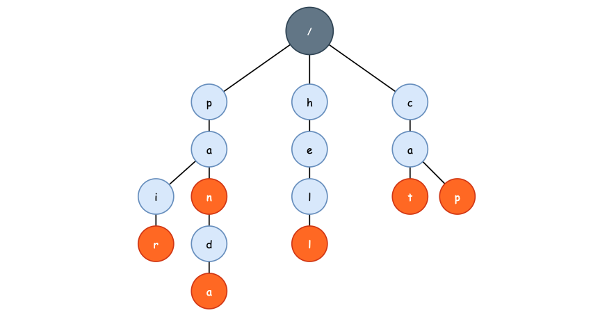

## Third-Trie

Trie 树是一种前缀树，也被称之为字典树，专门用来进行前缀查询，例如 IDE 中的自动补全功能我们就可以使用 Trie 树来实现。

和由 `rbtree` 所实现的 `map`，以及 `hashmap` 不同的是，Trie 在查找单词时的时间复杂度既不是 `O(logn)`，也不是 `O(1)`，而是 `O(K)`。其查找效率与我们要查找的单词长度有关，单词越长，查找效率越差。不过，在绝大多数场景下，我们所添加的字符串长度通常不会超过 30，例如通讯录的姓名、用户的搜索关键词，这些数据都不会很长，那么使用 Trie 也就不会出现效率问题。

首先，来看一下 Trie 树到底长什么样子，目前我们有 6 个单词，分别是: pan，panda，pair，hell，cat 以及 cap。我们利用这些字符串之间的公共前缀，将重复的前缀重合到一起，组成一棵 Trie 树:



根节点不包含任何信息，可以认为是一个“哑元”节点，也就是 DummyNode，在链表中经常使用。可以看到，单词中的每一个字符都是 Trie 树中的一个节点，但是树中的节点数量并不等于所有单词的字符数量，因为 Trie 进行了字符重叠。

在查找一个单词的时候，逐一地对待查找单词中的每一个字符进行匹配，直到我们找到了待查找的最后一个字符，或者我们没有找到某一个字符，此时应返回 false。

### 1. 实现

首先来看 Trie 树节点的实现。对于一个节点而言，我们肯定需要保存当前节点所携带的字符是什么。其次就是，通过上图我们可以看到，当我们查找 "pand" 这个单词时，是能够在 Trie 树中找到的，但是这个单词并不是我们添加的单词。因此，我们需要在每一个节点都添加一个标志位，标志当前节点是否是某一个单词的最后一个字符。

如此一来，"d" 节点的标识符应该为 false，当我们查找 "pand" 时，由于找到的最后一个字符 "d" 并不是某个单词的结尾，所以返回 false，这与我们的预期相符合。

其次是孩子节点用什么样的方式保存。在二叉树中，我们只需要使用 `left` 和 `right` 这两个指针即可保存左、右孩子节点。但是 Trie 本质上是一棵多叉树，因此必须要使用容器保存孩子节点。首先考虑数组，当我们待保存的字符串中仅包含英文字母时，只需要开大小为 26 的指针数组即可。但是如果包含中文字符呢? 如果用 unicode 来保存中文字符的话，那么这个数组就会变得极其庞大，此时我们可以使用 `hashmap` 来进行保存，并且仍然有 `O(1)` 的查找效率。

所以，若带保存字符串仅包含少量字符，使用静态数组保存孩子节点，否则使用 `hashmap`。在这里为了更通用，所以使用 `hashmap`，此时我们就得到了 Trie 节点需要的所有信息了:

```cpp
struct TrieNode {
    bool isWord;
    unordered_map<char, TrieNode*> next;  // 中文可使用 wchar_t
    TrieNode() : isWord(false) {}
};
```

再来看 Trie 树本身的实现，只需要一个 DummyRoot 即可，当然我们也可以额外的记录下当前保存的字符数量:

```cpp
class Trie {
private:
    int m_size;
    TrieNode *m_root;
    
    // 后序遍历释放内存
    void delete_self(TrieNode *root) {
        for (auto child : root->next)
            delete_self(child.second);
        delete root;
        root = nullptr;
    }
public:
    Trie() : m_size(0), m_root(new TrieNode()) {}
    ~Trie() {delete_self(m_root);}
    
    // 禁止拷贝
    Trie(const Trie& trie) = delete;
    Trie& operator= (const Trie& trie) = delete;
};
```

#### 1.1 插入

向 Trie 中插入一个字符串时，我们需要为每一个字符都创建 `TrieNode` 节点，当然，如果本身当前字符已经在 Trie 正确的路径上的话，即可复用:

```cpp
void insert(const string& word) {
    TrieNode *current = m_root;
    for (auto c : word) {
        if (current->next.count(c) == 0)        // 若没有当前字符节点则创建一个
            current->next[c] = new TrieNode();
        current = current->next[c];             // 沿着路径到达孩子节点
    }
    if (!current->isWord)                       // 将当前节点设置结束标识符
        current->isWord = true;
}
```

字符串的插入过程其实就是节点遍历过程，如果当前路径上没有该字符节点的话，创建一个。整体过程就像链表一样。

#### 1.2 查询

查询大致上可以分为两种: 查询某个单词是否在 Trie 中，查询前缀为 `prefix` 的所有单词。首先来看第一个，遍历查询单词，沿着 Trie 树的路径往下走即可:

```cpp
bool exist(const string& word) const {
    TrieNode *current = m_root;
    for (auto c : word) {
        if (current->next.count(c) == 0)
            return false;
        current = current->next[c];
    }
    return current->isWord;
}
```

再来看获取前缀为 `prefix` 的所有单词，首先我们先找到 `prefix` 最后一个字符所在的树节点。若该树节点不存在，那么我们就可以判断出 Trie 树中没有保存任何以 `prefix` 为前缀的单词。若树节点存在，那么我们使用回溯的方式获得以该节点为根节点的全部路径即可。实现如下:

```cpp
// 获取以 root 为根节点的到所有结束节点的路径
void __query(const TrieNode *root, vector<string>& result, string& path) const {
    if (root->isWord) result.push_back(path);
    for (const auto &item : root->next) {
        path.push_back(item.first);
        __query(item.second, result, path);
        path.pop_back();
    }
}

// 查询以 prefix 为前缀的全部单词
vector<string> query_prefix(const string& prefix) const {
    string path = prefix;
    vector<string> result;

    TrieNode *current = m_root;     // 找到 prefix 的最后一个节点
    for (auto c : prefix) {
        if (current->next.count(c) == 0) return result;
        current = current->next[c];
    }
    __query(current, result, path);
    return result;
}
```

实际上，根据 `__query` 这一递归函数，我们可以编写一个 `query_all` 函数，即获取 Trie 树中保存的所有单词，只需要将根节点参数换成 `m_root` 即可。


#### 1.3 删除

删除 Trie 中的某个单词，首先找到该单词最后一个字符的 `TrieNode`，将 `isWord` 标记为 false 即可。同时，如果当前节点没有其他孩子节点的话，将该节点从 Trie 树中删除。

```cpp
bool delete_word(const string& word) {
    TrieNode *current = m_root, *pre = nullptr;
    for (auto c : word) {
        if (current->next.count(c) == 0) return false;
        pre = current;
        current = current->next[c];
    }
    current->isWord = false;

    if (current->next.empty()) {
        auto tail = word.back();
        delete pre->next[tail];
        pre->next.erase(tail);
    }
    return true;
}
```

实际上，删除接口在实际应用中调用频次非常少，因为 Trie 不太适合作为动态数据集合。如果是频繁的插入、删除的话，使用红黑树将会有更高的效率。

### 2. 应用

#### 2.1 IDE 或搜索引擎的拼写提示

由于 Trie 是一棵前缀树，那么我们就是可以实现 IDE 中的拼写提示功能。实现方式非常简单，首先我们将语言的常用关键字丢到 Trie 中，然后动态的将用户所编写的类名、函数名以及变量名放置到 Trie 中，当用户敲下 `re` 的时候，在 Trie 中查找以 `re` 为前缀的所有单词即可，再结合用户的拼写习惯、词频统计等信息，排序返回相应的数据。

```cpp
int main() {
    Trie trie;

    trie.insert("ret");
    trie.insert("return");
    trie.insert("reply");
    trie.insert("reuse_module");

    vector<string> res = trie.query_prefix("re");

    for (auto s : res) cout<<s<<endl;
}
```
 

#### 2.2 海量数据中寻找相同的数据（前缀相似）

例如给定 A、B 两个文件，每个文件都包含了约 40 亿的 URL 数据，内存限制 4G，找出 A、B 两个文件中相同的 URL。并且，这些 URL 数据仅来自于几个大型的网站，例如 google.com、facebook.com。

假设我们使用集合，`hash(string)` 得到的结果为 `unsigned int`，也就是占用 4 个字节，40 亿数据至少需要 14.5G 的内存才能存放，而且还未考虑额外使用的指针所占用内存。此时我们就可以利用题目给出的数据性质以及 Trie 前缀重合的特性来大量节省内存，使用 A 文件中的 URL 构建 Trie 树，使用 B 文件中的 URL 于该 Trie 中进行查找即可。

虽然我们在构建 Trie 的过程中无法使用并发的手段进行，但是在使用 B 文件的 URL 在 Trie 中查询时相当于一个“只读”操作，完全可以使用多线程的方式进行。

#### 2.3 求解数组中两个元素的异或区间问题

Count pairs having Bitwise XOR less than K from given array:

> Given an array nums of size N and an integer K, the task is to count the number of pairs from the given array such that the Bitwise XOR of each pair is less than K.  

题目描述比较简单，简单的来说就是给定一个数组 `nums`，求这个数组中两个元素的异或（XOR）值小于 K 的对数。例如 `nums = {1, 2, 3, 5}`，`K = 6`，那么满足题目条件的 pair 一共有 4 对:

```bash
nums[0] ^ nums[1] = 1 ^ 2 = 3 
nums[0] ^ nums[2] = 1 ^ 3 = 2 
nums[0] ^ nums[3] = 1 ^ 5 = 4 
nums[1] ^ nums[2] = 2 ^ 3 = 1 
```

针对这个问题，我们固然可以使用 `O(n^2)` 时间复杂度的暴力求解方式，但是假如 `nums.length` 达到了 10^5，甚至是 10^6 呢？此时 `O(n^2)` 的暴力解法将会消耗非常长的时间。

我们知道，异或（XOR）这一运算符实际上是比较两个整型之间的“差异”，例如 `10000 ^ 10001` 的结果为 1，尽管这两个值看起来都很大，但是它们的二进制表示只有一个 bit 的差异:

```bash
0010 0111 0001 0000 (10000)
0010 0111 0001 0001 (10001)
```

因此，如果我们想要使得两个整型的异或结果尽可能的小，那么它们的二进制表示从最高位到最低位应有更高的重合度。同时，差异应该尽可能地出现在低位，例如 14096 和 10000 虽然也只有一个 bit 的差异，但是它们的异或结果要远超于 10001 和 10000 的异或结果:

```bash
    0010 0111 0001 0000 (10000)
    0011 0111 0001 0000 (14096)
^   -------------------
    0001 0000 0000 0000 (4096)
```

首先，我们使用 `nums` 数组中元素的二进制形式，从高位到低位，构造一棵 Trie 树，因为 bit 位不是 0 就是 1，所以我们将会构造出一棵二叉树，根节点仍然是哑元节点。不过，因为我们需要求 pair 的数量，所以我们在每一个 TrieNode 节点中，都记录下 `nums` 数组中有多少个元素经过了该节点。换句话说，我们需要知道第 i 个 bit 位为 0 的元素个数，以及第 i 个 bit 位为 1 的元素个数，如下图所示:


现在，我们对 `nums` 数组中的前 3 个元素构建出了 Trie 树，来看下这棵树中有多少个元素与 `nums[3] = 5` 的异或结果小于 6。这里我们需要利用异或操作的一个性质:

```bash
A ^ B = K
A ^ K = B
```

`nums[3] = 5` 的二进制表示为 `0101`，`K = 6` 的二进制表示为 `0110`。首先来看 K 的最高位（这里我们使用了 4 bit 来表示一个数的二进制表示，所以是最高位，实际上这是第 29 位），为 `0`。

我们知道 `0 ^ 1 = 1`，也就是说，如果我们让 `K` 和一个第 29 位为 `1` 的数字进行异或的话，结果一定会大于 `K`。例如 `K ^ 1110`，结果为 14，大于 K。所以，我们只能往 `0` 的方向走。但是因为我们的 `K` 是要和 `nums[3]` 进行异或，所以我们此时只能朝着 5 的第 29 位那个方向前进。

再来看 `K` 的第 30 位，为 `1`，那么最优解是往 `0` 的问那个方向走，结果必然为 `0`。我们也可以往 `1` 的方向走，期待着后面儿会有什么不同，以此类推。


```cpp
#include <vector>
#include <iostream>

using namespace std;
 
struct TrieNode {
    // 因为 bit 位要么是 0，要么是 1，所以我们可以使用一个数组来表示
    TrieNode *child[2];

    // 记录经过了该节点共有多少个 number
    int count;

    TrieNode() : count(0) {
        child[0] = child[1] = nullptr;
    }
};


// 将 int 类型的 number 插入至 Trie
void insertTrie(TrieNode *root, int N) {
    for (int i = 31; i >= 0; i--) {
        bool x = (N) & (1 << i);

        if(!root->child[x]) {
            root->child[x] = new TrieNode();
        }

        root->child[x]->count ++;
        root= root->child[x];
    }
}
 
/*
 * 计算当前 Trie 数中，与 N 进行异或操作的结果小于 K 的数量
 */
int countSmaller(TrieNode * root, int N, int K){
     
    int countPairs = 0;
     
    for (int i = 31; i >= 0 && root; i--) {
                                          
        bool x = N & (1 << i);
        bool y = K & (1 << i);
        
        // 如果 K 的第 i 位为 1 的话，那么按照 XOR 的性质，1 XOR 1 = 0, 1 XOR 0 = 1
        // 那么我们需要做的事情就是尽可能的让异或结果为 0， 这样才能使得最终结果更小，而不是更大
        if (y) {
            
            // 如果 N 的第 i 位为 1 的话，那么我们一定能够保证，包含当前 TrieNode 节点的所有路径的元素与 N 
            // 异或均小于 K，因为此时第 i 位的异或结果将是 0，而 K 的第 i 位为 1
            if(root->child[x]) {
                countPairs += root->child[x]->count;
            }

            root = root->child[1 - x];
        }
        else {
            root = root->child[x];
        }
    }
    return countPairs;
}
 
int countSmallerPairs(vector<int>& array, int K) {
    TrieNode *root = new TrieNode();
    int countPairs = 0;
     
    for(int i = 0; i < array.size(); i++){    
        countPairs += countSmaller(root, array[i], K);
        insertTrie(root, array[i]);
    }
    return countPairs;
}
 
int main() {
    vector<int> arr {1, 2, 3, 4, 5, 6, 7, 8};
    int K = 7;

    cout << countSmallerPairs(arr, K) << endl;
}
```

在明白了这个问题以后，那么 Leetcode 上 [1803. Count Pairs With XOR in a Range](https://leetcode.com/problems/count-pairs-with-xor-in-a-range/) 这个问题就可以被非常轻松的解决掉了。这个问题要我们求 `nums` 在 `[low, high]` 这个闭区间所有的异或对，也就是

```bash
low <= A XOR B <= high, A、B in nums
```

`countSmallerPairs` 只能够求解小于 K 的所有异或对数量，不能求大于 K 的所有异或对数量。不过我们可以“曲线救国”，要求一个闭区间，那么我们用一个大区间减去一个小区间就好了:

```cpp
class Solution {
public:
    int countPairs(vector<int>& nums, int low, int high) {
        return countSmallerPairs(nums, high + 1) - countSmallerPairs(nums, low);
    }
};
```

