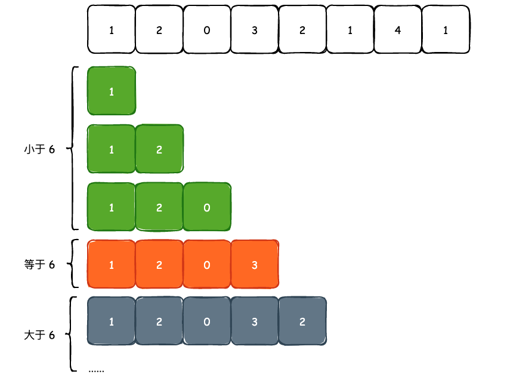
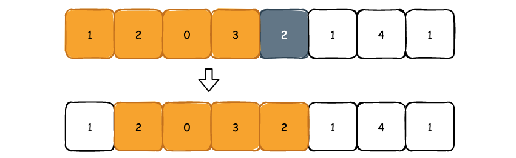
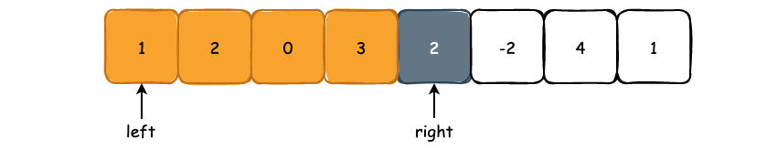
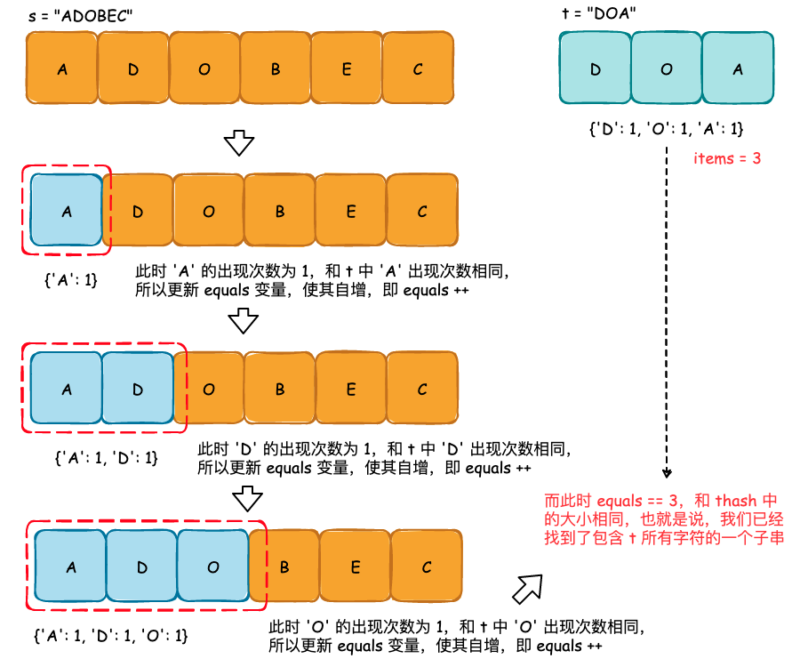

## 双指针与滑动窗口

Two Pointers 是一个非常有意思的算法技巧，但同时也要比 Tree 的遍历、BFS 等算法更难理解，但是接下来我们将会看到，双指针问题是可以“套模板”的。

本篇文章包含的算法问题:

- [3. Longest Substring Without Repeating Characters](https://leetcode.com/problems/longest-substring-without-repeating-characters/)
- [76. Minimum Window Substring](https://leetcode.com/problems/minimum-window-substring/)
- [159. Longest Substring with At Most Two Distinct Characters](https://leetcode.com/problems/longest-substring-with-at-most-two-distinct-characters/)
- [424. Longest Repeating Character Replacement](https://leetcode.com/problems/longest-repeating-character-replacement/)
- [713. Subarray Product Less Than K](https://leetcode.com/problems/subarray-product-less-than-k/)


### 0. 关于单调性

在介绍双指针的实际使用规则与场景之前，我们需要明确双指针到底适用于哪些场合，以及为什么使用双指针可以得到正确的结果。

能够使用双指针的场景必须满足**单调性质**，这里的单调性质并不是只单调递增或者是单调递减，而是**输入的数据要么是随着区间的扩大或者缩小，状态由“满足题目要求”到“不满足题目要求”，要么是随着区间的扩大或者缩小，状态由“不满足题目要求”到“满足题目要求”。不能出现随着区间的扩大或缩小，出现“满足要求-不满足要求-满足要求”这种带有波折的情况。**

我们以一道比较简单的问题为例，给定一个不包含负数的整数 `nums` 数组，请求出元素和小于等于 6 的最长连续子数组的长度:


上图所示的 `nums` 数组中和小于等于 6 的最长连续子数组的长度为 4，也就是 `[1, 2, 0, 3]`  或者是 `[0, 3, 2, 1]` 这 4 个元素所组成的子数组满足题目要求且具有最大长度。由于 `nums` 数组中并不包含负数，那么假设我们以 `nums[0]` 为起始点，不断地向后遍历，就可以把 `nums` 数组划分成 3 部分: 和小于 6 的子数组，和等于 6 的子数组，以及和大于 6 的子数组:



可以看到，不包含负数的 `nums` 数组是满足我们前面所提到的单调性的: **只要我们发现了第一个不满足题目要求的子数组，那么后面儿的元素我们可以都不用看了，因为后面一定不会有满足题目要求的子数组**，这其实就是单调性。

再来看单调性和双指针之间有什么联系。同样以上图为例，当我们发现遍历到第 4 个元素时，也就是得到了 `[1, 2, 0, 3]` 这个子数组时，其元素和为 6，满足题目要求，那么**其实我们就没有必要再去看 `[2, 0, 3]` 或者是 `[2, 0]`，又或者是 `[0, 3]` 这些子数组了，因为我们要找的是最长子数组**。

我们继续向前遍历，当 `[1, 2, 0, 3]` 子数组添加了元素 2 以后，元素和为 8，不满足题目要求了，此时我们该怎么做? 以 `nums[1]` 为起始点、子数组长度为 1 再继续寻找吗? 完全没有必要，因为以 `nums[1]` 为起始点、长度为 3 的子数组其实已经被包含在了 `[1, 2, 0, 3]` 中，所以我们可以直接越过这些子数组，直接来看 `[2, 0, 3, 2]` 这个子数组:



所以，我们可以使用 `left` 指针来表示以哪个元素为起始元素，`right` 指针则表示当前遍历到的元素。当 `[left, right]` 这一区间不满足题目要求时，由于 `nums` 数组具有单调性，那么我们就可以知道 `[left, rigth+1]`，`[left, right+2]`，......，`[left, nums.size()-1]` 这些区间都不会满足题目要求，直接丢弃不看。**并且，如果我们要求最长区间时，由于`[left, right-1]` 中已经包含了 `[left+1, right-1]` 这些区间，并且它们一定不是最优解，所以可以直接将区间更新至 `[left+1, right]`，再来审视该区间是否满足题目要求**。

那么不满足单调性质的 `nums` 数组为什么不可以使用双指针呢? 我们来看一个简单的例子:



如上图所示，假设以 `nums[0]` 为起始点开始寻找符合题目要求的子数组，当遍历到元素 2 时，子数组的元素和为 8，不满足题目要求了。按照双指针的思想，`left` 指针向前移动而 `right` 指针则不动，审视 `[2, 0, 3, 2]` 是否满足题目要求。但是我们可以看到，`[1, 2, 0, 3, 2, -2]` 其实才是满足题目要求的最长子数组，但是我们的算法却遗漏了。根本原因就在于包含了负数的 `nums` 数组不满足单调性质，以 `nums[0]` 为起始的子数组会有这样的状态变化: “满足要求->不满足要求->满足要求->不满足要求”，此时我们根本无法准确的判断从何处开始“舍弃”掉一部分元素。

顺带一提，不满足单调性质的数组，并且我们需要求最长子数组的话，通常会使用 DP 来解决。


### 1. 最长区间

在理解了双指针必须应用在具有单调性质的数组中之后，我们就可以来进行解题了。首先我们来解决上面例子中提到的问题，从而提炼出最长区间的模板与特性:

> 给定一个不包含负数的整数 `nums` 数组，请求出元素和小于等于 6 的最长连续子数组的长度

由于 `left` 指针表示以哪个元素为起始，所以其初始值应该为 0，但是 `right` 指针初始化应该是多少呢? 答案应该是 -1。因为我们定义的区间是 `[left, right]` 这一闭区间，在初始状态时应该不包含任何元素才对:

```cpp
int maximumSizeSubarraySum(vector<int>& nums, int target) {

    int result = 0, n = nums.size();

    // 初始化 [left, right] 这一闭区间
    int left = 0, right = -1;

    int current = 0;

    while (left < n) {

        // 满足条件时 right 不断向后移动
        if (right + 1 < n && current + nums[right + 1] <= target) {
            current += nums[right + 1];
            right ++;
        } 
        // 不满足条件时需要让 left 向右移动，重新选取起始元素
        else {
            current -= nums[left];
            left ++;
        }

        result = max(result, right - left + 1);
    }
    return result;
}
```

为什么这样的写法会得到最长区间呢? 是因为当满足题目要求时，`right` 指针将会一直往前移动，移动的越多区间越长。而 `left` 指针只有在不满足条件时才会移动，尽可能地让 `right - left + 1` 有更大的值，所以能够取得最长区间。

如果对 `right` 初始化成 -1 的写法不太理解的话，我们也可以使用另一种方式来实现，也就是每次固定 `right` 指针，使 `right` 指针不断向右遍历，那么此时我们只需要在不满足条件的时候让 `left` 指针不断向右移动即可:

```cpp
int maximumSizeSubarraySum(vector<int>& nums, int target) {

    int result = 0, n = nums.size();

    int left = 0, current = 0;

    for (int right = 0; right < n; right++) {

        // 当不满足条件时 left 指针要不断向前移动，这里的区间为 [left, right]
        while (left < n && current + nums[right] > target) {
            current -= left;
            left ++;
        }
        
        current += nums[right];

        // 此时 [left, right] 必然满足条件
        result = max(result, right - left + 1);
    }
    return result;
}
```

再来看一道非常经典的双指针问题: [3. Longest Substring Without Repeating Characters](https://leetcode.com/problems/longest-substring-without-repeating-characters/)，即给定一个字符串，请你找出其中不含有重复字符的**最长子串**的长度。

首先来看字符串符不符合单调性质。比如 "asddfhn"，很明显是符合的，因为一旦当一个子串包含了重复字符是，那么后面儿所有的子串都可以不用看了。判断是否重复则可以使用 `set` 完成:

```cpp
class Solution {
public:
    int lengthOfLongestSubstring(string s) {
        int n = s.size(), result = 0;

        unordered_set<char> visited;

        int left = 0, right = -1;

        // 只要 left 指针没有超出边界，就可以一直遍历下去
        while (left < n) {
            // 满足条件时 right 指针尽可能的往右移动
            if (right + 1 < n && visited.count(s[right + 1]) == 0) {
                right ++;
                visited.insert(s[right]);
            }
            // 不满足条件时 left 指针需要移动
            else {
                visited.erase(s[left]);
                left ++;
            }
            result = max(result, right - left + 1);
        }
        return result;
    }
};
```

这个问题同样可以使用 `for+while` 的方式进行改写:

```cpp
class Solution {
public:
    int lengthOfLongestSubstring(string s) {
        int n = s.size(), result = 0;

        unordered_set<char> visited;

        int left = 0;

        for (int right = 0; right < n; right++) {
            while (visited.count(s[right]) != 0) {
                visited.erase(s[left]);
                left ++;
            }
            visited.insert(s[right]);
            result = max(result, right - left + 1);
        }
        return result;
    }
};
```

从某种意义上来说，`for+while`循环可能更好理解。并且能够形成一个滑动窗口的模板: **当不满足条件时 left 指针不断地向右移动，直到满足条件**:

```cpp
int longestSlidingWindowTemplate(vector<int>& nums) {
    int n = nums.size(), result = 0;
    int left = 0;
    for (int right = 0; right < n; right ++) {
    
        // TODO: 将 nums[right] 纳入区间内容/状态
    
        while ([left, right] 区间不满足题目要求) {  /* TODO: 检查区间状态 */
            // TODO: 修改区间内容/状态
            left ++;
        }
        
        result = max(result, right - left + 1);
    }
    return result;
}
```

如上所示，只要根据题目要求在 3 个 "TODO" 上填上正确的内容，就可以求解滑动窗口中最大区间问题。

接下来再看一道关于最大区间的问题，[424. Longest Repeating Character Replacement](https://leetcode.com/problems/longest-repeating-character-replacement/):

给你一个仅由大写英文字母组成的字符串，你可以将任意位置上的字符替换成另外的字符，总共可最多替换 k 次。在执行上述操作后，找到包含重复字母的最长子串的长度。

```bash
输入：s = "AABABBA", k = 1
输出：4
解释：将中间的一个'A'替换为'B',字符串变为 "AABBBBA"。子串 "BBBB" 有最长重复字母, 答案为 4。
```

如果我们不考虑 `K` 这个限制的话，将一个字符串变成完全重复的字符串的最少操作次数，其实就是字符串长度减去出现次数最多字符个数。比如 `BABBBB`，最小操作次数其实就是 6 - 5 = 1，因为 `B` 出现了 5 次，为出现次数最多的字符，所以只需要将 `A` 换成 `B` 即可。

如果加上 `K` 这个限制的话，其实也就是 `字符串长度 - 最多出现次数 <= K`。因此，我们只需要去维护一个满足该条件的窗口即可，当然也需要计算出窗口中的最多出现次数:

```cpp
class Solution {
public:
    int characterReplacement(string s, int k) {
        int left = 0, maxTimes = 0, result = 0;

        vector<int> count(26, 0);

        for (int right = 0; right < s.size(); right++) {
            // 先将当前字符纳入窗口
            count[s[right] - 'A'] ++;

            // 计算最多出现次数，maxTimes 其实卡了一个窗口大小
            maxTimes = max(maxTimes, count[s[right] - 'A']);

            // 不满足条件时 left 需要不断向右移动
            while (right - left + 1 - maxTimes > k) {
                count[s[left] - 'A'] --;
                left ++;
            }

            result = max(result, right - left + 1);
        }
        return result;
    }
};
```

[159. Longest Substring with At Most Two Distinct Characters](https://leetcode.com/problems/longest-substring-with-at-most-two-distinct-characters/)，这道问题被锁了，所以如果需要进行 online 提交的话，得找个会员。

给定一个字符串 `s` ，找出**至多**包含两个不同字符的最长子串 `t` ，并返回该子串的长度。

输入: "ccaabbb"
输出: 5
解释: t 是 "aabbb"，长度为5。

在上一个示例中，如果我们选择 "ccaa" 的话，那么最多包含两个不同字符的最长子串长度为 4，要小于 "aabbb"，所以最终的输出为 5。

**题目中包含了“最长”、“连续”这样的关键词，所以第一步就是使用单调性判断这个问题是否可以使用双指针的方式进行求解**。而题目的核心要求就是一个子串中最多包含两个不同的字符，如果从第一个字符往后遍历的话，前两个字符一定符合题目要求。随着遍历的进行，后面的字符开始加入进我们遍历到的子串，可能会导致得到的子串不满足题目要求。并且显而易见的，当子串不满足题目要求时，后面的所有字符都可以不用看了，也就是说，这道题目给出的 input 满足单调性质，所以我们可以使用双指针来完成。

至多包含两个不同字符我们可以将其翻译成大小最多为 2 的 hashmap 那么就可以套用模板了:

```cpp
class Solution {
public:
    int lengthOfLongestSubstringTwoDistinct(string& s) {
        int n = s.size(), result = 0;

        if (s.size() <= 2) return s.size();

        int left = 0;
        
        // 记录遍历过程中每一个字符出现的次数
        unordered_map<char, int> bucket;

        for (int right = 0; right < n; right++) {

            // 把当前遍历到的元素扔进 bucket 中
            bucket[s[right]] ++;

            // 当不满足条件时 left 不断向右移动
            while (bucket.size() > 2) {
                bucket[s[left]] --;
                if (bucket[s[left]] == 0) bucket.erase(s[left]);
                left ++;
            }
            
            result = max(result, right - left + 1);
        }
        return result;
    }
};
```

最后我们再来看一个区间计数的问题，其实区间计数和求解最长区间有着非常强的关联。[713. Subarray Product Less Than K](https://leetcode.com/problems/subarray-product-less-than-k/)，给定一个正数数组 `nums`，以及一个正整数 `k`，求乘积小于 `k` 的子数组的个数。

以 `nums = [10,5,2,6]`，`k = 100` 为例，假设我们以 `nums[0]` 为起始元素，寻找乘积小于 `k` 的最长连续子数组，在这个过程中我们会找到下面的子数组:

```bash
[10]
[10, 5]
[10, 5, 2]
```

可以看到，在 `[10, 5]` 这个子数组中，`[5]` 其实也是满足题目要求的，**而区间长度其实就刚好等于当前满足题意的所有子数组个数**。比如 `[10, 5, 2]` 这个子数组，长度为 3，能够从中提取的子数组为 `[2]`、`[5, 2]` 以及 `[10, 5, 2]`。**也就是说，以 `nums[right]` 为结尾的、满足题目要求的子数组个数其实就是 `right - left + 1`**。

比如 `[1, 2, 3, 4]`，我们以 4 结尾来看:

```cpp
[1, 2, 3, 4]
   [2, 3, 4]
      [3, 4]
         [4]
```

个数刚好为 4，并且并不会和前面以 3 为结尾的子数组产生重复。

```cpp
class Solution {
public:
    int numSubarrayProductLessThanK(vector<int>& nums, int k) {
        int n = nums.size(), result = 0;

        int left = 0;
        int product = 1;

        for (int right = 0; right < n; right++) {
            // 将 nums[right] 纳入窗口
            product *= nums[right];

            // 当窗口不满足条件时就让 left 指针向右移动
            while (product >= k && left <= right) {
                product /= nums[left];
                left ++;
            }

            // 在 [left, right] 这个区间中，符合要求的子数组个数就是其长度
            result += right - left + 1;
        }
        return result;
    }
};
```

### 2. 最短区间

在最长区间问题中，当满足条件时让 `right` 指针移动，只有在不满足条件时才让 `left` 指针移动，从而找到另一个满足题目要求的区间。而**对于最短区间而言，我们需要在满足条件的时候让 `left` 指针主动的去破坏现有的区间，在不满足条件时则让 `right` 指针移动，来寻找另一个满足题目要求的区间**。

那么最短区间的问题可以更新为:

```cpp
int shortestSlidingWindowTemplate(vector<int>& nums) {
    int n = nums.size(), result = 0;
    int left = 0;
    for (int right = 0; right < n; right ++) {
    
        // TODO: 将 nums[right] 纳入区间内容/状态
    
        while ([left, right] 区间满足题目要求) {  /* TODO: 检查区间状态 */
        
            result = min(result, right - left + 1);
        
            // TODO: 修改区间内容/状态
            left ++;
        }
    }
    return result;
}
```

以 [76. Minimum Window Substring](https://leetcode.com/problems/minimum-window-substring/) 这个问题为例:

求 `s` 字符串中的最短子串，要能够包含 `t` 字符串中的所有字符

输入: s = "ADOBECODEBANC", t = "ABC"
输出: "BANC"
解释: 因为 s 中 存在最短子串 "BANC"，包含了 "ABC" 的所有字符

简单分析一下这道题的特性，或者说关键词:

- 最短区间: 题目要求我们找到 `s` 中连续的最短子串
- 约束条件: 连续子串中必须包含 `t` 中的所有字符
- 单调性: 当区间变长时，包含的字符只会增加，所以一旦找到了满足题目要求的子串以后，再添加字符的话，同样满足约束条件

因此，我们现在需要做的事情就是如何判断 `s` 中的子串包含了 `t` 中的所有字符，可以使用两个哈希表来完成。其中 `shash` 用于保存窗口中的字符及其出现次数，而 `thash` 则用于保存 `t` 中的所有字符和出现次数。那么我们该如何高效的去比较这两个哈希表是否相同呢?



如上图所示，我们可以在遍历 `s` 字符串的时候维护一个 `equals` 变量，用于表示当前遍历到的子串有多少个字符已经和 `t` 完全匹配了。那么当 `equals` 等于 `thash` 这个哈希表的大小时，我们就可以断定它们相同。

```cpp
class Solution {
public:
    string minWindow(string s, string t) {

        int n = s.size();

        unordered_map<char, int> shash;
        unordered_map<char, int> thash;

        // 构字符串 t 的哈希表
        for (auto c : t) thash[c] ++;
        // 判断相等的依据
        int items = thash.size();

        int left = 0;
        
        // 当前有多少字符已经相同
        int equals = 0;

        // 结果保存，start 用于保存最终子串的起始位置，result 则是最短子串的长度
        int start = n + 1, result = n + 1;

        for (int right = 0; right < n; right++) {
            // 将 s[right] 纳入区间
            shash[s[right]] ++;

            if (shash[s[right]] == thash[s[right]]) {
                equals ++;
            }

            // 若区间满足题目要求，那么我们需要主动的减少这个区间
            while (equals >= items) {
                // 判断是否更短
                if (right - left + 1 < result) {
                    start = left;
                    result = right - left + 1;
                }
                // 需要将 s[left] 移除
                // 注意在移除以前判断下 shash[s[left]] 和 thash[s[left]] 是否相同
                if (shash[s[left]] == thash[s[left]]) {
                    equals --;
                }
                shash[s[left]] --;
                left ++;
            }
        }
        return start == n+1 ? "" : s.substr(start, result);
    }
};
```

如果想要对上述代码进一步优化的话，可以将哈希表换成静态数组，以提高运行效率和空间使用率。

### 3. 小结

在上面我们得到了两个双指针的模板，分别是最长区间模板:

```cpp
int longestSlidingWindowTemplate(vector<int>& nums) {
    int n = nums.size(), result = 0;
    int left = 0;
    for (int right = 0; right < n; right ++) {
    
        // TODO: 将 nums[right] 纳入区间内容/状态
    
        while ([left, right] 区间不满足题目要求) {  /* TODO: 检查区间状态 */
            // TODO: 修改区间内容/状态
            left ++;
        }
        
        result = max(result, right - left + 1);
    }
    return result;
}
```

以及最短区间模板:

```cpp
int shortestSlidingWindowTemplate(vector<int>& nums) {
    int n = nums.size(), result = 0;
    int left = 0;
    for (int right = 0; right < n; right ++) {
    
        // TODO: 将 nums[right] 纳入区间内容/状态
    
        while ([left, right] 区间满足题目要求) {  /* TODO: 检查区间状态 */
        
            result = min(result, right - left + 1);
        
            // TODO: 修改区间内容/状态
            left ++;
        }
    }
    return result;
}
```

在最长区间问题中，当满足条件时让 `right` 指针移动，以寻找更长的区间，只有在不满足条件时才让 `left` 指针移动，从而找到另一个满足题目要求的区间。而对于最短区间而言，我们需要在满足条件的时候让 `left` 指针主动的去破坏现有的区间，以寻找更短的区间，在不满足条件时则让 `right` 指针移动，来寻找另一个满足题目要求的区间。

另外一点值得注意的是，使用双指针这样的解题技巧时，输入的数组或者是字符串必须满足单调性，否则将不能使用上述的双指针模板解决。
