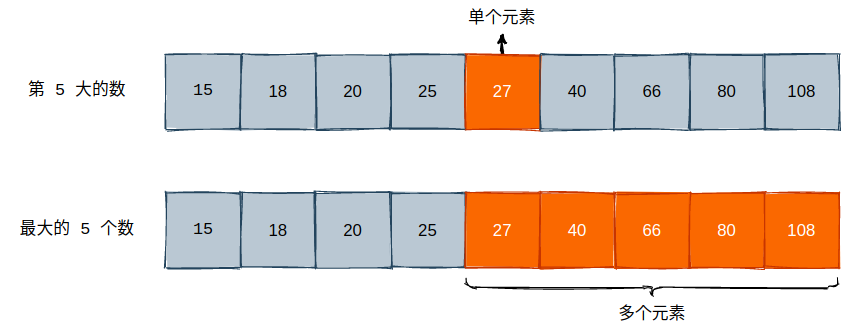
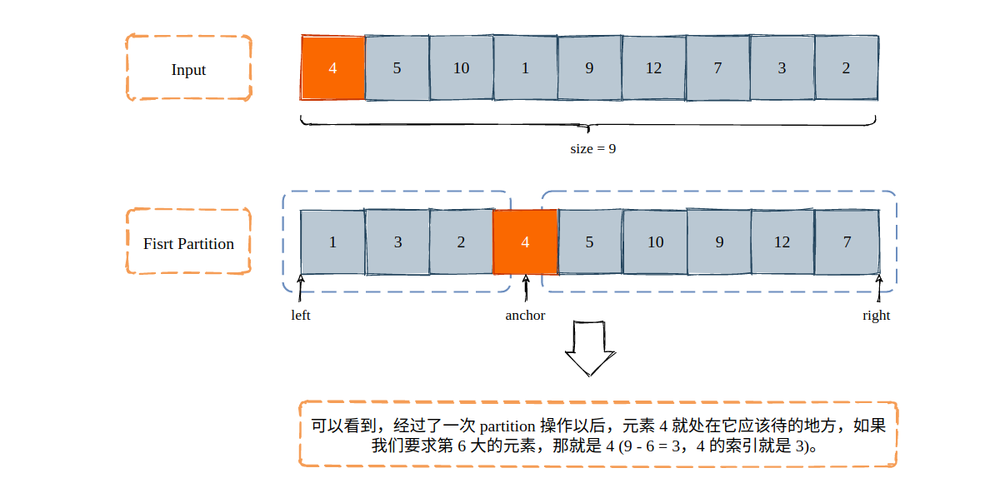
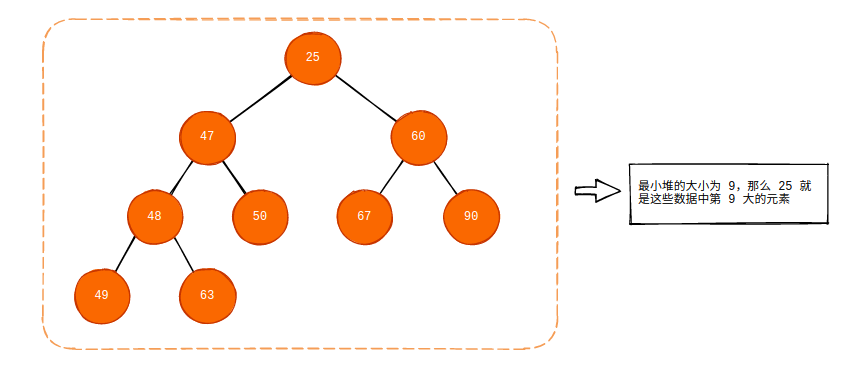
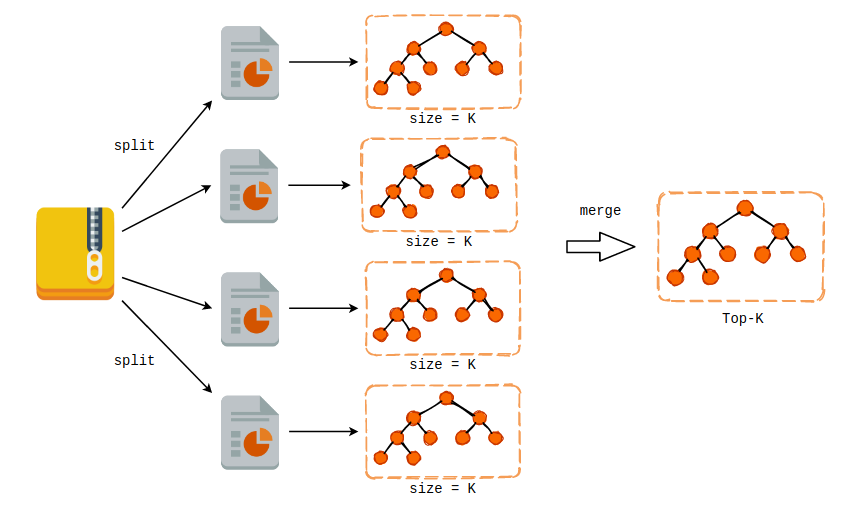

## 与 Top-K 相关的问题

### 1. 拥有充足的内存

在这种情况下，我们拥有足够的内存将所有的数据一次性的加载至内存中，可以使用一个静态 Array 或者是一个动态 List 进行存储。此时我们可以选择很多种方法来获取这些数据中诸如最大的 K 个数，最大的第 K 个数，或者是出现次数最多的数。

需要注意的是，第 K 个最大数和最大的 K 个数这两个问题并不是同一个概念:



#### 1.1 第 K 大的元素

如果我们要取一个数组中第 K 大的元素的话，那么最简单的办法就是排序处理，而后按数组下标直接在已排序的数组中取出该元素即可:

```cpp
int findKthLargestUseSort(vector<int>& array, int K) {
    sort(array.begin(), array.end());
    return array[array.size() - K];
}
```

如果我们使用快速排序的话，排序的平均时间复杂度为 `O(nlogn)`，获取第 K 个最大元素的时间复杂为 `O(1)`。并且，当我们对源数据进行排序以后，那么后续我们可以获得任意的 第 K 大个元素，而不受限于查询的频次和数据。

如果说我们只是为了写 PPT，一次性的获取数据中第 K 大的元素的话，那么我们就可以使用快速排序的 Partition 过程来进行优化。

快速排序的核心思想就是对数据进行“分片”，我们随机地选定一个锚点元素，它可以是数组中的第一个元素，可以是最后一个元素，或者说我们使用 `rand()` 方法随机的找一个。在找到锚点元素 `v` 以后，通过一些手段，使得数组中前半部分的元素均小于 `v`，使得数组的后半部分均大于 `v`，如下图所示:



可以看到，我们选定了锚定点 4，那么通过该锚定点可以将数组分成两部分: 其中前 3 个元素均小于 4，后 5 个元素均大于 4。如果我们要求第 6 大的元素的话，那么后 5 个元素怎么排序我们根本不关心，它们一定会比索引为 3 的元素要大。并且，锚定点所在的索引位置又恰好在索引为 3 的位置上，因此我们就可以直接返回 4 这个元素了，它一定就是数组中第 6 大的元素。具体实现如下:

```cpp
int __partition(vector<int> &nums, int left, int right) {
    // 两路分片，只需要找到 < v 和 > v 的分界点即可

    // 随机选取锚定点，并将其置于当前子数组的首位
    swap(nums[left], nums[left+rand()%(right-left+1)]);

    int demarcation = left, v = nums[left];

    // nums[left+1...demarcation] < v, nums[demarcation+1, right] >= v
    for (int i = left + 1; i <= right; i++) {
        if (nums[i] < v) {
            demarcation ++;
            swap(nums[i], nums[demarcation]);
        }
    }
    swap(nums[left], nums[demarcation]);
    return demarcation;
}

int __selection(vector<int>& nums, int left, int right, int k) {
    if (left == right) return nums[left];

    int pos = __partition(nums, left, right);

    if (nums.size() - k == pos)
        return nums[pos];
    else if (nums.size() - k > pos) 
        // 此时，我们应该去右边寻找
        return __selection(nums, pos + 1, right, k);
    else
        return __selection(nums, left, pos - 1, k);
}


int findKthLargestUsePartition(vector<int>& nums, int k) {
    srand(time(NULL));
    return __selection(nums, 0, nums.size() - 1, k);
}
```

我们可以对这两个方法做一个简单的性能测试:

```cpp
void test_func(const string& funcname, int(*topK)(vector<int>&, int), 
                vector<int>& array, int K) {
    
    clock_t start_time = clock();

    int res = topK(array, K);

    clock_t end_time = clock();

    auto spent = double(end_time - start_time) / CLOCKS_PER_SEC;
    cout << funcname << " : " << res << ", " << spent << "s" << endl;
}

int main() {
    // 生成 1000 万个随机数，取值范围在 [0, 15000000]
    vector<int> v = generate_random_int_array(10000000, 0, 15000000);

    test_func("findKthLargestUseSort", findKthLargestUseSort, v, 1024);

    test_func("findKthLargestUsePartition", findKthLargestUsePartition, v, 1024);
}
```

大致结果如下，可以看到，两个方法之间约有几十倍的差距。

```bash
findKthLargestUseSort : 14998469, 3.55009s
findKthLargestUsePartition : 14998469, 0.125115s
```

使用快速排序的 Parition 思想实现的 `findKthLargest` 虽然在效率上更高，但是它却是一次性的，如果我们要查询 100 次第 K 个最大的元素，这个过程就需要运行 100 次，因此其使用场景比较受限。


最后一个方法就是使用最小堆，我们可以构建一个大小为 K 的最小堆，堆顶元素为这 K 个元素的最小值。而后遍历整个数组的所有元素，依次和堆顶元素进行比较。若当前元素大于堆顶元素，则将堆顶元素弹出，将当前元素压入最小堆中。若当前元素比堆顶元素还要小，直接 Pass。当我们把所有的元素都遍历完成后，最小堆的堆顶元素就是第 K 大的元素。



实现如下:

```cpp
int findKthLargestUseHeapOptimization(vector<int>& nums, int k) {
    int res;
    priority_queue<int, vector<int>, greater<int>> minHeap;

    for (int i = 0; i < nums.size(); i++) {
        if (minHeap.size() == k) {
            if (nums[i] > minHeap.top()) {
                minHeap.pop();
                minHeap.push(nums[i]);
            }
        }
        else minHeap.push(nums[i]);
    }
    return minHeap.top();
}
```

采用堆实现的 `findKthLargest` 和采用 Partition 实现的 `findKthLargest` 一样，也是一次性的。因为最小堆的大小固定，如果我们第一次查询了第 1024 大的元素，那么第二次要想要查询第 2048 大的元素，就只能再重复这个过程了。**但是，采用堆实现的 `findKthLargest` 有一个最大的优点就是支持动态添加元素。也就是说，如果我们需求是实现一个排行榜，并且排行榜数据每时每刻都在更新的话，那么使用堆实现就是一个最佳的选择。**

寻找第 K 个最大的元素在 Leetcode 上有其原型，题目地址为 [215. Kth Largest Element in an Array](https://leetcode.com/problems/kth-largest-element-in-an-array/)。


#### 2. 寻找最大的 K 个数

可以看到，不管是快速排序，利用快速排序的 Partition 过程，还是使用最小堆，不仅仅能找到第 K 大的元素，而且也能够找到最大的 K 个元素。唯一的区别就在于排序和最小堆实现的寻找最大的 K 个元素能够有序的输出，而利用 Partition 实现的方法则只能输出乱序的元素。


### 3. 寻找出现次数最多的 K 个数

既然内存充足，那么无脑使用哈希表即可，key 为数据本身，value 则为其出现次数。构建完哈希映射以后，问题就变成了找到 value 最大的 K 个 value。这个问题我们在上面刚刚讨论完毕，用排序、Partition 或者是最小堆都可以。

```python
In [3]: from collections import Counter

# counter 接收一个可迭代对象，对内容进行频次统计
In [4]: counter = Counter([1, 9, 9, 5, 0, 9, 2, 5])

# 获取出现频次最高的 3 个元素，并给出频次
In [5]: print(counter.most_common(3))
[(9, 3), (5, 2), (1, 1)]
```

### 2. 没有充足的内存

#### 2.1 findKthLargest

在大数据的处理中，很多时候我们是没有足够的内存放下所有的数据的。比如我们原始数据有 10 亿，机器内存只有 2G，同样要求找到第 K 个最大元素或者是最大的 K 个元素。我们来做一个简单的数学题，看看 10 亿个 `int` 需要多少的内存才能够存储:

```bash
1000000000 * 4 / 1024 / 1024 / 1024 = 3.725 G
```

如果使用静态数组的话我们需要至少 3.725G 的内存才能把这 10 亿数装到内存里面儿，而现在内存只有 2G。这个时候不管是排序还是 Partition 都无法在此条件下完成。但是最小堆却可以，因为该方法实际需要的内存其实就只有 `K * 4` 这么多字节，剩下的元素以流的方式一个一个的从文件中或者 socket 流中读进去就好。

现在我们要做的事情就是基于最小堆的实现方法，想办法把寻找 Top-K 的问题进一步优化。**最行之有效的方式就是分而治之**，也就是将源数据文件分割成 N 个小文件，并发地找到这些小文件的 Top-K，这样一来我们就有了 N 个最小堆，把这 N 个最小堆“合并”一下，就能得到最终的结果。



分治的思想在处理大数据问题上可以说就是一个“银弹”，例如 MapReduce，以及这里的 Top-K 问题。

#### 2.2 findKthLargestFrequency

以 “只用 2GB 内存在 20 亿个整数中找到出现次数最多的 K 个数”为题目原型。

同样我们使用分治的思想将这 20 亿个数利用哈希函数扔到不同的文件当中，对每一个文件进行哈希词频统计，然后再汇总起来。使用哈希函数将数据分配到各个文件的原因在于这样一来我们能够保证同一个数据不会出现在两个文件中，那么在合并的时候我们只需要考虑每一个子哈希表的 value 值即可，不需要再对 key 进行合并，同样使用一个最小堆就能搞定。

**总之，很多大数据问题都离不开分流，要么是用哈希函数将大文件的内容分配给不同的节点，要么是不同的文件，然后再处理每一个小数据量的集合。**有点儿类似于 DP，都是将一个更大的问题拆解成一个更小的问题，首先解决更小的问题，利用该结果解决更大的问题。

另外，`hash(something) % mod` 这个东西很好使，在处理大数据问题没有思路的时候，可以尝试着从这一点出发。
