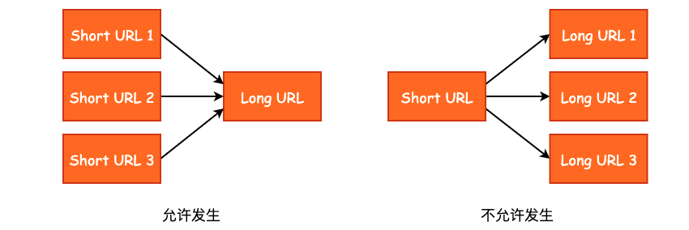
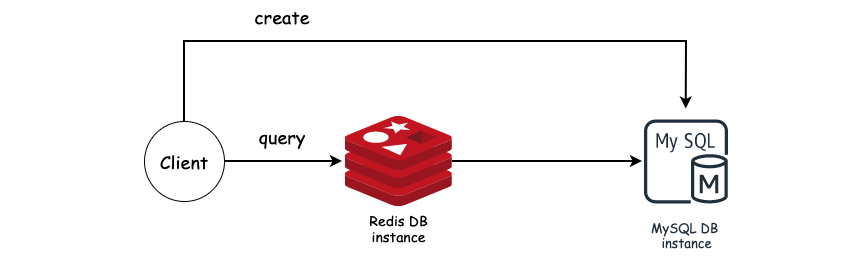
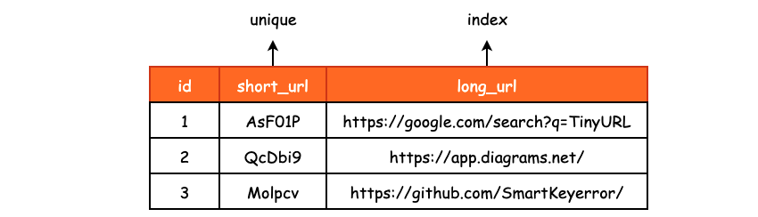
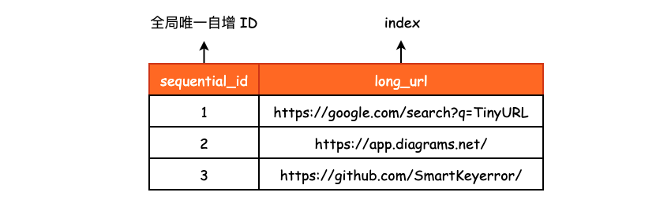
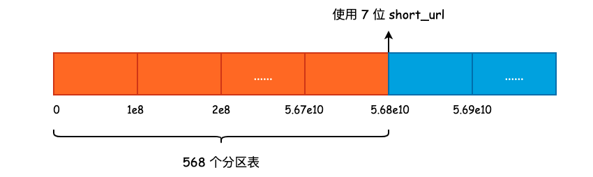
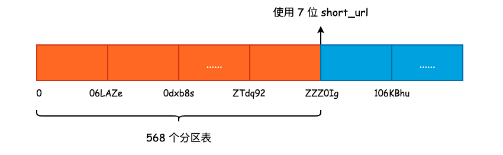

## 如何设计一个 Tiny URL 系统?

### 1. 预估数据量

以新浪微博为例，以前微博还会提供短链接的 API，不过现在没有了。假设微博每天有 1 亿的活跃用户，每天使用长链接生产短链接的用户占比 10%，也就是每天有 1000 万的生成短链接需求。假设每一个 URL 的长度为 100 字节，那么每天产生的数量大小为:

```bash
10000000 * 100 / 1024 / 1024 ≈ 950MB
```

我们就算 1 天 1G 的数据，一年需要 365G，3 年可以用完一块 1TB 的硬盘。再来看 QPS，假设每一个活跃用户都回去点击一次 Tiny URL，也就是

```bash
100000000 / 86400 ≈ 1157 QPS
```

也就是差不多 1K 的 QPS，峰值我们算 2K，和 C10 K 比起来还是有点儿差距的，并且应用层不会有太多的运算逻辑，压力基本上都在 DB 上，所以 Web Server 的数量不需要太多。

综上，我们得到了每年数据量在 365G、每天的 QPS 在 2K 的这样一个基本数据。

### 2. 算法选择

设计 Tiny URL 的第一个重点就是如何设计一个 Long URL 到 Short URL 的一个映射。首先来看我们的 Short URL 需要设计成多少位，能够选择的字符包括 `a-zA-Z` 的 52 个字符，以及 `0-9` 这 10 个数字，加起来 62 个字符。

```bash
62 ^ 4 ≈ 1500 万
62 ^ 5 ≈ 9 亿
62 ^ 6 ≈ 568 亿
62 ^ 7 ≈ 35000 亿
```

因此，Short URL 设计成 6 位足矣。


#### 2.1 MD5(LongURL)

取 `MD5(LongURL)` 的后六位，最简单粗暴，也不需要什么自增 ID。但是冲突概率可能会很高，DB 又不像内存，没有拉链法能够让我们处理哈希冲突，所以这个方法从根本上就不可行。


#### 2.2 随机生成 ShortURL + DB 去重

第二种方式就使用随机字符串，去重就交给 DB 来做，反正我们在设计 Schema 的时候 `short_url` 这一列必然需要设计成 unique 索引。

我们大概可以这样来写:

```cpp
stirng longToShort(const string& long_url) {
    while (true) {
        string short_url = random_string();
        if (database.insert(long_url, short_url)) {
            return short_url;
        }
    }
}
```

但是同样存在一个问题，就是系统运行的时间越久，产生冲突的可能性就越高，那么生成短网址的速度也就越慢。

#### 2.3 进制转换 Base62

因为我们可选的字符范围为 62 位，所以我们可以将一个整型看作是 62 进制的一个编码，然后我们写一个函数，将 `long long` 转换成 62 位进制数:

```cpp
string idToShortURL(long long n) {
    char charactors[] = "0123456789abcdefghijklmnopqrstuvwxyz"
                        "ABCDEFGHIJKLMNOPQRSTUVWXYZ";
  
    string short_url;
  
    while (n) {
        short_url.push_back(charactors[n % 62]);
        n = n / 62;
    }

    while (short_url.size() < 6) {
        short_url.push_back('0');
    }
  
    reverse(short_url.begin(), short_url.end());
    return short_url;
}
```

这种方法唯一的问题就是依赖全局的唯一自增 ID，两个不同的 Long URL 不能有相同的 ID，但是同一个 Long URL 其实是可以有多个 ID 的，我们只需要通过 Short URL 能够唯一确定 Long URL 即可，所以后者重复了也没有关系。




**需要自增的原因在于提高插入的效率**。大多数数据库底层使用树结构对数据进行有序存储，如果使用无序的 ID 进行数据插入的话，那么会多出很多的离散磁盘 I/O，对系统的整体性能是有影响的，这也是为什么不推荐使用无序的 UUID 作为数据库主键的原因。

生成全局唯一自增 ID 有这么几种方式：
1. 使用 MySQL `BIGINT` 自增 ID。这种方式简单直接，并且 MySQL 是现成的，问题在于这种方式很难进行水平拓展，除非说不同的 MySQL 实例有着不同的初始自增 ID 以及自增大小。
2. 利用 Redis 的单线程特性。直接使用 `incr` 即可满足我们的要求，只不过此时我们又引入了一个网络组件，那么如果 Redis 挂了或者是出现网络分区的情况，整个服务也会停止工作。
3. 使用 Snowflake，即 最高位 0 + 41 位毫秒级时间戳 + 10 位机器标志位 + 12 位时间戳，总计 64 位。优点就是不依赖任何外部系统，任何编程语言都可自行实现，唯一存在的问题就是时间回拨，会导致 ID 自增性收到破坏，并且也可能会出重复。MongoDB 的 `ObjectId` 也是类似于 Snowflake，所以就不再讨论。

除了这三种比较常用的方式以外，也可以直接使用知名互联网公司对全局唯一 ID 的生成方案:

- [百度 UIDGenertor](https://github.com/baidu/uid-generator/blob/master/README.zh_cn.md)
- [美团 Leaf](https://tech.meituan.com/2017/04/21/mt-leaf.html)
- [腾讯 Seqsvr](https://www.infoq.cn/article/wechat-serial-number-generator-architecture)

只不过这些解决方案的复杂度要远超于常见的 3 种方案，对基础设施会有比较高的要求。不过有一位仁兄说的很有道理，不管是使用 MySQL 自增 ID 或者是 Redis 自增特性，都需要高可用，那么也就默认为基础设施是完备的了。

#### 2.4 小结

使用随机字符串或者是使用进制转换的方式实现都可以，这两种方式都有着各自的优缺点。随机字符串需要利用数据库进行去重，并且数据量增大以后效率会降低，但是不依赖全局唯一自增 ID。进制转换不需要使用 DB 进行去重，唯独依赖全局的唯一自增 ID。

### 3. 基本实现



#### 3.1 基于随机数的实现

表结构设计:



```sql
create table mapping (
	`id` bigint not null auto_increment,
    `short_url` varchar(7) not null,
    `long_url` varchar(100) not null,
    primary key(`id`),
    unique(`short_url`),
    index(`long_url`)
);
```

需要额外注意的是 `id` 字段一定需要使用 `BIGINT`，尽量不要使用无符号整型，以免后续出现问题。另外，在判断生成的 Short URL 是否重复时，直接使用 `INSERT INTO ...` 该事务的结果来判断是否插入成功，尽量不要使用 `select ... for update` 的方式来锁定 DB 中没有出现的数据行，在这个业务场景下很容易出现死锁。

`INSERT INTO ...` 在插入失败时主键 ID 仍然会递增，所有有时候我们会看到主键 ID 有空洞的情况，可以定期对主键进行整理。

#### 3.2 基于进制转换的实现

基于进制转换的实现要比基于随机数的实现更复杂一些，首先就是必须要有一个全局唯一的自增 ID，生成方式我们在上面已经讨论过了。此时我们只需要记录两个字段即可，唯一自增 ID 以及 `long_url`，`short_url` 可以通过自增 ID 计算得到:




```cpp
create table mapping (
	`sequential_id` bigint not null auto_increment,
    `long_url` varchar(100) not null,
    primary key(`sequential_id`),
    index(`long_url`)
);
```

### 4. 水平扩容

在前面的数据量预估中，我们已经得到了一年大约产生 365G 的数据，显然无法直接使用一张表进行存储，我们必须对其进行水平扩容，将数据分散在不同的表中。

分表就涉及到如何选取 Sharding Key 的问题，以及在选择了 Sharding Key 以后，采用什么方式将数据尽可能均匀地分布在各个分区表中。

#### 4.1 使用 `long_url` 作为 Sharding Key

- 基于随机字符串的实现
如果使用 `long_url` 作为 Sharding Key 的话，那么当我们生成了多个相同的随机 `short_url` 的话，由于 `long_url` 可能并不相同，所以会流向不同的分区表，也就失去了利用 DB 进行去重的重要环节，导致同一个 `short_url` 对应了多个不同的 `long_url`，这是我们无法接受的。
- 基于进制转换的实现
因为 `sequential_id` 是全局唯一的，所以我们也不需要担心会出现两个相同的 `short_url`，那么也就不需要利用数据库进行去重。但是，当我们使用 `short_url` 进行查询时，由于使用的是 `long_url` 作为 Sharding Key，那么就需要去所有的分区表中去进行查找，将会导致查找效率低下。

#### 4.2 使用 `short_url` 作为 Sharding Key

- 基于随机字符串的实现
如果使用 `short_url` 作为 Sharding Key 的话，那么如果我们生成了多个相同的随机 `short_url` 的话，它们最终会流向同一个分区表，能够达到去重的效果。但是当我们创建数据时，就可能会出现同一个 `long_url` 对应着多个 `short_url`，不过没有关系，这种情况我们是可以接受的。
- 基于进制转换的实现
在调用 `shortToLongURL()` 方法时，只需要去一张分区表查询即可取出 `long_url`，查询效率很高。

综上，不管我们使用基于随机字符串的实现还是基于进制转换的实现，都可以使用 `short_url` 作为 Sharding Key，既能够满足数据分区的需求，同时也可以提高查询性能。

#### 4.3 如何进行分区

分区的方式有很多种，例如根据 Sharding Key 的范围进行分区，根据 Sharding Key 的散列进行范围分区，又或者是使用 `MD5(Sharding Key) % N` 的方式进行分区。

根据 Sharding Key 的范围进行分区比较适合基于进制转换的实现中，因为本身 `sequential_id` 就是全局唯一且自增的，那么根据 568 亿的 6 位 Short URL 的数据总量，以及单个分区表所能承受的数据量上限，很容易进行分区，并且每个分区表的数据量都是相对均匀的，不会出现数据倾斜的问题。

假设单个分区表最多能够容纳 1 亿条数据，那么我们此时在最开始就需要建立 568 个分区表，或者说动态创建也可以，只不过业务层的代码会稍微复杂一些。

在这种情况下，如果我们的系统已经将 6 位的 `short_url` 用尽了的话，可以继续使用 7 位的 `short_url`，分区不会受到任何影响。




而基于随机字符串的实现其实使用哪种分区方式都可以，因为 Sharding Key 本身就是随机生成，我们可以粗略的认为它们的分布是均匀的。因此我们既可以使用 Sharding Key 的范围进行分区，也可以对 `MD5(Sharding Key)` 的结果进行范围分区。



更进一步地，如果我们需要进行分库的话，那么由于 DB 实例的数据量不可能无限增长，所以基于范围的分区可能不太适用，此时就可以使用 `MD5(Sharding Key) % N`，N 为 DB 实例数量，这样的方式进行分库。


### 5. 优化查询效率——添加缓存

这里可以使用一致性哈希的方式来对 `short_url` 进行缓存，过程不再赘述。

